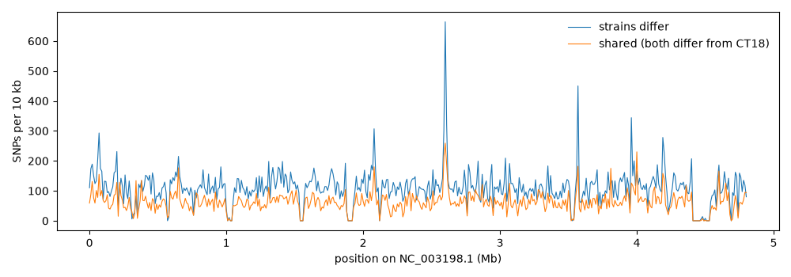
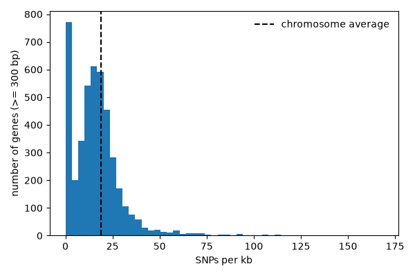

# Workshop: Which genes have the most SNPs? Finding interesting variants with Python

In the [Variant calling](Variants) lecture we made VCF files with `bcftools` and GATK and annotated them with snpEff. In this workshop we open up a VCF ourselves and ask biological questions of it with plain Python:

- Which genes have the most SNPs, and which have the most SNPs *per kb*?
- Where do two strains differ from *each other*, rather than from the reference?
- Which SNPs change the protein (nonsynonymous) and which are silent (synonymous)? This is the counting behind Ka/Ks from the [Sequence evolution](Sequence_evolution) lecture.
- Is a gene's SNP count more than we'd expect by chance? (a permutation test, plus FDR)
- Which SNPs hit a splice site and would break the `GT...AG` intron signals?

Part 1 uses a **real** VCF of two *Salmonella enterica* strains. Bacteria don't have spliceosomal introns, so Part 2 uses the real genome and gene annotation of the fungus *Aspergillus fumigatus* Af293 (the organism in the GATK pipeline of the [Variants](Variants) lecture) with **simulated** SNPs.

Every script below is complete: save it with the file name given, put it in the same folder as the data, and run it. Later scripts `import` functions from earlier ones (e.g. `from vcf_filter import read_snps`), so keep them all in one folder. All the output shown is from real runs of these scripts.

## Setup

You need Biopython, SciPy and matplotlib (NumPy comes along with them). On the HPCC, start an interactive job first rather than running on the login node:

```bash
srun -p short -N 1 -n 1 -c 1 --mem 4gb --time 2:00:00 --pty bash -l
# e.g. in a conda environment or with pip
pip install biopython scipy matplotlib
mkdir -p ~/bigdata/snp_workshop/salmonella
cd ~/bigdata/snp_workshop/salmonella
```

Download the Part 1 data. The VCF and GFF are from last year's class examples; the genome is the NCBI RefSeq assembly of the *S. enterica* serovar Typhi CT18 reference.

```bash
URL=https://raw.githubusercontent.com/biodataprog/GEN220_2025_classexamples/main
curl -O $URL/bioinformatics_varcalling/S_enterica_CT18.2strains.vcf
curl -O $URL/bioinformatics_varcalling/GCF_000195995.1_ASM19599v1_genomic.gff
NCBI=https://ftp.ncbi.nlm.nih.gov/genomes/all/GCF/000/195/995/GCF_000195995.1_ASM19599v1
curl -O $NCBI/GCF_000195995.1_ASM19599v1_genomic.fna.gz
```

About the data:

- The reference is *S. enterica* serovar **Typhi** strain CT18: a 4.8 Mb chromosome (`NC_003198.1`) and two plasmids (`NC_003384.1`, `NC_003385.1`).
- The two samples, `SRR10574912` and `SRR10574913`, are Illumina MiSeq genomes of food/environmental isolates from the GenomeTrakr project (USDA FSIS). SRR10574913 is serovar Enteritidis. Neither is Typhi, so each strain differs from the reference at tens of thousands of positions. That's a lot of SNPs, which makes this a good dataset for finding patterns.
- The VCF was made with `bcftools mpileup | bcftools call -vm` as in the [Variants](Variants) lecture.
- There is also a `GCF_000195995.1_ASM19599v1_genomic.genes.gff` in the class examples folder. It has only the `gene` lines, with no gene products and no `CDS` lines. We use the full `genomic.gff`, because we need the `product` (what the gene does), the `pseudogene` features and the `CDS` coordinates.

## Part 1: SNPs in two *Salmonella* strains

### Step 1 and 2: Read the VCF and keep good SNPs

A VCF has `##` header lines, then one `#CHROM` line naming the columns, then one line per variant:

```bash
grep -v "^##" S_enterica_CT18.2strains.vcf | head -3
```

```text
#CHROM      POS REF ALT QUAL    INFO      FORMAT   SRR10574912.bam   SRR10574913.bam
NC_003198.1 30  A   G   216.008 DP=46;... GT:PL:AD 0/0:0,57,255:19,0 1/1:255,45,0:0,15
NC_003198.1 38  A   G   483.052 DP=47;... GT:PL:AD 1/1:255,54,0:0,18 1/1:255,48,0:0,16
```

(the columns are separated by tabs; to make it readable we lined them up, shortened INFO, and left out the ID and FILTER columns, which are both `.` here). Columns 10 and beyond are the samples. The `FORMAT` column says what is in each sample column, separated by `:`. Here `GT:PL:AD` = genotype, genotype likelihoods, and allele depths (reads supporting REF, ALT). The genotype `GT` uses numbers: `0` = the REF allele, `1` = the first ALT allele, `./.` = no call (no reads). So at position 30, strain 912 has the reference `A` (`0/0`, 19 reads with A) and strain 913 has `G` (`1/1`, 15 reads with G).

`bcftools call` assumes a diploid organism by default, so it writes genotypes like `1/1`. A bacterium is haploid: `0/0` and `1/1` are what we expect, and a "heterozygous" `0/1` call usually means reads from two similar copies of a repeat (or a mixed sample) were mapped to the same place. (`bcftools call --ploidy 1` would make haploid calls.)

`QUAL` is a Phred-scaled quality: QUAL 30 means a 1 in 1000 chance the site is not variant. We'll keep only **bi-allelic SNPs** (one base REF, one base ALT: no indels and no `A>G,T` sites) with QUAL of at least 30.

Save this as `vcf_filter.py`:

```python
#!/usr/bin/env python3
"""Read a VCF file with plain Python, parse genotypes, and keep good SNPs."""

import gzip
import sys

VCF = "S_enterica_CT18.2strains.vcf"
MIN_QUAL = 30


def open_file(path):
    """Open a plain or gzipped text file for reading."""
    if path.endswith(".gz"):
        return gzip.open(path, "rt")
    return open(path)


def parse_genotype(format_col, sample_col):
    """Turn FORMAT 'GT:PL:AD' and a sample '1/1:255,45,0:0,15' into a dict,
    e.g. {'GT': '1/1', 'PL': '255,45,0', 'AD': '0,15'}"""
    keys = format_col.split(":")
    values = sample_col.split(":")
    return dict(zip(keys, values))


def read_vcf(path):
    """Yield one dict per variant line in the VCF."""
    samples = []
    with open_file(path) as fh:
        for line in fh:
            if line.startswith("##"):  # meta-information header lines
                continue
            row = line.rstrip("\n").split("\t")
            if line.startswith("#CHROM"):  # column names; samples start in column 10
                samples = row[9:]
                continue
            genotypes = {}
            for name, sample_col in zip(samples, row[9:]):
                genotypes[name] = parse_genotype(row[8], sample_col)["GT"]
            yield {
                "chrom": row[0],
                "pos": int(row[1]),
                "ref": row[3],
                "alt": row[4],
                "qual": float(row[5]),
                "gt": genotypes,
            }


def is_snp(var):
    """True for a bi-allelic single base change (A>G), not an indel or A>G,T."""
    return len(var["ref"]) == 1 and len(var["alt"]) == 1


def read_snps(path, min_qual=MIN_QUAL):
    """Return a list of the SNPs passing the QUAL filter."""
    return [v for v in read_vcf(path) if is_snp(v) and v["qual"] >= min_qual]


def main():
    path = sys.argv[1] if len(sys.argv) > 1 else VCF
    total = snps = indels = multi = lowqual = 0
    gt_patterns = {}
    for var in read_vcf(path):
        total += 1
        if "," in var["alt"]:
            multi += 1
        elif not is_snp(var):
            indels += 1
        elif var["qual"] < MIN_QUAL:
            lowqual += 1
        else:
            snps += 1
            pattern = " ".join(var["gt"].values())  # e.g. '0/0 1/1'
            gt_patterns[pattern] = gt_patterns.get(pattern, 0) + 1
    print("variant lines:", total)
    print("multi-allelic (ALT has a comma):", multi)
    print("indels:", indels)
    print("SNPs with QUAL < %d:" % MIN_QUAL, lowqual)
    print("SNPs kept:", snps)
    print()
    print("genotype patterns of kept SNPs (%s):" % " ".join(var["gt"]))
    for pattern, n in sorted(gt_patterns.items(), key=lambda x: -x[1]):
        print("  %-10s %6d" % (pattern, n))


if __name__ == "__main__":
    main()
```

```bash
python vcf_filter.py
```

```text
variant lines: 94760
multi-allelic (ALT has a comma): 731
indels: 1054
SNPs with QUAL < 30: 1353
SNPs kept: 91622

genotype patterns of kept SNPs (SRR10574912.bam SRR10574913.bam):
  1/1 0/0     30591
  1/1 1/1     30103
  0/0 1/1     22660
  ./. 1/1      4014
  1/1 ./.      2663
  0/0 0/1       365
  0/1 0/0       328
  ./. 0/1       229
  1/1 0/1       228
  0/1 0/1       182
  0/1 1/1       156
  0/1 ./.       103
```

Things to notice:

- `read_vcf` is a **generator** (it uses `yield`): it hands back one variant at a time, so we never need the whole file in memory. `read_snps` collects the ones that pass into a list, which is fine for ~90,000 SNPs.
- `open_file` works for `.vcf` and `.vcf.gz` files, just like reading gzipped FASTQ in the Python lectures.
- `if __name__ == "__main__":` means `main()` only runs when we run this file as a script. When a later script does `from vcf_filter import read_snps`, it gets the function without running `main()`.
- Most SNPs are `1/1 0/0`, `0/0 1/1` (the strains differ from each other) or `1/1 1/1` (both differ from CT18). We'll use these patterns in Step 5.

**Real tools.** In practice, for filtering you would use `bcftools`, which is much faster and handles every corner of the VCF format:

```bash
module load bcftools
bcftools view -v snps -m2 -M2 -i 'QUAL>=30' S_enterica_CT18.2strains.vcf | grep -vc "^#"
bcftools query -f '%CHROM\t%POS\t%REF\t%ALT\t%QUAL[\t%GT]\n' \
    S_enterica_CT18.2strains.vcf | head -3
```

```text
91622
NC_003198.1	30	A	G	216.008	0/0	1/1
NC_003198.1	38	A	G	483.052	1/1	1/1
NC_003198.1	44	A	G	483.052	1/1	1/1
```

(`-v snps` = SNPs only, `-m2 -M2` = exactly two alleles, `-i` = include sites matching an expression. bcftools also prints a harmless warning that the `MQ` tag's type is declared wrongly in this file's header.) The same 91,622 SNPs as our script.

and in Python the [cyvcf2](https://brentp.github.io/cyvcf2/) or [pysam](https://pysam.readthedocs.io/) (`pysam.VariantFile`) libraries read VCF and BCF files for you (`pip install cyvcf2`):

```python
from cyvcf2 import VCF

n = 0
for var in VCF("S_enterica_CT18.2strains.vcf"):
    if var.is_snp and len(var.ALT) == 1 and var.QUAL >= 30:
        n += 1
        if n <= 3:
            print(var.CHROM, var.POS, var.REF, var.ALT[0], var.gt_bases)
print("SNPs kept:", n)
```

```text
NC_003198.1 30 A G ['A/A' 'G/G']
NC_003198.1 38 A G ['G/G' 'G/G']
NC_003198.1 44 A G ['G/G' 'G/G']
SNPs kept: 91622
```

Same answer as our script. Writing the parser once yourself is the best way to understand what those libraries are doing.

### Step 3: Which gene is each SNP in?

The GFF gives each gene's chromosome, start, end and strand (see the [Range queries](Ranges_Features_overlap) lecture):

```text
NC_003198.1 RefSeq  gene 337 2799 . + . ID=gene-STY_RS00010;Name=thrA;gene=thrA;...
NC_003198.1 Protein CDS  337 2799 . + 0 ID=cds-WP_001264731.1;Parent=gene-STY_RS00010;
                                       ...;product=bifunctional aspartate kinase/...;
```

(shortened: column 2 is really `Protein Homology`, and the attributes in column 9 are much longer). The gene's function (`product`) is on the `CDS` line, which points back to its gene with `Parent=`. We read both. GFF also escapes some characters in column 9 (`,` becomes `%2C`, `;` becomes `%3B`), so we decode them with `urllib.parse.unquote`.

**Finding the gene for each SNP.** The naive way is a loop inside a loop:

```python
for snp in snps:              # 91,622 SNPs
    for gene in genes:        # x 5,146 genes = 470 million comparisons
        if gene["chrom"] == snp["chrom"] and gene["start"] <= snp["pos"] <= gene["end"]:
            ...
```

This works but is slow: 5,000 SNPs took 5.3 seconds on a laptop, so all of them would take about 1.5 minutes. With a million SNPs or a 30,000 gene genome it gets painful.

A better way is to **sort** the genes by start once, and then use [`bisect`](https://docs.python.org/3/library/bisect.html) to jump straight to the right place in the sorted list, like looking up a word in a dictionary instead of reading every page. `bisect_right(starts, pos)` tells us how many genes start at or before `pos`. The gene just to the left of that spot is the only candidate... except that genes can overlap (common in bacteria) and a long gene that started earlier may still cover `pos`. So we walk left until genes start more than one "longest gene length" before `pos`; none of those can reach it.

```text
gene starts (sorted):  190   337   2801  3734  5114 ...
                                         ^ bisect_right(starts, 3000) = 3
     so check the gene at index 2 (thrB, 2801-3730), then keep walking left
```

This assigns all 91,622 SNPs in about 0.3 seconds. The same idea (sorted intervals) is how `bedtools` and tabix indexes are fast. A SNP that hits no gene is **intergenic**; we count those separately. A SNP in two overlapping genes counts for both.

### Step 4: Count SNPs per gene and per kb

Save as `snps_per_gene.py`:

```python
#!/usr/bin/env python3
"""Assign SNPs to genes from a GFF file and report the genes with the most SNPs."""

import bisect
from urllib.parse import unquote
from vcf_filter import open_file, read_snps, VCF

GFF = "GCF_000195995.1_ASM19599v1_genomic.gff"


def parse_attributes(col9):
    """Turn 'ID=gene-X;Name=thrA;product=a%2Cb' into a dict:
    {'ID': 'gene-X', 'Name': 'thrA', 'product': 'a,b'}"""
    attrs = {}
    for field in col9.strip().split(";"):
        if "=" in field:
            key, value = field.split("=", 1)
            attrs[key] = unquote(value)  # GFF escapes , ; = as %2C %3B %3D
    return attrs


def read_genes(path):
    """Read gene and pseudogene features. Returns {chrom: [gene, ...]} by start.
    Each gene is a dict; the 'product' is taken from its CDS/RNA child feature."""
    genes = {}  # gene ID -> gene dict
    products = {}  # gene ID -> product of a child feature
    with open_file(path) as fh:
        for line in fh:
            if line.startswith("#"):
                continue
            row = line.rstrip("\n").split("\t")
            if len(row) < 9:
                continue
            attrs = parse_attributes(row[8])
            if row[2] in ("gene", "pseudogene"):
                genes[attrs["ID"]] = {
                    "chrom": row[0],
                    "start": int(row[3]),
                    "end": int(row[4]),
                    "strand": row[6],
                    "id": attrs["ID"],
                    "locus": attrs.get("locus_tag", attrs["ID"]),
                    "name": attrs.get("gene", "-"),
                    "biotype": attrs.get("gene_biotype", row[2]),
                }
            elif "Parent" in attrs and "product" in attrs:
                products.setdefault(attrs["Parent"], attrs["product"])
    by_chrom = {}
    for gene_id, gene in genes.items():
        gene["product"] = products.get(gene_id, "")
        gene["length"] = gene["end"] - gene["start"] + 1
        by_chrom.setdefault(gene["chrom"], []).append(gene)
    for chrom in by_chrom:
        by_chrom[chrom].sort(key=lambda g: g["start"])
    return by_chrom


def find_genes(genes_by_chrom, chrom, pos, starts, longest):
    """Return a list of genes that contain chrom:pos (0, 1 or 2+ genes).
    starts[chrom] is the sorted list of gene starts, longest[chrom] the longest gene.
    """
    genes = genes_by_chrom.get(chrom, [])
    hits = []
    # bisect finds where pos goes in the sorted starts: genes up to i start <= pos
    i = bisect.bisect_right(starts.get(chrom, []), pos) - 1
    # walk left; a gene that starts more than 'longest' bp before pos can't reach it
    while i >= 0 and genes[i]["start"] >= pos - longest[chrom]:
        if genes[i]["end"] >= pos:
            hits.append(genes[i])
        i -= 1
    return hits


def count_snps_per_gene(snps, genes_by_chrom):
    """Return ({gene id: number of SNPs}, number of intergenic SNPs)."""
    starts = {c: [g["start"] for g in gl] for c, gl in genes_by_chrom.items()}
    longest = {c: max(g["length"] for g in gl) for c, gl in genes_by_chrom.items()}
    counts = {}
    intergenic = 0
    for snp in snps:
        hits = find_genes(genes_by_chrom, snp["chrom"], snp["pos"], starts, longest)
        if not hits:
            intergenic += 1
        for gene in hits:  # overlapping genes each get the SNP
            counts[gene["id"]] = counts.get(gene["id"], 0) + 1
    return counts, intergenic


def all_genes(genes_by_chrom):
    """Flatten {chrom: [genes]} to {gene id: gene}."""
    return {g["id"]: g for gl in genes_by_chrom.values() for g in gl}


def print_table(rows, counts, gene_info):
    print(
        "%-13s %-9s %6s %5s %7s  %s"
        % ("locus", "name", "length", "SNPs", "per_kb", "product")
    )
    for gene_id in rows:
        g = gene_info[gene_id]
        per_kb = 1000 * counts[gene_id] / g["length"]
        print(
            "%-13s %-9s %6d %5d %7.1f  %s"
            % (g["locus"], g["name"][:9], g["length"], counts[gene_id], per_kb,
               g["product"][:40])
        )


def main():
    snps = read_snps(VCF)
    genes_by_chrom = read_genes(GFF)
    gene_info = all_genes(genes_by_chrom)
    counts, intergenic = count_snps_per_gene(snps, genes_by_chrom)

    print("SNPs:", len(snps), " genes:", len(gene_info))
    print(
        "SNPs in genes: %d   intergenic: %d" % (len(snps) - intergenic, intergenic)
    )
    print(
        "genes with >= 1 SNP: %d  with 0 SNPs: %d"
        % (len(counts), len(gene_info) - len(counts))
    )

    print("\nTop 10 genes by number of SNPs")
    top = sorted(counts, key=lambda gid: counts[gid], reverse=True)[:10]
    print_table(top, counts, gene_info)

    print("\nTop 10 genes by SNPs per kb (genes >= 300 bp)")
    big = [gid for gid in counts if gene_info[gid]["length"] >= 300]
    top = sorted(
        big, key=lambda gid: counts[gid] / gene_info[gid]["length"], reverse=True
    )[:10]
    print_table(top, counts, gene_info)


if __name__ == "__main__":
    main()
```

```text
SNPs: 91622  genes: 5146
SNPs in genes: 79505   intergenic: 12117
genes with >= 1 SNP: 4117  with 0 SNPs: 1029

Top 10 genes by number of SNPs
locus         name      length  SNPs  per_kb  product
STY_RS13035   ratB        7268   831   114.3  DUF823/DUF824 repeat adhesin RatB
STY_RS13040   -           6375   636    99.8  adhesion domain-containing protein
STY_RS21320   siiE       16680   418    25.1  non-fimbrial adhesin SiiE
STY_RS20610   -           5600   406    72.5  autotransporter adhesin BigA
STY_RS13025   -           4957   357    72.0  autotransporter outer membrane beta-barr
STY_RS13645   -          10875   308    28.3  BapA/Bap/LapF family large adhesin
STY_RS19795   glyS        2070   228   110.1  glycine--tRNA ligase subunit beta
STY_RS19610   sadA        3177   210    66.1  trimeric autotransporter adhesin SadA
STY_RS00345   carB        3228   184    57.0  carbamoyl-phosphate synthase large subun
STY_RS15215   gcvP        2874   170    59.2  aminomethyl-transferring glycine dehydro

Top 10 genes by SNPs per kb (genes >= 300 bp)
locus         name      length  SNPs  per_kb  product
STY_RS01520   -            612   103   168.3  integrase core domain-containing protein
STY_RS09420   -            309    46   148.9  tyrosine-type recombinase/integrase
STY_RS21980   -            486    70   144.0  phage tail protein
STY_RS17750   -            759   109   143.6  HesA/MoeB/ThiF family protein
STY_RS22030   -            606    83   137.0  phage tail protein I
STY_RS23195   -            846   101   119.4  SdiA-regulated domain-containing protein
STY_RS09615   -            600    69   115.0  DUF1367 family protein
STY_RS00920   panB         795    91   114.5  3-methyl-2-oxobutanoate hydroxymethyltra
STY_RS13035   ratB        7268   831   114.3  DUF823/DUF824 repeat adhesin RatB
STY_RS26130   -           1053   120   114.0  tyrosine-type recombinase/integrase
```

Things to notice:

- 13% of SNPs are intergenic, a little more than the 11% of the chromosome that lies outside genes. Bacterial genomes are packed with genes, so most SNPs fall in genes.
- The genes with the most SNPs are almost all **large surface adhesins** (`ratB`, `siiE`, `sadA`, BigA, BapA): proteins on the outside of the cell that interact with the host and the immune system. These are known to vary a lot between *Salmonella* serovars. `siiE` is long (16.7 kb), so it has many SNPs, but its *density* (25 per kb) is close to the genome average.
- Ranking by count favours long genes; ranking by SNPs per kb favours short genes (one SNP in a 60 bp gene is 16.7 per kb!), which is why we set a minimum length. The density list is full of **integrases and phage proteins** - mobile DNA that moves between strains. When genes from a different phage are "mapped" onto the reference prophage, every little difference is a SNP.
- 1,029 genes have **zero** SNPs. That does not always mean the strains are identical to the reference there - see Step 8.

### Step 5: Where do the two strains differ from each other?

So far a SNP is "different from the reference". But with two strains we can ask a more interesting question. Compare the genotypes:

| strain 912 | strain 913 | meaning |
| :--- | :--- | :--- |
| `1/1` | `1/1` | **shared**: both strains differ from CT18 (they share an ancestor that is not Typhi) |
| `1/1` | `0/0` | only 912 differs: **the strains differ from each other** |
| `0/0` | `1/1` | only 913 differs: **the strains differ from each other** |
| `./.` | anything | no reads in strain 912 at this site |
| `0/1` | anything | "heterozygous" call: suspicious in a haploid |

Save as `strain_differences.py`:

```python
#!/usr/bin/env python3
"""Which genes differ between the two strains, and which differ from the reference?"""

from vcf_filter import read_snps, VCF
from snps_per_gene import read_genes, all_genes, find_genes, GFF

S1, S2 = "SRR10574912.bam", "SRR10574913.bam"


def snp_pattern(gt):
    """Classify a SNP by the genotypes of the two strains."""
    g1, g2 = gt[S1], gt[S2]
    if g1 == "1/1" and g2 == "1/1":
        return "shared"  # both strains differ from the reference (CT18)
    if g1 == "1/1" and g2 == "0/0":
        return "only_912"  # strains differ from each other
    if g1 == "0/0" and g2 == "1/1":
        return "only_913"
    if g1 == "./.":
        return "missing_912"  # no reads in strain 912: DNA missing in that strain?
    if g2 == "./.":
        return "missing_913"
    return "het"  # 0/1 in a haploid bacterium: repeats or mixed sample


def main():
    snps = read_snps(VCF)
    genes_by_chrom = read_genes(GFF)
    gene_info = all_genes(genes_by_chrom)
    starts = {c: [g["start"] for g in gl] for c, gl in genes_by_chrom.items()}
    longest = {c: max(g["length"] for g in gl) for c, gl in genes_by_chrom.items()}

    totals = {}
    per_gene = {}  # gene id -> {'shared': n, 'only_912': n, ...}
    for snp in snps:
        pattern = snp_pattern(snp["gt"])
        totals[pattern] = totals.get(pattern, 0) + 1
        for gene in find_genes(
            genes_by_chrom, snp["chrom"], snp["pos"], starts, longest
        ):
            counts = per_gene.setdefault(gene["id"], {})
            counts[pattern] = counts.get(pattern, 0) + 1

    print("Genome-wide SNP patterns")
    patterns = ["shared", "only_912", "only_913", "missing_912", "missing_913", "het"]
    for pattern in patterns:
        print(
            "  %-11s %6d  (%.1f%%)"
            % (pattern, totals[pattern], 100 * totals[pattern] / len(snps))
        )

    def n_differ(gid):
        """SNPs where the two strains have different alleles."""
        return per_gene[gid].get("only_912", 0) + per_gene[gid].get("only_913", 0)

    print("\nTop 10 genes where the two strains DIFFER from each other")
    print(
        "%-13s %-7s %6s %7s %8s %8s  %s"
        % ("locus", "name", "length", "shared", "only_912", "only_913", "product")
    )
    for gid in sorted(per_gene, key=n_differ, reverse=True)[:10]:
        g, c = gene_info[gid], per_gene[gid]
        print(
            "%-13s %-7s %6d %7d %8d %8d  %s"
            % (g["locus"], g["name"][:7], g["length"], c.get("shared", 0),
               c.get("only_912", 0), c.get("only_913", 0), g["product"][:32])
        )

    # Genes where one strain has no genotype call at most SNPs: gene probably absent
    print("\nGenes with >= 20 SNPs, >= 90% of them missing (./.) in one strain")
    for strain in ("missing_912", "missing_913"):
        absent = [
            gid
            for gid in per_gene
            if sum(per_gene[gid].values()) >= 20
            and per_gene[gid].get(strain, 0) >= 0.9 * sum(per_gene[gid].values())
        ]
        print("  %s: %d genes, e.g." % (strain, len(absent)))
        for gid in sorted(absent, key=lambda x: -per_gene[x][strain])[:4]:
            g = gene_info[gid]
            print(
                "    %-13s %-7s SNPs=%3d  %s"
                % (g["locus"], g["name"][:7], per_gene[gid][strain],
                   g["product"][:40])
            )


if __name__ == "__main__":
    main()
```

```text
Genome-wide SNP patterns
  shared       30103  (32.9%)
  only_912     30591  (33.4%)
  only_913     22660  (24.7%)
  missing_912   4243  (4.6%)
  missing_913   2766  (3.0%)
  het           1259  (1.4%)

Top 10 genes where the two strains DIFFER from each other
locus         name    length  shared only_912 only_913  product
STY_RS13035   ratB      7268     206      315      208  DUF823/DUF824 repeat adhesin Rat
STY_RS13040   -         6375     172      188      168  adhesion domain-containing prote
STY_RS20610   -         5600     125      141       83  autotransporter adhesin BigA
STY_RS21320   siiE     16680     130      104       96  non-fimbrial adhesin SiiE
STY_RS13645   -        10875     114       99       95  BapA/Bap/LapF family large adhes
STY_RS13025   -         4957     116       77       59  autotransporter outer membrane b
STY_RS19610   sadA      3177      38       88       20  trimeric autotransporter adhesin
STY_RS00345   carB      3228      77       43       64  carbamoyl-phosphate synthase lar
STY_RS17740   thiC      1896      19       78       26  phosphomethylpyrimidine synthase
STY_RS14590   cysJ      1800      21       42       56  NADPH-dependent assimilatory sul

Genes with >= 20 SNPs, >= 90% of them missing (./.) in one strain
  missing_912: 45 genes, e.g.
    STY_RS21975   -       SNPs=119  phage late control D family protein
    STY_RS22195   -       SNPs=104  site-specific integrase
    STY_RS22105   -       SNPs= 98  terminase ATPase subunit family protein
    STY_RS22110   -       SNPs= 95  phage portal protein
  missing_913: 19 genes, e.g.
    STY_RS26130   -       SNPs=120  tyrosine-type recombinase/integrase
    STY_RS00945   staC    SNPs=106  Sta fimbria outer membrane usher protein
    STY_RS00940   -       SNPs= 60  fimbrial protein
    STY_RS22155   -       SNPs= 58  3'-5' exonuclease
```

Things to notice:

- `per_gene` is a **dictionary of dictionaries**: `per_gene["gene-STY_RS13035"]["only_912"]` is the number of SNPs in *ratB* where only strain 912 differs.
- About a third of SNPs are shared, and more than half separate the two strains. So these are two quite different lineages, each also different from Typhi.
- The same adhesin genes top this list: they differ between the two strains *and* from CT18.
- A gene where nearly every SNP is `./.` in one strain probably **isn't in that strain at all** (no reads map there). The other strain has a related but different copy. Here these are mostly **prophage** genes (integrase, portal, terminase) and one fimbrial operon (*sta*), which is exactly the kind of DNA that is gained and lost between strains. To confirm, you would look at read depth (`samtools depth`) across the gene.

### Step 6: Synonymous or nonsynonymous?

For a SNP inside a coding sequence we can work out what it does to the protein:

1. Get the CDS sequence from the reference genome. For a `-` strand gene, take the **reverse complement** so it reads 5' to 3' (start codon first).
2. Find the SNP's position in the CDS. On the `+` strand that is `pos - start`; on the `-` strand we count from the other end, `end - pos`, and **complement** the REF and ALT bases (the VCF always reports the `+` strand).
3. The codon is the 3 bases containing that position (`offset - offset % 3`), and the position in the codon is `offset % 3`.
4. Swap in the ALT base and translate both codons with Biopython (`Seq(codon).translate(table=11)`, the bacterial code).

As a check, the REF base in the VCF must match the genome: if our coordinates were off by one, or we forgot the strand, we would see `ref_mismatch`.

To connect to **Ka/Ks** (dN/dS) from the [Sequence evolution](Sequence_evolution) lecture, we also count the number of synonymous and nonsynonymous **sites** in each gene (the Nei-Gojobori idea: for each base of a codon, what fraction of the 3 possible mutations would be silent?) and compute **pN/pS** = (nonsynonymous SNPs / nonsynonymous sites) / (synonymous SNPs / synonymous sites). This is the same idea as Ka/Ks, but without the correction for multiple hits and using SNPs rather than an alignment of two genes.

Save as `syn_nonsyn.py`:

```python
#!/usr/bin/env python3
"""Classify coding SNPs as synonymous or nonsynonymous using the reference genome."""

from Bio import SeqIO
from Bio.Seq import Seq
from vcf_filter import open_file, read_snps, VCF
from snps_per_gene import parse_attributes, read_genes, find_genes, GFF

GENOME = "GCF_000195995.1_ASM19599v1_genomic.fna.gz"
TABLE = 11  # bacterial genetic code
COMPLEMENT = {"A": "T", "C": "G", "G": "C", "T": "A"}


def read_cds(gff_path, genome):
    """Read CDS features and attach their DNA sequence (5' to 3', coding strand).
    Skips pseudogenes and CDS in several pieces (programmed frameshifts).
    Returns {chrom: [cds, ...]} sorted by start, like read_genes()."""
    pieces = {}
    with open_file(gff_path) as fh:
        for line in fh:
            row = line.rstrip("\n").split("\t")
            if line.startswith("#") or len(row) < 9 or row[2] != "CDS":
                continue
            attrs = parse_attributes(row[8])
            if attrs.get("pseudo") == "true":
                continue
            cds = {
                "chrom": row[0],
                "start": int(row[3]),
                "end": int(row[4]),
                "strand": row[6],
                "id": attrs["ID"],
                "gene_id": attrs["Parent"],
            }
            pieces.setdefault(attrs["ID"], []).append(cds)
    by_chrom = {}
    for cds_id, parts in pieces.items():
        if len(parts) > 1:
            continue
        cds = parts[0]
        cds["length"] = cds["end"] - cds["start"] + 1
        if cds["length"] % 3 != 0:
            continue
        seq = genome[cds["chrom"]].seq[
            cds["start"] - 1 : cds["end"]
        ]  # GFF is 1-based
        if cds["strand"] == "-":
            seq = seq.reverse_complement()
        cds["seq"] = str(seq).upper()
        by_chrom.setdefault(cds["chrom"], []).append(cds)
    for chrom in by_chrom:
        by_chrom[chrom].sort(key=lambda c: c["start"])
    return by_chrom


def classify_snp(cds, pos, ref, alt):
    """Return (effect, ref_codon, alt_codon, ref_aa, alt_aa) for a SNP in a CDS."""
    if cds["strand"] == "+":
        offset = pos - cds["start"]  # 0-based position in the CDS
    else:
        offset = cds["end"] - pos  # count from the other end...
        ref, alt = COMPLEMENT[ref], COMPLEMENT[alt]  # ...and use the other strand
    if cds["seq"][offset] != ref:
        return ("ref_mismatch", "", "", "", "")
    codon_start = offset - offset % 3
    ref_codon = cds["seq"][codon_start : codon_start + 3]
    alt_codon = list(ref_codon)
    alt_codon[offset % 3] = alt
    alt_codon = "".join(alt_codon)
    ref_aa = str(Seq(ref_codon).translate(table=TABLE))
    alt_aa = str(Seq(alt_codon).translate(table=TABLE))
    if ref_aa == alt_aa:
        effect = "synonymous"
    elif alt_aa == "*":
        effect = "nonsense"  # stop gained
    elif ref_aa == "*":
        effect = "stop_lost"
    else:
        effect = "missense"
    return (effect, ref_codon, alt_codon, ref_aa, alt_aa)


SITE_CACHE = {}


def codon_sites(codon):
    """Number of synonymous sites in a codon: for each of the 3 positions, the
    fraction of the 3 possible changes that keep the amino acid (Nei-Gojobori).
    """
    if codon not in SITE_CACHE:
        aa = Seq(codon).translate(table=TABLE)
        syn = 0
        for i in range(3):
            for base in "ACGT":
                if base != codon[i]:
                    mutant = codon[:i] + base + codon[i + 1 :]
                    if Seq(mutant).translate(table=TABLE) == aa:
                        syn += 1 / 3
        SITE_CACHE[codon] = syn
    return SITE_CACHE[codon]


def syn_sites(seq):
    """Return (synonymous sites, nonsynonymous sites) for a coding sequence."""
    s = 0.0
    codons = [
        seq[i : i + 3] for i in range(0, len(seq) - 3, 3)
    ]  # skip the stop codon
    for codon in codons:
        if set(codon) <= set("ACGT"):
            s += codon_sites(codon)
    return s, 3 * len(codons) - s


def main():
    genome = SeqIO.to_dict(SeqIO.parse(open_file(GENOME), "fasta"))
    cds_by_chrom = read_cds(GFF, genome)
    genes = {g["id"]: g for gl in read_genes(GFF).values() for g in gl}
    starts = {c: [x["start"] for x in cl] for c, cl in cds_by_chrom.items()}
    longest = {c: max(x["length"] for x in cl) for c, cl in cds_by_chrom.items()}
    print("CDS used:", sum(len(cl) for cl in cds_by_chrom.values()))

    effects = {}
    per_cds = {}  # cds id -> {'S': n, 'N': n}
    shown = set()  # effects we have printed an example of
    for snp in read_snps(VCF):
        for cds in find_genes(
            cds_by_chrom, snp["chrom"], snp["pos"], starts, longest
        ):
            result = classify_snp(cds, snp["pos"], snp["ref"], snp["alt"])
            effect = result[0]
            effects[effect] = effects.get(effect, 0) + 1
            counts = per_cds.setdefault(cds["id"], {"S": 0, "N": 0})
            if effect == "synonymous":
                counts["S"] += 1
            elif effect != "ref_mismatch":
                counts["N"] += 1
            # print one example of each effect on the - strand
            if cds["strand"] == "-" and effect not in shown:
                shown.add(effect)
                print(
                    "example: %s:%d %s>%s in %s (- strand) codon %s>%s %s>%s %s"
                    % (snp["chrom"], snp["pos"], snp["ref"], snp["alt"],
                       genes[cds["gene_id"]]["locus"], *result[1:], effect)
                )

    print("\nEffects of coding SNPs")
    for effect in ["synonymous", "missense", "nonsense", "stop_lost", "ref_mismatch"]:
        print("  %-13s %6d" % (effect, effects.get(effect, 0)))

    # pN/pS = (nonsyn SNPs / nonsyn sites) / (syn SNPs / syn sites): like Ka/Ks
    all_cds = {c["id"]: c for cl in cds_by_chrom.values() for c in cl}
    total_s = total_n = 0.0
    rows = []
    for cds_id, counts in per_cds.items():
        s_sites, n_sites = syn_sites(all_cds[cds_id]["seq"])
        total_s += s_sites
        total_n += n_sites
        if counts["S"] > 0:
            pnps = (counts["N"] / n_sites) / (counts["S"] / s_sites)
            rows.append((cds_id, counts["S"], counts["N"], pnps))
    n_all = sum(c["N"] for c in per_cds.values())
    s_all = sum(c["S"] for c in per_cds.values())
    print("\ntotal: S=%d N=%d  N/S=%.2f" % (s_all, n_all, n_all / s_all))
    print("sites in genes with SNPs: syn=%.0f nonsyn=%.0f" % (total_s, total_n))
    print("genome-wide pN/pS = %.3f" % ((n_all / total_n) / (s_all / total_s)))

    print("\nGenes with the highest pN/pS (at least 10 SNPs)")
    print(
        "%-13s %-6s %4s %4s %6s  %s"
        % ("locus", "name", "S", "N", "pN/pS", "product")
    )
    rows = [r for r in rows if r[1] + r[2] >= 10]
    for cds_id, s, n, pnps in sorted(rows, key=lambda r: -r[3])[:10]:
        g = genes[all_cds[cds_id]["gene_id"]]
        print(
            "%-13s %-6s %4d %4d %6.2f  %s"
            % (g["locus"], g["name"][:6], s, n, pnps, g["product"][:38])
        )
    print(
        "genes (>= 10 SNPs) with pN/pS > 1: %d of %d"
        % (sum(1 for r in rows if r[3] > 1), len(rows))
    )


if __name__ == "__main__":
    main()
```

```text
CDS used: 4672
example: NC_003198.1:5240 A>G in STY_RS00025 (- strand) codon AGT>AGC S>S synonymous
example: NC_003198.1:5335 C>T in STY_RS00025 (- strand) codon GAT>AAT D>N missense
example: NC_003198.1:106552 T>A in STY_RS00470 (- strand) codon AAA>TAA K>* nonsense
example: NC_003198.1:471577 A>G in STY_RS02150 (- strand) codon TAG>CAG *>Q stop_lost

Effects of coding SNPs
  synonymous     57443
  missense       13557
  nonsense          62
  stop_lost         23
  ref_mismatch       0

total: S=57443 N=13642  N/S=0.24
sites in genes with SNPs: syn=849796 nonsyn=2727884
genome-wide pN/pS = 0.074

Genes with the highest pN/pS (at least 10 SNPs)
locus         name      S    N  pN/pS  product
STY_RS00220   -         1   15   4.56  hypothetical protein
STY_RS15280   -         1    9   2.60  hypothetical protein
STY_RS09360   -         1    9   2.48  hypothetical protein
STY_RS06400   -         1    9   2.40  subtilase family AB5 toxin binding sub
STY_RS22130   -         2   10   1.47  hypothetical protein
STY_RS10390   -         4   16   1.34  hypothetical protein
STY_RS06875   -         2    9   1.30  hypothetical protein
STY_RS22740   -         2    9   1.29  hypothetical protein
STY_RS05190   pipA      3   13   1.23  type III secretion system effector pro
STY_RS21425   nrfG      3    9   0.95  heme lyase NrfEFG subunit NrfG
genes (>= 10 SNPs) with pN/pS > 1: 9 of 2529
```

Things to notice:

- 0 `ref_mismatch`: our strand and coordinate arithmetic is right. Always build a check like this in!
- Look at the examples: position 5240 is `A>G` on the `+` strand, but the gene is on the `-` strand so the codon changes `AGT` to `AGC`: the `T` to `C` is the complement of `A` to `G`.
- Only 19% of coding SNPs are nonsynonymous (N/S = 0.24), even though about 3/4 of all sites are nonsynonymous (2.7 million vs 0.85 million sites). The genome-wide pN/pS of 0.07 means most amino acid changing mutations have been removed by **purifying selection**, just like the dN/dS of 0.11 we got when we simulated strong purifying selection.
- The few genes with pN/pS > 1 are mostly small "hypothetical proteins" with only 1-2 synonymous SNPs, so their ratios are very noisy (dividing by a small number, as in the Ka/Ks lecture). *pipA*, a type III secretion system effector injected into host cells, is a more believable candidate for diversifying selection.
- `nonsense` SNPs make a premature stop codon: candidates for genes that have been lost (pseudogenes) in one strain.
- Real tools that do this: snpEff (in the [Variants](Variants) lecture), Ensembl VEP, and `bcftools csq`.

### Step 7: More SNPs than expected? A permutation test

*ratB* has 831 SNPs. Is that surprising for a 7.3 kb gene? We can ask the same question as the shuffling tests in the [Sequence evolution](Sequence_evolution) lecture: *if the same number of SNPs were scattered at random along the chromosome, how often would a gene this long get this many?*

The permutation:

1. Drop the same number of SNPs (91,620 on the chromosome) at random positions.
2. Count how many land in each gene.
3. Repeat 1,000 times and, for each gene, count how often the random count was at least the real count.
4. p-value = (that count + 1) / (1000 + 1); then correct for testing ~4,800 genes with the Benjamini-Hochberg FDR (`scipy.stats.false_discovery_control`).

Counting 90,000 random SNPs in 4,800 genes 1,000 times is slow in pure Python, so we use **NumPy** (installed with SciPy and matplotlib). `np.searchsorted` is the NumPy version of `bisect` and does it for all genes at once. For this simple null model there is also an exact answer: the number of SNPs landing in a gene of length L follows a **binomial** distribution with n = number of SNPs and p = L / chromosome length, so we print that p-value too as a check.

Save as `snp_permutation.py`:

```python
#!/usr/bin/env python3
"""Do some genes have more SNPs than expected by chance? A permutation test."""

import numpy as np
from scipy.stats import binom, false_discovery_control
from vcf_filter import read_snps, VCF
from snps_per_gene import read_genes, GFF

CHROM = "NC_003198.1"
CHROM_LENGTH = 4809037  # from the ##contig line in the VCF header
N_PERMUTATIONS = 1000
SEED = 220


def count_in_genes(sorted_positions, starts, ends):
    """Number of positions inside each gene [start, end], for all genes at once.
    searchsorted finds where each start/end would be inserted in the sorted positions.
    """
    left = np.searchsorted(sorted_positions, starts, side="left")
    right = np.searchsorted(sorted_positions, ends, side="right")
    return right - left


def main():
    positions = np.array(
        sorted(s["pos"] for s in read_snps(VCF) if s["chrom"] == CHROM)
    )
    genes = read_genes(GFF)[CHROM]
    starts = np.array([g["start"] for g in genes])
    ends = np.array([g["end"] for g in genes])
    n_snps = len(positions)
    observed = count_in_genes(positions, starts, ends)
    print(
        "chromosome SNPs: %d  genes: %d  (1 SNP per %.0f bp)"
        % (n_snps, len(genes), CHROM_LENGTH / n_snps)
    )

    # Null model: the same number of SNPs dropped at random places on the chromosome
    rng = np.random.default_rng(SEED)
    # for each gene: how often a random genome had >= the observed number of SNPs
    as_extreme = np.zeros(len(genes))
    for i in range(N_PERMUTATIONS):
        random_pos = np.sort(rng.integers(1, CHROM_LENGTH + 1, size=n_snps))
        as_extreme += count_in_genes(random_pos, starts, ends) >= observed
    pvalues = (as_extreme + 1) / (N_PERMUTATIONS + 1)
    qvalues = false_discovery_control(pvalues)  # Benjamini-Hochberg

    # For comparison, the exact answer for this null model is a binomial:
    # P(X >= observed) for X ~ Binomial(n_snps, gene length / chromosome length)
    lengths = ends - starts + 1
    binom_p = binom.sf(observed - 1, n_snps, lengths / CHROM_LENGTH)

    print(
        "\n%-13s %-6s %6s %5s %8s %7s %7s %9s"
        % ("locus", "name", "length", "SNPs", "expected",
           "perm_p", "perm_q", "binom_p")
    )
    order = np.argsort(-observed)[:10]
    for i in order:
        g = genes[i]
        expected = n_snps * lengths[i] / CHROM_LENGTH
        print(
            "%-13s %-6s %6d %5d %8.1f %7.4f %7.4f %9.2e"
            % (g["locus"], g["name"][:6], lengths[i], observed[i], expected,
               pvalues[i], qvalues[i], binom_p[i])
        )

    print("\ngenes with perm p < 0.05: %d" % np.sum(pvalues < 0.05))
    print("genes with perm q < 0.05: %d" % np.sum(qvalues < 0.05))
    print("genes tied at the smallest p-value: %d" % np.sum(as_extreme == 0))
    print(
        "genes with binomial q < 0.05: %d"
        % np.sum(false_discovery_control(binom_p) < 0.05)
    )
    print("smallest possible perm p-value: %.4f" % (1 / (N_PERMUTATIONS + 1)))


if __name__ == "__main__":
    main()
```

```text
chromosome SNPs: 91620  genes: 4773  (1 SNP per 52 bp)

locus         name   length  SNPs expected  perm_p  perm_q   binom_p
STY_RS13035   ratB     7268   831    138.5  0.0010  0.0168  0.00e+00
STY_RS13040   -        6375   636    121.5  0.0010  0.0168 6.52e-237
STY_RS21320   siiE    16680   418    317.8  0.0010  0.0168  4.32e-08
STY_RS20610   -        5600   406    106.7  0.0010  0.0168 3.63e-108
STY_RS13025   -        4957   357     94.4  0.0010  0.0168  1.41e-94
STY_RS13645   -       10875   308    207.2  0.0010  0.0168  3.61e-11
STY_RS19795   glyS     2070   228     39.4  0.0010  0.0168  3.70e-94
STY_RS19610   sadA     3177   210     60.5  0.0010  0.0168  9.82e-51
STY_RS00345   carB     3228   184     61.5  0.0010  0.0168  1.71e-36
STY_RS15215   gcvP     2874   170     54.8  0.0010  0.0168  1.06e-35

genes with perm p < 0.05: 627
genes with perm q < 0.05: 323
genes tied at the smallest p-value: 283
genes with binomial q < 0.05: 350
smallest possible perm p-value: 0.0010
```

Things to notice:

- With 1,000 permutations the smallest possible p-value is 1/1001, so the top genes all get p = 0.0010: *none* of the random genomes put that many SNPs in them. The binomial p-values show how extreme they really are. To tell very small p-values apart with a permutation test you need more permutations (this is fine for 1,000; try 10,000 for Exercise 3).
- After FDR correction, 323 genes are significant (q < 0.05), close to the 350 from the exact binomial test. The top genes all get q = 0.0168: Benjamini-Hochberg multiplies the p-value by the number of tests divided by its rank, and 283 genes are tied at p = 1/1001, so q = 0.000999 x 4773 / 283.
- **What is the null model?** "SNPs land uniformly at random" is a simple but *unrealistic* null: mutation rates differ along the genome, recombination brings in whole blocks of divergent DNA, and intergenic regions evolve differently from genes. So "significant" here means "more SNPs than a uniform scatter", which is a good way to find hotspots, not proof of selection. A better null might shuffle SNPs only among coding positions, or compare nonsynonymous to synonymous SNPs within each gene (which is what pN/pS does).

### Step 8: Plots

Save as `plot_snps.py`:

```python
#!/usr/bin/env python3
"""Plot SNP density along the chromosome and a histogram of SNPs per kb per gene."""

import matplotlib

matplotlib.use("Agg")  # draw to files, no screen needed (e.g. on the cluster)
import matplotlib.pyplot as plt
from vcf_filter import read_snps, VCF
from snps_per_gene import read_genes, count_snps_per_gene, all_genes, GFF
from strain_differences import snp_pattern

CHROM = "NC_003198.1"
CHROM_LENGTH = 4809037
WINDOW = 10000


def window_counts(positions, window, length):
    """Count positions in consecutive windows of size 'window'."""
    counts = [0] * (length // window + 1)
    for pos in positions:
        counts[(pos - 1) // window] += 1
    return counts


def main():
    snps = [s for s in read_snps(VCF) if s["chrom"] == CHROM]
    shared = [s["pos"] for s in snps if snp_pattern(s["gt"]) == "shared"]
    differ = [
        s["pos"] for s in snps if snp_pattern(s["gt"]) in ("only_912", "only_913")
    ]
    x = [i * WINDOW / 1e6 for i in range(CHROM_LENGTH // WINDOW + 1)]  # in Mb

    fig, ax = plt.subplots(figsize=(10, 3.5))
    ax.plot(
        x,
        window_counts(differ, WINDOW, CHROM_LENGTH),
        lw=0.8,
        label="strains differ",
    )
    ax.plot(
        x,
        window_counts(shared, WINDOW, CHROM_LENGTH),
        lw=0.8,
        label="shared (both differ from CT18)",
    )
    ax.set_xlabel("position on %s (Mb)" % CHROM)
    ax.set_ylabel("SNPs per %d kb" % (WINDOW // 1000))
    ax.legend(frameon=False)
    fig.tight_layout()
    fig.savefig("snp_density.png", dpi=100)

    genes_by_chrom = read_genes(GFF)
    counts, intergenic = count_snps_per_gene(read_snps(VCF), genes_by_chrom)
    gene_info = all_genes(genes_by_chrom)
    per_kb = [
        1000 * counts.get(gid, 0) / g["length"]
        for gid, g in gene_info.items()
        if g["length"] >= 300
    ]
    fig, ax = plt.subplots(figsize=(6, 4))
    ax.hist(per_kb, bins=50)
    ax.axvline(
        1000 * len(snps) / CHROM_LENGTH,
        color="black",
        ls="--",
        label="chromosome average",
    )
    ax.set_xlabel("SNPs per kb")
    ax.set_ylabel("number of genes (>= 300 bp)")
    ax.legend(frameon=False)
    fig.tight_layout()
    fig.savefig("snps_per_kb_hist.png", dpi=100)
    print("wrote snp_density.png and snps_per_kb_hist.png")


if __name__ == "__main__":
    main()
```

```bash
python plot_snps.py
```

```text
wrote snp_density.png and snps_per_kb_hist.png
```



SNPs per 10 kb window along the chromosome, split into sites where the strains differ from each other and sites where both differ from CT18. The spikes are divergent regions: the tallest, near 2.6 Mb, is the *ratB* region. Where both lines drop to **zero** the strains don't have that DNA at all, so there are no reads and no SNPs. The gaps between 4.41 and 4.54 Mb are in **SPI-7**, a Typhi-specific pathogenicity island that carries the Vi capsule genes (*tviA-E*, *vexA-E*); our non-Typhi strains don't have it. Zero SNPs can mean "identical" or "missing"!



The distribution of SNPs per kb for genes of at least 300 bp. Most genes are close to the chromosome average (dashed line, about 19 per kb), with a long tail of very divergent genes on the right. The spike at 0 is genes with no SNPs. Most of these are on the two Typhi plasmids (only 5 variants were called on them: these strains don't carry the plasmids) or in the chromosome regions missing from both strains.

## Part 2: Splice-site SNPs in *Aspergillus fumigatus* (simulated SNPs)

Most fungal and animal genes have **introns**, which are spliced out of the pre-mRNA. The spliceosome recognizes short signals at each end of the intron. Nearly every intron starts with `GT` (the 5' **donor** site) and ends with `AG` (the 3' **acceptor** site), with weaker signals a few bases further in. A SNP that changes the `GT` or `AG` usually breaks splicing: the intron is kept or a different splice site is used, which usually shifts the reading frame. Splice-site variants are often as damaging as a premature stop codon.

```text
+ strand gene: the intron reads left to right (5' to 3')

   ...exon]GTAAGT..................CTAAC.....YYYYYYYYYYAG[exon...
           DDdddd                            aaaaaaaaaaAA

- strand gene: the genome FASTA and the VCF show the + strand, so the same
  intron appears reverse complemented, with the donor at the RIGHT end:

   ...exon]CTRRRRRRRRRR.....GTTAG..................ACTTAC[exon...
           AAaaaaaaaaaa                            ddddDD

D = donor (GT, +1 +2)          d = donor region (+3 to +6)
A = acceptor (AG, -2 -1)       a = acceptor region (-12 to -3)
Y = C or T (pyrimidine), R = A or G; CTAAC is the branch point
```

On the `-` strand the numbering runs backwards along the chromosome: the leftmost base of the intron is -1 and the rightmost is +1.

In this part we use:

- the **real** Af293 genome and gene annotation (**NCBI RefSeq assembly GCF_000002655.1**, with `AFUA_` locus tags). The [Variants](Variants) lecture downloads Af293 from FungiDB, but the FungiDB download site was not reachable when this workshop was written, so we use the NCBI copy of the same genome assembly.
- **simulated SNPs**: randomly placed SNPs made by our own script with a fixed random seed. **These are not real variants.** Real SNP calls for *A. fumigatus* would come from the GATK pipeline in the Variants lecture. Random SNPs are useful here because we know what to expect: they land in splice sites exactly as often as chance predicts.

```bash
mkdir -p ~/bigdata/snp_workshop/afumigatus
cd ~/bigdata/snp_workshop/afumigatus
URL=https://ftp.ncbi.nlm.nih.gov/genomes/all/GCF/000/002/655
curl -O $URL/GCF_000002655.1_ASM265v1/GCF_000002655.1_ASM265v1_genomic.fna.gz
curl -O $URL/GCF_000002655.1_ASM265v1/GCF_000002655.1_ASM265v1_genomic.gff.gz
```

### Find the introns

A GFF lists **exons**, not introns: each `exon` line has `Parent=` pointing to its mRNA. The introns are the gaps between consecutive exons of the same mRNA. Sort the exons by start; then each intron runs from (one exon's end + 1) to (the next exon's start - 1). For a `-` strand gene, we take the reverse complement of the intron sequence so it reads 5' to 3' on the gene's strand, and then *every* intron should start with `GT` and end with `AG`. Checking that is a great **sanity check** that we got the coordinates and strands right.

Save as `introns.py`:

```python
#!/usr/bin/env python3
"""Find introns from the exons of each mRNA and check their GT...AG signals."""

import gzip
from urllib.parse import unquote
from Bio import SeqIO

GENOME = "GCF_000002655.1_ASM265v1_genomic.fna.gz"
GFF = "GCF_000002655.1_ASM265v1_genomic.gff.gz"


def parse_attributes(col9):
    """'ID=exon-1;Parent=rna-1' -> {'ID': 'exon-1', 'Parent': 'rna-1'}
    (the same function as in snps_per_gene.py)"""
    attrs = {}
    for field in col9.strip().split(";"):
        if "=" in field:
            key, value = field.split("=", 1)
            attrs[key] = unquote(value)
    return attrs


def read_exons(gff_path):
    """Return {transcript id: [exon, ...]} for exons of mRNAs."""
    exons = {}
    with gzip.open(gff_path, "rt") as fh:
        for line in fh:
            row = line.rstrip("\n").split("\t")
            if line.startswith("#") or len(row) < 9 or row[2] != "exon":
                continue
            attrs = parse_attributes(row[8])
            if attrs.get("gbkey") != "mRNA":  # skip tRNA, rRNA, ncRNA exons
                continue
            exons.setdefault(attrs["Parent"], []).append(
                {
                    "chrom": row[0],
                    "start": int(row[3]),
                    "end": int(row[4]),
                    "strand": row[6],
                    "locus": attrs.get("locus_tag", ""),
                    "product": attrs.get("product", ""),
                }
            )
    return exons


def get_introns(exons_by_transcript, genome):
    """Introns are the gaps between consecutive exons of a transcript.
    Each intron gets its sequence on the transcribed strand, so it reads 5' GT...AG 3'
    for both + and - strand genes. Introns shared by two isoforms are kept once."""
    introns = {}
    for tx, exons in exons_by_transcript.items():
        # sort left to right on the chromosome
        exons = sorted(exons, key=lambda e: e["start"])
        for left, right in zip(exons, exons[1:]):
            chrom, strand = left["chrom"], left["strand"]
            start, end = left["end"] + 1, right["start"] - 1  # 1-based, inclusive
            if end - start + 1 < 4:
                continue
            key = (chrom, start, end, strand)
            if key in introns:
                continue
            seq = genome[chrom].seq[start - 1 : end]
            if strand == "-":
                seq = seq.reverse_complement()  # now 5' -> 3' of the gene
            introns[key] = {
                "chrom": chrom,
                "start": start,
                "end": end,
                "strand": strand,
                "seq": str(seq).upper(),
                "locus": left["locus"],
                "product": left["product"],
                "transcript": tx,
            }
    return list(introns.values())


def load_introns():
    """Read the genome and GFF and return the list of introns."""
    with gzip.open(GENOME, "rt") as fh:
        genome = SeqIO.to_dict(SeqIO.parse(fh, "fasta"))
    return get_introns(read_exons(GFF), genome), genome


def main():
    introns, genome = load_introns()
    print("introns:", len(introns))
    lengths = sorted(i["end"] - i["start"] + 1 for i in introns)
    print(
        "intron length: min %d  median %d  max %d"
        % (lengths[0], lengths[len(lengths) // 2], lengths[-1])
    )
    signals = {}
    for intron in introns:
        pair = intron["seq"][:2] + "-" + intron["seq"][-2:]  # e.g. GT-AG
        signals[pair] = signals.get(pair, 0) + 1
    print("\nsplice signals (5' donor - 3' acceptor)")
    for pair, n in sorted(signals.items(), key=lambda x: -x[1])[:6]:
        print("  %s %6d  %5.2f%%" % (pair, n, 100 * n / len(introns)))
    for strand in "+-":
        subset = [i for i in introns if i["strand"] == strand]
        gtag = 0
        for i in subset:
            if i["seq"].startswith("GT") and i["seq"].endswith("AG"):
                gtag += 1
        print(
            "strand %s: %d introns, %.2f%% GT-AG"
            % (strand, len(subset), 100 * gtag / len(subset))
        )


if __name__ == "__main__":
    main()
```

```text
introns: 21583
intron length: min 4  median 60  max 17227

splice signals (5' donor - 3' acceptor)
  GT-AG  21422  99.25%
  GC-AG    135   0.63%
  AT-AC     11   0.05%
  GT-CA      2   0.01%
  GT-GG      2   0.01%
  GT-AC      2   0.01%
strand +: 10816 introns, 99.30% GT-AG
strand -: 10767 introns, 99.21% GT-AG
```

99.25% of introns are canonical `GT-AG`, on both strands. Most of the rest are `GC-AG` (a known, weaker, donor) and a few `AT-AC` (introns spliced by the rare "minor" spliceosome). If we had forgotten the reverse complement for `-` strand genes, only half of introns would look canonical. The median fungal intron is short (60 bp), much shorter than in animals. The few tiny "introns" of 4-10 bp are annotation artifacts (often used to fix a frameshift in the genome sequence) rather than real introns.

### Simulate SNPs and write a VCF

We put on average one SNP every 500 bp, roughly the density of differences between two unrelated *A. fumigatus* isolates. `random.Random(SEED)` makes a random number generator with a fixed seed, so everyone gets exactly the same "random" SNPs. Save as `simulate_snps.py`:

```python
#!/usr/bin/env python3
"""SIMULATE random SNPs on the A. fumigatus Af293 genome and write them as a VCF.
These are NOT real variants - they are for practicing the splice-site analysis."""

import gzip
import random
from Bio import SeqIO
from introns import GENOME

SNP_EVERY = 500  # on average 1 SNP per 500 bp
SEED = 220
OUT = "Af293_simulated.vcf"


def simulate(genome, snp_every, rng):
    """Pick random positions (about one per snp_every bp) on every chromosome.
    Returns a list of (chrom, pos, ref, alt) sorted by chromosome and position."""
    snps = []
    for chrom, record in genome.items():
        seq = str(record.seq).upper()
        n = len(seq) // snp_every
        # rng.sample picks n different positions (no position is picked twice)
        for pos in sorted(rng.sample(range(1, len(seq) + 1), n)):
            ref = seq[pos - 1]
            if ref not in "ACGT":  # skip N (gaps in the assembly)
                continue
            alt = rng.choice([b for b in "ACGT" if b != ref])
            snps.append((chrom, pos, ref, alt))
    return snps


def write_vcf(snps, genome, path):
    """Write a minimal VCF 4.2 file with one haploid sample called SIM1."""
    with open(path, "w") as out:
        out.write("##fileformat=VCFv4.2\n")
        out.write(
            "##source=simulate_snps.py SIMULATED random SNPs, seed=%d\n" % SEED
        )
        for chrom, record in genome.items():
            out.write("##contig=<ID=%s,length=%d>\n" % (chrom, len(record)))
        out.write('##FORMAT=<ID=GT,Number=1,Type=String,Description="Genotype">\n')
        out.write("#CHROM\tPOS\tID\tREF\tALT\tQUAL\tFILTER\tINFO\tFORMAT\tSIM1\n")
        for chrom, pos, ref, alt in snps:
            out.write(
                "%s\t%d\t.\t%s\t%s\t60\tPASS\t.\tGT\t1\n" % (chrom, pos, ref, alt)
            )


def main():
    rng = random.Random(SEED)  # our own random generator with a fixed seed
    with gzip.open(GENOME, "rt") as fh:
        genome = SeqIO.to_dict(SeqIO.parse(fh, "fasta"))
    snps = simulate(genome, SNP_EVERY, rng)
    write_vcf(snps, genome, OUT)
    size = sum(len(r) for r in genome.values())
    print("genome size: %d bp in %d chromosomes" % (size, len(genome)))
    print(
        "wrote %d SIMULATED SNPs to %s (1 per %.0f bp)"
        % (len(snps), OUT, size / len(snps))
    )


if __name__ == "__main__":
    main()
```

```text
genome size: 29384958 bp in 8 chromosomes
wrote 57636 SIMULATED SNPs to Af293_simulated.vcf (1 per 510 bp)
```

```bash
grep -v "^##" Af293_simulated.vcf | head -3
```

```text
#CHROM	POS	ID	REF	ALT	QUAL	FILTER	INFO	FORMAT	SIM1
NC_007194.1	1466	.	T	A	60	PASS	.	GT	1
NC_007194.1	1561	.	T	G	60	PASS	.	GT	1
```

The genotype is `1` rather than `1/1` because *A. fumigatus* is haploid. The file is a valid VCF, so you could also run it through `bcftools` or snpEff.

### Classify splice-site SNPs

For each intron we make a dictionary entry for each of the 18 bases we care about, keyed by `(chrom, position)`. Looking up a SNP is then just a dictionary lookup. For the `-` strand, the donor (`+1`) is the intron's **right** end (`end`) and the acceptor (`-1`) is its **left** end (`start`). We also complement the ALT base before comparing it to the intron sequence, just as for codons in Step 6.

| region | intron bases | what a SNP here does |
| :--- | :--- | :--- |
| donor | +1, +2 (the `GT`) | almost always breaks splicing |
| acceptor | -2, -1 (the `AG`) | almost always breaks splicing |
| donor region | +3 to +6 | can weaken the donor (consensus `GTRAGT`) |
| acceptor region | -12 to -3 | can weaken the acceptor (pyrimidine-rich tract before `AG`) |

Save as `splice_snps.py`:

```python
#!/usr/bin/env python3
"""Find SNPs in splice sites and ask whether they break the GT...AG consensus."""

from introns import load_introns

VCF = "Af293_simulated.vcf"
COMPLEMENT = {"A": "T", "C": "G", "G": "C", "T": "A"}


def read_snps(path):
    """Read CHROM, POS, REF, ALT from a VCF (SNPs only)."""
    snps = []
    with open(path) as fh:
        for line in fh:
            if line.startswith("#"):
                continue
            row = line.split("\t")
            if len(row[3]) == 1 and len(row[4]) == 1:
                snps.append((row[0], int(row[1]), row[3], row[4]))
    return snps


def splice_index(introns):
    """Map each splice-site base to what it is:
    {(chrom, pos): [(intron, region, offset), ...]}.
    offset is the position in the intron counted from its 5' end (0 = first G of GT),
    or from its 3' end as a negative number (-1 = last G of AG), on the gene's strand.
    """
    index = {}
    for intron in introns:
        s, e = intron["start"], intron["end"]
        regions = (
            [("donor", i) for i in (0, 1)]
            + [("donor_region", i) for i in range(2, 6)]
            + [("acceptor", i) for i in (-1, -2)]
            + [("acceptor_region", i) for i in range(-3, -13, -1)]
        )
        for region, offset in regions:
            if intron["strand"] == "+":
                pos = s + offset if offset >= 0 else e + offset + 1
            else:  # minus strand: the 5' end is on the right
                pos = e - offset if offset >= 0 else s - offset - 1
            index.setdefault((intron["chrom"], pos), []).append(
                (intron, region, offset)
            )
    return index


def breaks_consensus(intron, offset, alt, strand):
    """Does changing this base destroy the GT (donor) or AG (acceptor)?
    Returns 'breaks', 'GT>GC' (still a weak GC donor), 'keeps' or 'noncanonical'."""
    if strand == "-":
        alt = COMPLEMENT[alt]  # intron seq is stored 5'->3' on the gene strand
    seq = list(intron["seq"])
    before = intron["seq"][:2] if offset >= 0 else intron["seq"][-2:]
    seq[offset] = alt
    after = "".join(seq)[:2] if offset >= 0 else "".join(seq)[-2:]
    consensus = "GT" if offset >= 0 else "AG"
    if before != consensus:
        return "noncanonical"
    if after == consensus:
        return "keeps"
    if after == "GC":
        return "GT>GC"
    return "breaks"


def main():
    introns, genome = load_introns()
    index = splice_index(introns)
    snps = read_snps(VCF)
    genome_size = sum(len(r) for r in genome.values())
    print("introns: %d   SIMULATED SNPs: %d" % (len(introns), len(snps)))

    region_counts = {}
    consequence = {}
    examples = []
    for chrom, pos, ref, alt in snps:
        hits = index.get((chrom, pos), [])
        if not hits:
            continue
        # a base can be near two introns (isoforms, tiny introns): use the most severe
        order = ["donor", "acceptor", "donor_region", "acceptor_region"]
        intron, region, offset = min(hits, key=lambda h: order.index(h[1]))
        region_counts[region] = region_counts.get(region, 0) + 1
        if region in ("donor", "acceptor"):
            result = breaks_consensus(intron, offset, alt, intron["strand"])
            consequence[result] = consequence.get(result, 0) + 1
            if result == "breaks":
                examples.append((intron, region, offset, chrom, pos, ref, alt))

    density = len(snps) / genome_size
    sizes = {"donor": 2, "acceptor": 2, "donor_region": 4, "acceptor_region": 10}
    print("\n%-16s %5s %9s" % ("region", "SNPs", "expected"))
    for region in ("donor", "acceptor", "donor_region", "acceptor_region"):
        expected = len(introns) * sizes[region] * density
        print("%-16s %5d %9.1f" % (region, region_counts.get(region, 0), expected))

    print("\ndonor/acceptor SNPs and the GT-AG consensus")
    for result, n in sorted(consequence.items(), key=lambda x: -x[1]):
        print("  %-13s %4d" % (result, n))

    print("\nexamples of SNPs that break a splice site")
    print(
        "%-11s %8s %s %-8s %3s %s  %s"
        % ("chrom", "pos", "s", "site", "off", "snp", "gene")
    )
    for intron, region, offset, chrom, pos, ref, alt in examples[:8]:
        label = "+%d" % (offset + 1) if offset >= 0 else "%d" % offset
        print(
            "%-11s %8d %s %-8s %3s %s  %s %s"
            % (chrom, pos, intron["strand"], region, label, ref + ">" + alt,
               intron["locus"], intron["product"][:32])
        )
    genes = set(ex[0]["locus"] for ex in examples)
    print(
        "... %d SNPs breaking a splice site in %d genes"
        % (len(examples), len(genes))
    )


if __name__ == "__main__":
    main()
```

```text
introns: 21583   SIMULATED SNPs: 57636

region            SNPs  expected
donor               73      84.7
acceptor            97      84.7
donor_region       185     169.3
acceptor_region    443     423.3

donor/acceptor SNPs and the GT-AG consensus
  breaks         157
  GT>GC           13

examples of SNPs that break a splice site
chrom            pos s site     off snp  gene
NC_007194.1   319748 - acceptor  -2 T>G  AFUA_1G00880 uncharacterized protein
NC_007194.1   715649 - donor     +2 A>T  AFUA_1G02460 DNA-directed RNA polymerase III 
NC_007194.1   736330 + acceptor  -1 G>C  AFUA_1G02520 uncharacterized protein
NC_007194.1   897015 + donor     +1 G>T  AFUA_1G03110 60S ribosomal protein eL29
NC_007194.1  1063627 + donor     +2 T>G  AFUA_1G03660 5'/3'-nucleotidase SurE
NC_007194.1  1473453 + acceptor  -1 G>A  AFUA_1G05140 uncharacterized protein
NC_007194.1  1822477 + acceptor  -2 A>G  AFUA_1G06340 60S ribosomal eL27 domain-contai
NC_007194.1  1872109 - acceptor  -2 T>C  AFUA_1G06520 translation initiation factor 2
... 157 SNPs breaking a splice site in 155 genes
```

Things to notice:

- The "expected" column is number of introns x bases in the region x SNP density. The observed counts are close to it, which is what we should see for **random** SNPs. With **real** SNPs you'd expect *fewer* than this in donor and acceptor sites, because mutations that break splicing are harmful and removed by purifying selection. That is the same logic as pN/pS < 1 in Step 6, and a nice test to run on real data.
- Any change to the `G` or `T` of a donor or the `A` or `G` of an acceptor breaks the consensus, except `GT` to `GC`: `GC-AG` introns exist, so those 13 SNPs might still splice (less efficiently).
- The examples include `-` strand introns: at 319748 the VCF says `T>G`, which on the gene's strand is `A>C` at position -2, turning `AG` into `CG`.
- A real analysis would also look at the exon side of the splice site (the last 3 exon bases are part of the donor signal) and at SNPs that *create* a new `GT` or `AG` nearby (cryptic splice sites).

**Real tools** annotate these for you, with their own definitions of the regions:

- **snpEff** (used in the [Variants](Variants) lecture): `SPLICE_SITE_DONOR` and `SPLICE_SITE_ACCEPTOR` (the 2 intron bases at each end) and `SPLICE_SITE_REGION` (1-3 bases into the exon or 3-8 bases into the intron). snpEff calls these effects `splice_donor_variant`, `splice_acceptor_variant` and `splice_region_variant` in the `ANN` field of the VCF.
- **Ensembl VEP**: the same Sequence Ontology terms, plus `splice_donor_5th_base_variant`, `splice_donor_region_variant` (+3 to +6) and `splice_polypyrimidine_tract_variant` (-3 to -17).
- **SpliceAI**: a deep learning model that predicts from the sequence around a variant whether it will create or destroy a splice site, including cryptic sites far from the intron ends. It was trained on human genes, so treat its scores for fungi with caution.

## Exercises

1. **Strain 913 only.** Change `snps_per_gene.py` to count only SNPs where strain 913 has the ALT allele (`gt["SRR10574913.bam"] == "1/1"`). Do the same genes come out on top? Add a command-line argument so you can choose the sample name.
2. **Intergenic SNPs.** Instead of just counting intergenic SNPs, report the nearest gene for each one and how far away it is (hint: use `bisect` to find the genes to the left and right). Are there intergenic regions with many SNPs? Is the SNP density in intergenic DNA higher or lower than in genes?
3. **A better null model.** Change `snp_permutation.py` so the random SNPs are placed only in coding positions (make a list of all positions inside genes and draw from it with `rng.choice`), and use 10,000 permutations. How many genes are still significant at q < 0.05? Why does the answer change?
4. **Which genes lost their function?** Using `classify_snp` from `syn_nonsyn.py`, list the genes with a `nonsense` SNP, which strain has it (use `snp_pattern`), and how far into the protein the premature stop is. A stop codon in the last few codons probably matters less than one near the start.
5. **Splice sites in real data.** Many more SNPs should be tolerated in the acceptor region than in the donor or acceptor sites themselves. Change `simulate_snps.py` so that SNPs landing on a donor or acceptor base are kept only 10% of the time (mimicking purifying selection), then rerun `splice_snps.py`. Compare observed to expected. How would you turn this into a permutation test?
6. **Challenge: cryptic splice sites.** Extend `splice_snps.py` to find SNPs in the *exon* next to an intron, or within 20 bp of a splice site, that create a *new* `GT` (on the gene's strand). Report how many there are compared to how many you would expect by chance. Then run the simulated VCF through snpEff (see the [Variants](Variants) lecture) and compare its `splice_*` calls to yours.

## Further reading

- [VCF format specification](https://samtools.github.io/hts-specs/VCFv4.2.pdf) and the [bcftools manual](https://samtools.github.io/bcftools/bcftools.html) (`view`, `query`, `csq`)
- [cyvcf2](https://brentp.github.io/cyvcf2/) and [pysam](https://pysam.readthedocs.io/) for reading VCF/BCF in Python
- [snpEff](https://pcingola.github.io/SnpEff/) and [Ensembl VEP consequence terms](https://www.ensembl.org/info/genome/variation/prediction/predicted_data.html)
- Jaganathan K et al. (2019) Predicting splicing from primary sequence with deep learning (SpliceAI). *Cell* [doi:10.1016/j.cell.2018.12.015](https://doi.org/10.1016/j.cell.2018.12.015)
- Parkhill J et al. (2001) Complete genome sequence of a multiple drug resistant *Salmonella enterica* serovar Typhi CT18. *Nature* [doi:10.1038/35101607](https://doi.org/10.1038/35101607)
- Kryazhimskiy S, Plotkin JB (2008) The population genetics of dN/dS. *PLoS Genetics* [doi:10.1371/journal.pgen.1000304](https://doi.org/10.1371/journal.pgen.1000304) - why pN/pS within a species is not quite the same as dN/dS between species
