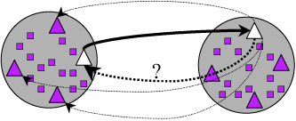
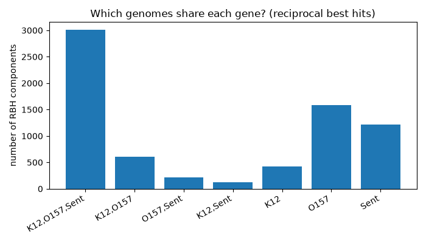
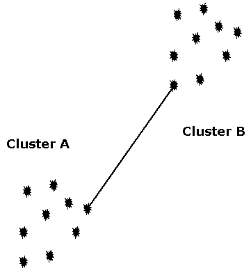
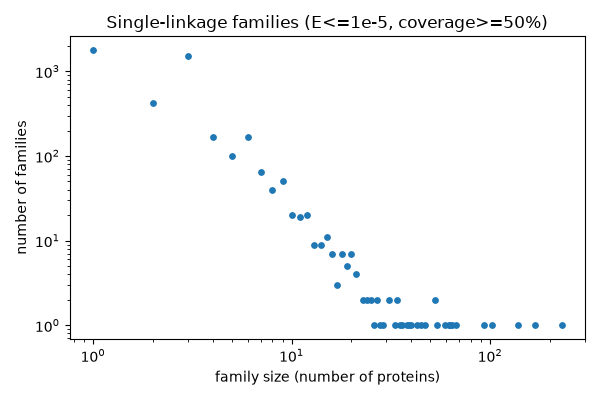
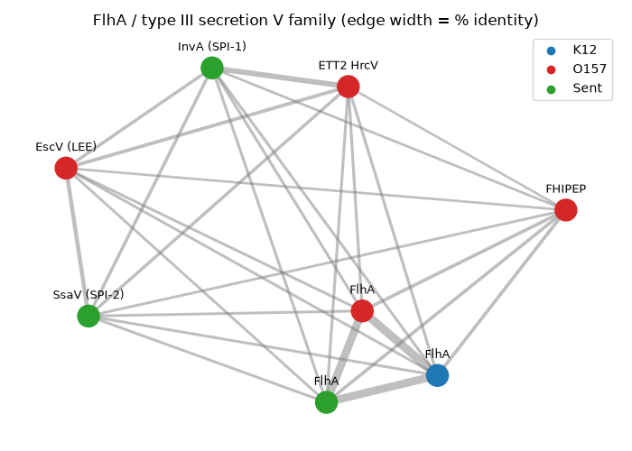

# Workshop: Finding orthologs and gene networks from BLAST

In this workshop we take three bacterial proteomes, compare them with BLAST, and use Python to answer some biological questions: which genes are shared, which belong to families, and which are unique to one genome. We will build the answer step by step: first from a single BLAST table, then with *reciprocal best hits*, and finally by treating the BLAST results as a **network** (a graph) with the [networkx](https://networkx.org/) library.

Background for this workshop:

- [Orthology](Orthology) lecture: orthologs vs paralogs, reciprocal best hits (BRH) and single-linkage clustering.
- [Basics and BLAST](Basic_Bioinformatics) lecture, especially the section on BLAST output formats (`-outfmt 6`).

You should already be comfortable with Python lists, dictionaries, loops, functions, reading files (including `.gz` files) and making a basic plot with matplotlib.

## 1. The question

*Escherichia coli* K-12 is the harmless lab strain. *E. coli* O157:H7 is a food-borne pathogen that causes bloody diarrhea and kidney failure (hemolytic uremic syndrome). *Salmonella enterica* is a related genus (it split from *E. coli* roughly 100 million years ago) that is also a pathogen.

We want to know:

1. Which genes are found in all three genomes - the shared **core genome**?
2. Which genes belong to **gene families** (several related copies within and between genomes)?
3. Which genes are **unique** to one genome? In particular, can we find the genes that make O157:H7 a pathogen - e.g. **Shiga toxin** (*stx*), the **LEE** pathogenicity island (intimin *eae*, *tir*, *esp* genes and a type III secretion system) and the plasmid **hemolysin**?

Two important words (see the [Orthology](Orthology) lecture):

- **Orthologs** are genes in different species that descend from one gene in their common ancestor (they were separated by *speciation*).
- **Paralogs** are genes that descend from a *duplication* - usually copies in the same genome.

## 2. The data

We will use the annotated protein sets of the three genomes. Make a folder for the workshop and download them.

```bash
mkdir -p networks
cd networks
curl -LO https://github.com/biodataprog/GEN220_data/raw/main/genome/E_coli_K12.pep.gz
curl -LO https://github.com/biodataprog/GEN220_data/raw/main/genome/E_coli_O157_H7.pep.gz
curl -LO https://github.com/biodataprog/GEN220_data/raw/main/genome/S_enterica.pep.gz
```

Always look at your data first. What do the headers look like, and how many proteins are in each file?

```bash
for f in *.pep.gz
do
  echo "== $f"
  zcat $f | grep '>' | head -2
  zcat $f | grep -c '>'
done
```

(On a Mac use `gzip -dc` instead of `zcat`.)

```text
== E_coli_K12.pep.gz
>gi|388476124|ref|YP_488307.1| thr operon leader peptide [Escherichia coli str. K-12 substr. W3110]
>gi|388476125|ref|YP_488308.1| fused aspartokinase I and homoserine dehydrogenase I [Escherichia coli str. K-12 substr. W3110]
4213
== E_coli_O157_H7.pep.gz
>gi|209395592|ref|YP_002268403.1| hemolysin-activating lysine-acyltransferase HlyC [Escherichia coli O157:H7 str. EC4115]
>gi|209395598|ref|YP_002268404.1| RTX C- domain protein [Escherichia coli O157:H7 str. EC4115]
5477
== S_enterica.pep.gz
>gi|525826476|ref|YP_008248866.1| hydrogenase 1 b-type cytochrome subunit [Salmonella enterica subsp. enterica serovar Heidelberg str. CFSAN002069]
>gi|525826477|ref|YP_008248867.1| hydrogenase [Salmonella enterica subsp. enterica serovar Heidelberg str. CFSAN002069]
4603
```

Things to notice:

- The three strains are *E. coli* K-12 substr. W3110 (**4,213** proteins), *E. coli* O157:H7 str. EC4115 (**5,477** proteins - about 1,250 more than K-12!) and *S. enterica* serovar Heidelberg str. CFSAN002069 (**4,603** proteins). The O157 and Salmonella files include the proteins encoded on their plasmids.
- The ID (everything up to the first space) is an old NCBI style ID: `gi|388476124|ref|YP_488307.1|`. The useful part is the RefSeq protein accession `YP_488307.1`, the 4th field when we split on `|`. BLAST will report the full ID, so our Python scripts will shorten it.
- After the ID comes a description (the gene product name) and the organism in `[...]`. We will use the descriptions to find out *what* the unique genes are.

BLAST needs uncompressed FASTA files:

```bash
gunzip -k *.pep.gz       # -k keeps the .gz files too
ls
```

## 3. Running BLAST

Make a protein BLAST database for each proteome:

```bash
module load ncbi-blast
for name in E_coli_K12 E_coli_O157_H7 S_enterica
do
  makeblastdb -in $name.pep -dbtype prot
done
```

```text
...
Adding sequences from FASTA; added 4213 sequences in 0.0559342 seconds.
...
```

To find reciprocal best hits we need searches **in both directions** for each pair of genomes: K-12 vs O157 *and* O157 vs K-12, and so on. Three genomes give 3 x 2 = **6 directional searches**. A double loop that skips a genome against itself does this:

```bash
for A in E_coli_K12 E_coli_O157_H7 S_enterica
do
  for B in E_coli_K12 E_coli_O157_H7 S_enterica
  do
    if [ $A != $B ]; then
      blastp -query $A.pep -db $B.pep -outfmt 6 -evalue 1e-5 \
        -num_threads 4 -out $A-vs-$B.BLASTP.tab
    fi
  done
done
```

For the gene family part (section 6) we will also want each genome searched **against itself** (to find paralogs). That is 3 more searches; the easiest is to remove the `if` so all 9 combinations run. On the cluster, put it in a job script - here it is with all 9:

```bash
#!/bin/bash -l
#SBATCH -p short -N 1 -n 1 -c 8 --mem 8G --time 2:00:00
#SBATCH -J blast3
#SBATCH -o logs/%x.%j.log

module load ncbi-blast

set -euo pipefail
CPU=${SLURM_CPUS_PER_TASK:-1}   # the -c value above; 1 if not run by SLURM
GENOMES="E_coli_K12 E_coli_O157_H7 S_enterica"

for name in $GENOMES
do
  if [ ! -f $name.pep.pin ]; then
    makeblastdb -in $name.pep -dbtype prot
  fi
done

# all 9 searches: A vs B, B vs A for each pair, plus each genome vs itself
for A in $GENOMES
do
  for B in $GENOMES
  do
    OUT=$A-vs-$B.BLASTP.tab
    if [ ! -s $OUT ]; then
      echo "running $A vs $B"
      time blastp -query $A.pep -db $B.pep -outfmt 6 -evalue 1e-5 \
        -num_threads $CPU -out $OUT
    fi
  done
done
```

Save it as `run_blast.sh`, make the log folder with `mkdir -p logs`, and submit it with `sbatch run_blast.sh`; check on it with `squeue -u $USER`. The `if [ ! -s $OUT ]` test skips searches that already finished, so if the job runs out of time you can just submit it again.

**How long does it take?** On a laptop (Apple M3, BLAST+ 2.17, `-num_threads 4`) each search took **15-40 seconds**, and all 9 took **3-4 minutes** in total (two separate runs). The cluster should be similar; the job may wait in the queue longer than it runs. Bacterial proteomes are small - the same all-vs-all approach for large eukaryotic genomes (20,000-40,000 proteins each) takes hours to days, which is why tools like DIAMOND exist.

The result is 9 tables in the 12-column `-outfmt 6` format:

```bash
wc -l *.BLASTP.tab
head -3 E_coli_K12-vs-E_coli_O157_H7.BLASTP.tab
```

```text
   21909 E_coli_K12-vs-E_coli_K12.BLASTP.tab
   21583 E_coli_K12-vs-E_coli_O157_H7.BLASTP.tab
   19213 E_coli_K12-vs-S_enterica.BLASTP.tab
   21679 E_coli_O157_H7-vs-E_coli_K12.BLASTP.tab
   28914 E_coli_O157_H7-vs-E_coli_O157_H7.BLASTP.tab
   20210 E_coli_O157_H7-vs-S_enterica.BLASTP.tab
   19335 S_enterica-vs-E_coli_K12.BLASTP.tab
   20205 S_enterica-vs-E_coli_O157_H7.BLASTP.tab
   20374 S_enterica-vs-S_enterica.BLASTP.tab
  193422 total
```

```text
gi|388476125|ref|YP_488308.1|	gi|209398223|ref|YP_002268610.1|	99.633	818	3	0	3	820	1	818	0.0	1675
gi|388476125|ref|YP_488308.1|	gi|209399480|ref|YP_002273462.1|	30.694	821	525	17	5	812	16	805	1.24e-107	346
gi|388476125|ref|YP_488308.1|	gi|209399821|ref|YP_002273543.1|	29.936	471	289	10	3	460	6	448	1.34e-43	161
```

Read these three lines: the K-12 protein `YP_488308.1` (fused aspartokinase I / homoserine dehydrogenase I, *thrA*) is 99.6% identical over 818 residues to one O157 protein (bit score 1675) - surely its ortholog. It also hits two more O157 proteins at about 30% identity: these are *paralogs* (the related aspartokinase II and III genes, *metL* and *lysC*), which are also present in K-12 itself. The first line is the best hit; we will use that idea next.

## 4. Python part 1: best hits and reciprocal best hits

### Best hit per query

For each query we want its single best hit. BLAST lists hits best-first, so the first line for each query is usually the best, but to be safe we compare bit scores (column 12) and keep the highest. A dictionary `query -> (best subject, bitscore)` is perfect for this.

### Reciprocal best hits (RBH)

Gene *a* in genome A and gene *b* in genome B are **reciprocal best hits** if *b* is the best hit of *a* when searching genome B, **and** *a* is the best hit of *b* when searching genome A.



Why use RBH? A one-way best hit always exists if there is any similar gene, even when the true ortholog was lost. Requiring the relationship to hold **in both directions** removes many of these false pairs. RBH is simple, fast, and a good first estimate of 1:1 orthologs.

Save this as `rbh.py`:

```python
#!/usr/bin/env python3
"""Find reciprocal best hits (RBH) between two genomes.

usage: python rbh.py A-vs-B.BLASTP.tab B-vs-A.BLASTP.tab > A_B.rbh.tsv
"""
import sys


def short_id(blast_id):
    """gi|388476124|ref|YP_488307.1| -> YP_488307.1"""
    parts = blast_id.split("|")
    if len(parts) >= 4:
        return parts[3]
    return blast_id


def best_hits(blast_file):
    """Return a dict: query -> (best subject, bitscore)."""
    best = {}
    with open(blast_file) as fh:
        for line in fh:
            row = line.rstrip("\n").split("\t")
            query = short_id(row[0])
            subject = short_id(row[1])
            bitscore = float(row[11])
            # keep this hit if it is the first one we have seen for this
            # query, or if it scores higher than the one we kept before
            if query not in best or bitscore > best[query][1]:
                best[query] = (subject, bitscore)
    return best


if len(sys.argv) != 3:
    sys.exit("usage: python rbh.py A-vs-B.BLASTP.tab B-vs-A.BLASTP.tab")

a_to_b = best_hits(sys.argv[1])
b_to_a = best_hits(sys.argv[2])

rbh_count = 0
for a_gene, (b_gene, bits) in a_to_b.items():
    # is the best hit of b_gene (in the other direction) our a_gene?
    if b_gene in b_to_a and b_to_a[b_gene][0] == a_gene:
        print(a_gene, b_gene, bits, sep="\t")
        rbh_count += 1

# summary goes to STDERR so it does not end up in the output file
print(f"{sys.argv[1]}: {len(a_to_b)} queries have a hit", file=sys.stderr)
print(f"{sys.argv[2]}: {len(b_to_a)} queries have a hit", file=sys.stderr)
print(f"reciprocal best hits: {rbh_count}", file=sys.stderr)
```

Run it for the three pairs of genomes:

```bash
python rbh.py E_coli_K12-vs-E_coli_O157_H7.BLASTP.tab \
    E_coli_O157_H7-vs-E_coli_K12.BLASTP.tab > K12_O157.rbh.tsv
python rbh.py E_coli_K12-vs-S_enterica.BLASTP.tab \
    S_enterica-vs-E_coli_K12.BLASTP.tab > K12_Sent.rbh.tsv
python rbh.py E_coli_O157_H7-vs-S_enterica.BLASTP.tab \
    S_enterica-vs-E_coli_O157_H7.BLASTP.tab > O157_Sent.rbh.tsv
head -5 K12_O157.rbh.tsv
```

```text
E_coli_K12-vs-E_coli_O157_H7.BLASTP.tab: 3913 queries have a hit
E_coli_O157_H7-vs-E_coli_K12.BLASTP.tab: 4139 queries have a hit
reciprocal best hits: 3654
E_coli_K12-vs-S_enterica.BLASTP.tab: 3635 queries have a hit
S_enterica-vs-E_coli_K12.BLASTP.tab: 3706 queries have a hit
reciprocal best hits: 3163
E_coli_O157_H7-vs-S_enterica.BLASTP.tab: 4043 queries have a hit
S_enterica-vs-E_coli_O157_H7.BLASTP.tab: 3796 queries have a hit
reciprocal best hits: 3248
```

```text
YP_488308.1	YP_002268610.1	1675.0
YP_488309.1	YP_002268611.1	639.0
YP_488310.1	YP_002268612.1	880.0
YP_488311.1	YP_002268613.1	190.0
YP_488312.1	YP_002268614.1	525.0
```

| Genome pair | RBH pairs |
| :--- | ---: |
| K-12 - O157:H7 | 3,654 |
| K-12 - *S. enterica* | 3,163 |
| O157:H7 - *S. enterica* | 3,248 |

As expected, the two *E. coli* strains share more RBH pairs with each other than either does with *Salmonella*. Notice also that 3,913 K-12 proteins had *some* hit in O157, but only 3,654 of those are reciprocal: for about 260 K-12 proteins the best hit in O157 "prefers" a different K-12 protein.

### The limits of RBH

RBH is a heuristic, not a definition of orthology. It fails in predictable ways:

- **Paralogs / duplications.** RBH can only ever give **one** partner per gene. If O157 has two copies of a gene that K-12 has once (e.g. a gene on a repeated prophage), only one copy gets an RBH; the other is left with nothing, even though it is a perfectly good homolog.
- **Gene loss.** If the true ortholog was lost in genome B, the best hit may be a paralog. If that paralog's own ortholog was also lost in A, the pair can even be reciprocal - a false ortholog.
- **Gene fusion and fission.** When one protein in A is two proteins in B (or a multi-domain protein), each part can only give one best hit, so the relationship is missed or half-captured.
- **Close ties.** Two nearly identical copies have almost the same bit score; which one is "best" is decided by tiny differences (or the order in the file).
- **Short or fast-evolving proteins** (small peptides, some secreted proteins) may give no significant hit at `-evalue 1e-5` at all.

The [Orthology](Orthology) lecture shows how phylogenetic trees and tools like OrthoFinder handle these cases better.

## 5. Python part 2: an RBH network with networkx

With three genomes it gets awkward to track RBH pairs in dictionaries. A **graph** (network) is a better way to think about it:

- each protein is a **node**, with attributes such as which genome it came from;
- each RBH pair is an **edge** between two nodes.

Proteins that are linked together, directly or through other proteins, form a **connected component**. If the K-12, O157 and *Salmonella* versions of a gene are all RBH of each other, they form a **triangle** - a component of exactly three proteins, one from each genome. That is our **1:1:1 ortholog** (the core genome). Proteins with no edges at all are genome-specific (at least as far as RBH can tell).

Install networkx (and matplotlib if you don't have it). On the cluster or your own computer, a virtual environment keeps things tidy:

```bash
python3 -m venv ~/venvs/gen220
source ~/venvs/gen220/bin/activate
pip install networkx matplotlib scipy
```

(`scipy` is needed by one of the layout functions we use in section 6.)

The networkx basics we need:

```python
import networkx as nx
G = nx.Graph()                            # an empty, undirected graph
G.add_node("YP_488308.1", genome="K12")   # a node with an attribute
G.add_edge("YP_488308.1", "YP_002268610.1", bitscore=1675)  # adds both nodes if needed
G.nodes["YP_488308.1"]["genome"]          # -> 'K12'
G.degree("YP_488308.1")                   # number of edges -> 1
for comp in nx.connected_components(G):   # each component is a set of nodes
    print(len(comp), comp)
```

Save this as `rbh_network.py` (it reads the `.pep.gz` files for the descriptions and the three `.rbh.tsv` files from part 1):

```python
#!/usr/bin/env python3
"""Build an ortholog network from reciprocal best hits of 3 genomes."""
import gzip
import networkx as nx

genomes = {"K12": "E_coli_K12.pep.gz",
           "O157": "E_coli_O157_H7.pep.gz",
           "Sent": "S_enterica.pep.gz"}
rbh_files = ["K12_O157.rbh.tsv", "K12_Sent.rbh.tsv", "O157_Sent.rbh.tsv"]


def short_id(blast_id):
    """gi|388476124|ref|YP_488307.1| -> YP_488307.1"""
    parts = blast_id.split("|")
    if len(parts) >= 4:
        return parts[3]
    return blast_id


def read_headers(fasta_gz):
    """Return a dict: protein id -> description (from the FASTA header)."""
    desc = {}
    with gzip.open(fasta_gz, "rt") as fh:
        for line in fh:
            if line.startswith(">"):
                # >gi|209395592|ref|YP_002268403.1| hemolysin-activating ... [E. coli ...]
                full_id, text = line[1:].rstrip().split(" ", 1)
                text = text.split(" [")[0]      # drop the [organism] part
                desc[short_id(full_id)] = text
    return desc


G = nx.Graph()

# 1. every protein is a node, even if it has no RBH
for genome, fasta in genomes.items():
    for protein, text in read_headers(fasta).items():
        G.add_node(protein, genome=genome, desc=text)

# 2. every RBH pair is an edge
for rbh_file in rbh_files:
    with open(rbh_file) as fh:
        for line in fh:
            a, b, bits = line.rstrip("\n").split("\t")
            G.add_edge(a, b, bitscore=float(bits))

print(f"nodes (proteins): {G.number_of_nodes()}")
print(f"edges (RBH pairs): {G.number_of_edges()}")

# 3. connected components = groups of proteins linked by RBH
patterns = {}          # e.g. "K12,O157,Sent" -> number of components
core_triangles = 0
core_paths = 0
for comp in nx.connected_components(G):
    members = sorted(G.nodes[p]["genome"] for p in comp)
    pattern = ",".join(members)
    patterns[pattern] = patterns.get(pattern, 0) + 1
    if members == ["K12", "O157", "Sent"]:
        sub = G.subgraph(comp)
        if sub.number_of_edges() == 3:
            core_triangles += 1     # all three pairs are RBH
        else:
            core_paths += 1         # only two of the three pairs are RBH

print("\ncomponent composition (genomes of the members): count")
for pattern, count in sorted(patterns.items(), key=lambda x: -x[1]):
    print(f"  {pattern:30s} {count}")

print(f"\n1:1:1 orthologs (one protein per genome): {core_triangles + core_paths}")
print(f"  closed triangles (3 RBH edges): {core_triangles}")
print(f"  open paths       (2 RBH edges): {core_paths}")

# 4. proteins with no RBH at all
for genome in genomes:
    alone = [p for p in G if G.nodes[p]["genome"] == genome and G.degree(p) == 0]
    print(f"{genome}: {len(alone)} proteins have no RBH partner")

# 5. write the O157 proteins with no RBH partner to a file
with open("O157_no_RBH.tsv", "w") as out:
    for p in sorted(G):
        if G.nodes[p]["genome"] == "O157" and G.degree(p) == 0:
            out.write(f"{p}\t{G.nodes[p]['desc']}\n")

# 6. what kinds of proteins are O157-specific? count some words
alone_o157 = [p for p in G if G.nodes[p]["genome"] == "O157" and G.degree(p) == 0]
print(f"\nwords in the descriptions of the {len(alone_o157)} O157 proteins with no RBH:")
for word in ["hypothetical", "phage", "transpos", "IS629", "tail"]:
    n = 0
    for p in alone_o157:
        if word.lower() in G.nodes[p]["desc"].lower():
            n += 1
    print(f"  {word:12s} {n}")

# 7. look up some famous O157 virulence genes by their description
#    and report which kind of component each one ended up in
virulence_words = ["shiga", "intimin", "Tir", "Esp", "LEE", "RTX", "hemolysin", "HlyC",
                   "type III secretion"]
print("\nO157 virulence-related proteins and the genomes in their RBH component:")
for p in sorted(G):
    if G.nodes[p]["genome"] != "O157":
        continue
    desc = G.nodes[p]["desc"]
    if any(word in desc for word in virulence_words):
        comp = nx.node_connected_component(G, p)
        genomes_in = ",".join(sorted(set(G.nodes[q]["genome"] for q in comp)))
        print(f"  {p:16s} {genomes_in:15s} {desc}")

# 8. bar plot of the component types (only the simple 1-, 2- and 3-member ones)
import matplotlib
matplotlib.use("Agg")
import matplotlib.pyplot as plt

order = ["K12,O157,Sent", "K12,O157", "O157,Sent", "K12,Sent",
         "K12", "O157", "Sent"]
plt.figure(figsize=(7, 4))
plt.bar(order, [patterns.get(x, 0) for x in order], color="tab:blue")
plt.ylabel("number of RBH components")
plt.xticks(rotation=30, ha="right")
plt.title("Which genomes share each gene? (reciprocal best hits)")
plt.tight_layout()
plt.savefig("rbh_patterns.png", dpi=100)
print("\nwrote rbh_patterns.png")
```

```bash
python rbh_network.py
```

```text
nodes (proteins): 14293
edges (RBH pairs): 10065

component composition (genomes of the members): count
  K12,O157,Sent                  3006
  O157                           1590
  Sent                           1219
  K12,O157                       605
  K12                            422
  O157,Sent                      210
  K12,Sent                       122
  K12,O157,O157,Sent             22
  K12,K12,O157,Sent              14
  K12,O157,Sent,Sent             4
  K12,K12,O157,O157,Sent         2

1:1:1 orthologs (one protein per genome): 3006
  closed triangles (3 RBH edges): 2988
  open paths       (2 RBH edges): 18
K12: 422 proteins have no RBH partner
O157: 1590 proteins have no RBH partner
Sent: 1219 proteins have no RBH partner

words in the descriptions of the 1590 O157 proteins with no RBH:
  hypothetical 869
  phage        176
  transpos     71
  IS629        39
  tail         129

O157 virulence-related proteins and the genomes in their RBH component:
  YP_002268403.1   O157            hemolysin-activating lysine-acyltransferase HlyC
  YP_002268404.1   O157            RTX C- domain protein
  YP_002268856.1   O157            type III secretion protein, FHIPEP family
  YP_002269110.1   K12,O157,Sent   hemolysin expression-modulating protein
  YP_002269439.1   O157            non-LEE-encoded effector NleB
  YP_002269440.1   O157            non-LEE encoded type III effector C
  YP_002269441.1   O157            non-LEE-encoded effector NleH
  YP_002269765.1   O157            hemolysin activator-like protein
  YP_002270122.1   K12,O157        hemolysin E
  YP_002270243.1   O157            non-LEE-encoded effector NleH
  YP_002270247.1   O157            EspM3 protein
  YP_002270547.1   O157            non-LEE-encoded effector NleG
  YP_002270603.1   O157            non-LEE-encoded effector NleG
  YP_002271088.1   O157            non-LEE-encoded effector EspJ
  YP_002271220.1   O157            shigatoxin 2, subunit B
  YP_002271221.1   O157            shiga toxin subunit A
  YP_002271796.1   O157            shiga toxin 2 B subunit
  YP_002271797.1   O157            shiga toxin subunit A
  YP_002272093.1   O157            EspM3 protein
  YP_002272324.1   O157,Sent       type III secretion apparatus lipoprotein EprK
  YP_002272325.1   O157,Sent       type III secretion apparatus protein EprJ
  YP_002272326.1   O157,Sent       type III secretion apparatus needle protein
  YP_002272330.1   O157,Sent       type III secretion apparatus protein EpaQ
  YP_002272332.1   O157,Sent       type III secretion apparatus protein
  YP_002272335.1   O157,Sent       type III secretion protein, HrcV family
  YP_002272337.1   O157,Sent       type III secretion outer membrane pore, YscC/HrcC family
  YP_002272374.1   K12,O157,Sent   hemolysin III family channel protein
  YP_002273149.1   O157            protein EspF
  YP_002273151.1   O157,Sent       type III secretion apparatus needle protein
  YP_002273153.1   O157            protein EspB
  YP_002273154.1   O157            protein EspD
  YP_002273155.1   O157,Sent       protein EspA
  YP_002273157.1   O157,Sent       type III secretion apparatus protein, YscD/HrpQ family
  YP_002273158.1   O157            intimin C-type lectin domain-containing protein
  YP_002273159.1   O157            Tir chaperone
  YP_002273160.1   O157            Tir
  YP_002273166.1   O157,Sent       type III secretion apparatus H+-transporting two-sector ATPase
  YP_002273167.1   O157,Sent       type III secretion protein, HrcV family
  YP_002273170.1   O157,Sent       type III secretion apparatus lipoprotein, YscJ/HrcJ family
  YP_002273173.1   O157,Sent       type III secretion outer membrane pore, YscC/HrcC family
  YP_002273177.1   O157,Sent       type III secretion apparatus protein SpaR/YscT/HrcT
  YP_002273179.1   O157,Sent       type III secretion system protein
  YP_002273183.1   O157            type III secretion system protein, YseE family
  YP_002273185.1   O157            protein EspG
  YP_002273584.1   O157            non-LEE-encoded effector NleG

wrote rbh_patterns.png
```



What did we find?

- **Core genome: 3,006 1:1:1 orthologs** are found in all three genomes (2,988 of them are closed triangles; in 18 only two of the three pairs are reciprocal). That is 71% of the K-12 proteins but only 55% of the O157 proteins.
- **605** genes are shared *only* by the two *E. coli* strains - candidate "*E. coli* genes" - and a few hundred are shared by each *E. coli* with *Salmonella* but not the other *E. coli*.
- **Genome-specific:** 1,590 O157 proteins have no RBH partner, compared with 422 for K-12 and 1,219 for *Salmonella*. O157 has much more unique DNA than K-12.
- A few dozen components have 4 or 5 members (e.g. `K12,O157,O157,Sent`): a chain of RBH pairs that links two copies of a gene. These are the paralog problems from section 4 showing up in the network.

**What are the O157-specific genes?** Look at `O157_no_RBH.tsv`. More than half (869) are "hypothetical protein" - genes with no known function. Many others are **mobile DNA**: phage genes (176 mention "phage", 129 "tail" as in phage tail fibers) and insertion sequence (IS) transposases. O157:H7 carries many prophages (the well-studied O157 strain Sakai has 18), and much of its extra DNA is in them.

**Did the virulence genes show up?** Yes, and clearly:

- **Shiga toxin**: two copies of both the A and B subunits (`shiga toxin subunit A`, `shigatoxin 2, subunit B`) - this strain carries two Stx2-type toxin genes, both on prophages. None of them has an RBH partner in K-12 or *Salmonella*.
- **LEE island effectors and adhesins**: intimin (`intimin C-type lectin domain-containing protein`, the *eae* gene), its receptor **Tir** and the Tir chaperone, and the secreted proteins EspB, EspD, EspF, EspG are all O157-only.
- **Non-LEE effectors** (NleB, NleC, NleG, NleH, EspJ, ...) injected into host cells are O157-only.
- **Plasmid hemolysin**: `HlyC` and the `RTX C- domain protein` (most likely the hemolysin toxin HlyA itself) from the pO157 plasmid are O157-only.

But look carefully at the **type III secretion system** (T3SS) - the molecular syringe that injects the effectors. Its structural parts (the needle, the pore `YscC/HrcC`, the ATPase, `HrcV`) *do* have RBH partners - in **Salmonella**, not K-12. *Salmonella* has its own T3SSs (on its pathogenicity islands SPI-1 and SPI-2), and the syringe machinery is conserved even though the effectors it injects are completely different. Even EspA (the filament of the O157 syringe) has an RBH partner in Salmonella (SseB). This is a nice biological result: the pathogens share a secretion machine that the lab strain lacks.

And a warning: the simple word search also caught "hemolysin" proteins that are in all three genomes (`hemolysin expression-modulating protein`, `hemolysin III family`) and `hemolysin E`, which K-12 also has. A name match is not evidence of virulence - you have to read the list.

## 6. Python part 3: gene families by single-linkage clustering

RBH only gives 1:1 pairs. To find **gene families** - all the copies of related genes, within and between genomes - we use *every* significant hit, not only the best one, and put all connected proteins in the same cluster. This is **single-linkage clustering**: if A is linked to B and B is linked to C, then A, B and C are in one cluster, even if A and C are not similar to each other.



In graph terms: add an edge for every hit that passes a cutoff, then each **connected component is a family**. networkx does the clustering for us with `nx.connected_components()`.

**Do we need the self searches?** Paralogs in the same genome (e.g. the many ABC transporters of K-12) are only linked *directly* by searching a genome against itself. Without self searches, two paralogs can still end up in the same family if they both hit a protein in another genome, but a family that exists in only one genome (like the Shiga toxin copies in O157) would never be linked. The three extra searches take only a minute, so we use all 9 tables. (The table below shows what happens if we leave them out.)

**Coverage.** Many proteins are made of several domains. A transcription regulator with a common DNA-binding domain can hit hundreds of unrelated regulators through that domain alone, and single linkage will then chain them into one giant cluster. A common fix is to require the alignment to cover a good part of the proteins. `-outfmt 6` does not report protein lengths, so we get them from the FASTA files and compute coverage = aligned length / protein length for the *shorter* of the two proteins' alignments.

Save this as `families.py`:

```python
#!/usr/bin/env python3
"""Gene families by single-linkage clustering of all-vs-all BLASTP hits."""
import gzip
import networkx as nx

genomes = {"K12": "E_coli_K12",
           "O157": "E_coli_O157_H7",
           "Sent": "S_enterica"}


def short_id(blast_id):
    """gi|388476124|ref|YP_488307.1| -> YP_488307.1"""
    parts = blast_id.split("|")
    if len(parts) >= 4:
        return parts[3]
    return blast_id


def read_fasta_info(fasta_gz):
    """Return two dicts: protein id -> description, protein id -> length."""
    desc = {}
    length = {}
    protein = None
    with gzip.open(fasta_gz, "rt") as fh:
        for line in fh:
            line = line.rstrip()
            if line.startswith(">"):
                full_id, text = line[1:].split(" ", 1)
                protein = short_id(full_id)
                desc[protein] = text.split(" [")[0]
                length[protein] = 0
            else:
                length[protein] += len(line)
    return desc, length


# --- read protein information -------------------------------------------
genome_of = {}
desc = {}
length = {}
for label, prefix in genomes.items():
    d, l = read_fasta_info(prefix + ".pep.gz")
    desc.update(d)
    length.update(l)
    for p in d:
        genome_of[p] = label
print(f"{len(genome_of)} proteins in {len(genomes)} genomes")

# --- read all 9 BLAST tables (including each genome against itself) -----
hits = []
for a in genomes.values():
    for b in genomes.values():
        with open(f"{a}-vs-{b}.BLASTP.tab") as fh:
            for line in fh:
                row = line.split("\t")
                q = short_id(row[0])
                s = short_id(row[1])
                if q == s:
                    continue            # a protein hitting itself
                pident = float(row[2])
                aln_q = int(row[7]) - int(row[6]) + 1
                aln_s = abs(int(row[9]) - int(row[8])) + 1
                # fraction of the SHORTER of the two proteins covered
                cov = min(aln_q / length[q], aln_s / length[s])
                evalue = float(row[10])
                bits = float(row[11])
                self_search = (a == b)
                hits.append((q, s, pident, cov, evalue, bits, self_search))
print(f"{len(hits)} BLAST hits read (self hits removed)")


def build_graph(max_evalue, min_pident=0, min_cov=0, use_self=True):
    """Graph with one node per protein and an edge for every good hit."""
    G = nx.Graph()
    for p in genome_of:
        G.add_node(p, genome=genome_of[p], desc=desc[p])
    for q, s, pident, cov, evalue, bits, self_search in hits:
        if self_search and not use_self:
            continue
        if evalue <= max_evalue and pident >= min_pident and cov >= min_cov:
            # the same pair shows up in both directions (and sometimes as
            # several HSPs); keep the best bit score on the edge
            if not G.has_edge(q, s) or G[q][s]["bitscore"] < bits:
                G.add_edge(q, s, bitscore=bits, pident=pident, evalue=evalue)
    return G


def summarize(G):
    sizes = [len(c) for c in nx.connected_components(G)]
    families = [n for n in sizes if n > 1]
    return (G.number_of_edges(), len(families), sum(families),
            sizes.count(1), max(sizes))


# --- how do the thresholds change the clusters? ---------------------------
settings = [  # (label, evalue, min %identity, min coverage, use self hits)
    ("E<=1e-5",                    1e-5,   0, 0.0, True),
    ("E<=1e-5, no self searches",  1e-5,   0, 0.0, False),
    ("E<=1e-20",                   1e-20,  0, 0.0, True),
    ("E<=1e-50",                   1e-50,  0, 0.0, True),
    ("E<=1e-5, cov>=50%",          1e-5,   0, 0.5, True),
    ("E<=1e-5, id>=40%",           1e-5,  40, 0.0, True),
    ("E<=1e-5, id>=40%, cov>=50%", 1e-5,  40, 0.5, True),
    ("E<=1e-5, id>=80%, cov>=80%", 1e-5,  80, 0.8, True),
]
print("\n| Cutoff | Edges | Families (size>=2) | Proteins in families |"
      " Singletons | Largest family |")
print("| :--- | ---: | ---: | ---: | ---: | ---: |")
for label, ev, pid, cov, use_self in settings:
    edges, nfam, nprot, single, largest = summarize(
        build_graph(ev, pid, cov, use_self))
    print(f"| {label} | {edges} | {nfam} | {nprot} | {single} | {largest} |")

# --- pick one definition of a family and look at it closely ---------------
G = build_graph(1e-5, min_cov=0.5)
families = sorted(nx.connected_components(G), key=len, reverse=True)
print(f"\nUsing E<=1e-5 and coverage>=50%: {len(families)} clusters "
      f"(including singletons)")

# a gene count table like OrthoFinder's Orthogroups.GeneCount.tsv
patterns = {}
with open("families.tsv", "w") as out:
    out.write("family\tK12\tO157\tSent\tsize\texample_description\n")
    for i, fam in enumerate(families, start=1):
        name = f"FAM{i:05d}"
        counts = {g: 0 for g in genomes}
        for p in fam:
            counts[genome_of[p]] += 1
            G.nodes[p]["family"] = name
        example = desc[sorted(fam)[0]]
        out.write(f"{name}\t{counts['K12']}\t{counts['O157']}\t{counts['Sent']}"
                  f"\t{len(fam)}\t{example}\n")
        # which genomes are present in this family?
        present = ",".join(g for g in genomes if counts[g] > 0)
        patterns[present] = patterns.get(present, 0) + 1

print("\ngenomes present in each cluster: count")
for present, count in sorted(patterns.items(), key=lambda x: -x[1]):
    print(f"  {present:15s} {count}")

print("\nthe 5 largest families:")
for fam in families[:5]:
    counts = {g: 0 for g in genomes}
    words = {}
    for p in sorted(fam):
        counts[genome_of[p]] += 1
        words[desc[p]] = words.get(desc[p], 0) + 1
    top = max(words, key=words.get)
    print(f"  size {len(fam):4d}  {counts}  most common: {top}")

# --- where did some O157 virulence genes end up? -------------------------
print("\nfamilies of some O157 virulence genes:")
for p in ["YP_002271221.1", "YP_002271220.1", "YP_002273158.1",
          "YP_002273160.1", "YP_002273155.1"]:
    fam = nx.node_connected_component(G, p)
    members = [f"{genome_of[q]}:{desc[q]}" for q in sorted(fam) if q != p]
    print(f"  {desc[p]} ({G.nodes[p]['family']}, size {len(fam)})")
    for m in members:
        print(f"      with {m}")

# --- save the graph (without singletons) for plotting and Cytoscape ------
big = G.subgraph([p for p in G if G.degree(p) > 0])
nx.write_graphml(big, "families.graphml")
print(f"\nwrote families.graphml: {big.number_of_nodes()} nodes, "
      f"{big.number_of_edges()} edges")
```

```bash
python families.py
```

```text
14293 proteins in 3 genomes
179129 BLAST hits read (self hits removed)

(the cutoff table - see below)

Using E<=1e-5 and coverage>=50%: 4496 clusters (including singletons)

genomes present in each cluster: count
  K12,O157,Sent   2109
  O157            900
  Sent            758
  K12             273
  K12,O157        261
  O157,Sent       133
  K12,Sent        62

the 5 largest families:
  size  229  {'K12': 77, 'O157': 83, 'Sent': 69}  most common: ABC transporter ATP-binding protein
  size  168  {'K12': 52, 'O157': 54, 'Sent': 62}  most common: transporter
  size  138  {'K12': 45, 'O157': 44, 'Sent': 49}  most common: DNA-binding transcriptional regulator
  size  102  {'K12': 33, 'O157': 35, 'Sent': 34}  most common: transcriptional regulator
  size   93  {'K12': 31, 'O157': 32, 'Sent': 30}  most common: sulfate/thiosulfate transporter subunit

families of some O157 virulence genes:
  shiga toxin subunit A (FAM02634, size 2)
      with O157:shiga toxin subunit A
  shigatoxin 2, subunit B (FAM02633, size 2)
      with O157:shiga toxin 2 B subunit
  intimin C-type lectin domain-containing protein (FAM03665, size 1)
  Tir (FAM03667, size 1)
  protein EspA (FAM02677, size 2)
      with Sent:pathogenicity island 2 effector protein SseB

wrote families.graphml: 12511 nodes, 54876 edges
```

The table printed by the script is already in Markdown format:

| Cutoff | Edges | Families (size>=2) | Proteins in families | Singletons | Largest family |
| :--- | ---: | ---: | ---: | ---: | ---: |
| E<=1e-5 | 83024 | 2437 | 12765 | 1528 | 576 |
| E<=1e-5, no self searches | 56795 | 2334 | 12328 | 1965 | 575 |
| E<=1e-20 | 40863 | 3033 | 12304 | 1989 | 232 |
| E<=1e-50 | 19373 | 3341 | 11214 | 3079 | 64 |
| E<=1e-5, cov>=50% | 54876 | 2714 | 12511 | 1782 | 229 |
| E<=1e-5, id>=40% | 19399 | 3476 | 12120 | 2173 | 152 |
| E<=1e-5, id>=40%, cov>=50% | 17167 | 3653 | 11858 | 2435 | 70 |
| E<=1e-5, id>=80%, cov>=80% | 10617 | 3810 | 10519 | 3774 | 20 |

How the cutoffs change the clusters:

- With a loose cutoff (E <= 1e-5, nothing else) single linkage builds one **giant family of 576 proteins** that lumps together transcription regulators, diguanylate cyclases and ABC transporters - clearly not one gene family. This is **chaining** through shared domains.
- Leaving out the self searches loses about 26,000 edges, but the families change less than you might expect (2,334 instead of 2,437) because most paralogs are also linked through a hit in another genome. The self searches mainly rescue families found in only one genome.
- A stricter E-value breaks the giant cluster up (576 -> 232 -> 64), but also loses real, older family members.
- Requiring **coverage >= 50%** breaks up much of the domain chaining (largest family 229) while keeping most proteins in families. Adding identity cutoffs makes the families smaller and tighter; at 80% identity and 80% coverage we are close to "the same gene in the two *E. coli*" and the largest family has only 20 members.

There is no single correct cutoff; it depends on the question. We use **E <= 1e-5 and coverage >= 50%** for the rest of this section.

With that definition there are 4,496 clusters (including 1,782 singletons). 2,109 families contain proteins from all three genomes and 900 are O157-only. Even at this cutoff the largest families are the big bacterial superfamilies: ABC transporter ATPases (229 proteins), MFS transporters (168), LysR-type regulators (138), response regulators (102). These really are families of paralogs that expanded long before these species split, and they are hard to split into orthologs with BLAST alone.

The virulence genes behave as expected: the two Shiga toxin A subunits form an O157-only family of two (as do the two B subunits), and intimin and Tir are singletons. Intimin does have BLAST hits to K-12 and Salmonella intimin/invasin-like adhesins, but those alignments cover less than half of the protein, so the coverage filter keeps it separate. EspA again groups with Salmonella SseB.

The file `families.tsv` is a gene count table, one row per family, like the `Orthogroups.GeneCount.tsv` file from OrthoFinder:

```bash
head -4 families.tsv
```

```text
family	K12	O157	Sent	size	example_description
FAM00001	77	83	69	229	type I secretion system ATPase family protein
FAM00002	52	54	62	168	major facilitator family transporter
FAM00003	45	44	49	138	transcriptional activator NhaR
```

### Plotting the families

The graph was saved as `families.graphml`. **GraphML** is an XML text format for networks that keeps the node and edge attributes; networkx can read it back in and so can Cytoscape. Save this as `plot_families.py`; it plots the size distribution and draws one small family:

```python
#!/usr/bin/env python3
"""Plot the family sizes and draw one family (run families.py first)."""
import networkx as nx
import matplotlib
matplotlib.use("Agg")           # write PNG files, no window needed
import matplotlib.pyplot as plt

# --- 1. family size distribution, from the families.tsv table -----------
size_counts = {}
with open("families.tsv") as fh:
    next(fh)                    # skip the header line
    for line in fh:
        size = int(line.split("\t")[4])
        size_counts[size] = size_counts.get(size, 0) + 1
sizes = sorted(size_counts)
print("size  number of families")
for s in sizes[:8]:
    print(f"{s:4d}  {size_counts[s]}")
print("...")

plt.figure(figsize=(6, 4))
plt.scatter(sizes, [size_counts[s] for s in sizes], s=15)
plt.xscale("log")
plt.yscale("log")
plt.xlabel("family size (number of proteins)")
plt.ylabel("number of families")
plt.title("Single-linkage families (E<=1e-5, coverage>=50%)")
plt.tight_layout()
plt.savefig("family_sizes.png", dpi=100)
print("wrote family_sizes.png")

# --- 2. draw one small family, read back from the GraphML file ----------
G = nx.read_graphml("families.graphml")
fam = nx.node_connected_component(G, "YP_002273167.1")   # O157 EscV
# copy the family into its own small graph, in sorted order so the
# drawing comes out the same every time we run the script
H = nx.Graph()
for p in sorted(fam):
    H.add_node(p, **G.nodes[p])
for a in sorted(fam):
    for b in sorted(G[a]):
        H.add_edge(a, b, **G[a][b])
print(f"\nfamily of YP_002273167.1: {H.number_of_nodes()} proteins, "
      f"{H.number_of_edges()} edges")
for p in sorted(H, key=lambda x: (H.nodes[x]["genome"], x)):
    print(f"  {H.nodes[p]['genome']:5s} {p:16s} {H.nodes[p]['desc']}")

colors = {"K12": "tab:blue", "O157": "tab:red", "Sent": "tab:green"}
# short names, typed in by hand after reading the descriptions above
names = {"YP_490141.1": "FlhA", "YP_002270963.1": "FlhA",
         "YP_008253182.1": "FlhA", "YP_002273167.1": "EscV (LEE)",
         "YP_002272335.1": "ETT2 HrcV", "YP_002268856.1": "FHIPEP",
         "YP_008252318.1": "InvA (SPI-1)", "YP_008249246.1": "SsaV (SPI-2)"}
# place similar proteins close together: distance = 100 / % identity
for a, b in H.edges():
    H[a][b]["distance"] = 100 / H[a][b]["pident"]
pos = nx.kamada_kawai_layout(H, weight="distance")
widths = [H[a][b]["pident"] / 15 for a, b in H.edges()]

plt.figure(figsize=(7, 5))
nx.draw_networkx_edges(H, pos, width=widths, edge_color="grey", alpha=0.5)
nx.draw_networkx_nodes(H, pos, node_size=300,
                       node_color=[colors[H.nodes[p]["genome"]] for p in H])
nx.draw_networkx_labels(H, pos, font_size=9, verticalalignment="bottom",
                        labels={p: names.get(p, p) + "\n" for p in H})
for g, c in colors.items():                  # a simple legend
    plt.scatter([], [], color=c, label=g)
plt.legend(loc="best")
plt.title("FlhA / type III secretion V family (edge width = % identity)")
plt.axis("off")
plt.tight_layout()
plt.savefig("family_FlhA.png", dpi=100)
print("wrote family_FlhA.png")

nx.write_graphml(H, "family_FlhA.graphml")
print("wrote family_FlhA.graphml")
```

```bash
python plot_families.py
```

```text
size  number of families
   1  1782
   2  428
   3  1536
   4  169
   5  99
   6  169
   7  65
   8  40
...
wrote family_sizes.png

family of YP_002273167.1: 8 proteins, 28 edges
  K12   YP_490141.1      flagellar export pore protein
  O157  YP_002268856.1   type III secretion protein, FHIPEP family
  O157  YP_002270963.1   flagellar biosynthesis protein FlhA
  O157  YP_002272335.1   type III secretion protein, HrcV family
  O157  YP_002273167.1   type III secretion protein, HrcV family
  Sent  YP_008249246.1   secretion system apparatus protein SsaV
  Sent  YP_008252318.1   type III secretion system protein InvA
  Sent  YP_008253182.1   flagellar biosynthesis protein FlhA
wrote family_FlhA.png
wrote family_FlhA.graphml
```



Most families are small, and a few are very large (note both axes are logarithmic). The spike at size **3** is the 1:1:1 orthologs (one protein per genome) and there is a smaller bump at size **6** (two copies in each genome, e.g. an old duplication before the species split). Size 1 is the singletons: proteins with no hit at this cutoff.



This family is a nice example of what BLAST networks can show. Every genome has **FlhA**, part of the export gate at the base of the bacterial **flagellum**; the three FlhA proteins are 95-99% identical (thick edges). The *pathogens* also have extra, more distant members (30-65% identity): EscV from the O157 LEE island, InvA from Salmonella SPI-1, SsaV from SPI-2, and an HrcV protein from ETT2, a second (mostly broken) T3SS of O157. The injectisome of a pathogen is an evolutionary relative of the flagellum, and the network shows the paralogs added by horizontal transfer of pathogenicity islands. InvA (SPI-1) and the O157 ETT2 protein are more similar to each other (64% identity) than to anything else: the ETT2 system is related to Salmonella SPI-1.

### Looking at the network in Cytoscape

[Cytoscape](https://cytoscape.org/) is a free desktop program for exploring networks. Download `families.graphml` or the small `family_FlhA.graphml` to your computer, then in Cytoscape choose **File > Import > Network from File** and select the file. Use the **Style** panel to color nodes by the `genome` column and set the edge width from `pident`; use **Select > Nodes > By column value** to find a protein by `desc`. The whole family graph (12,511 nodes, 54,876 edges) is large, so it may take a minute to lay out.

## 7. Exercises

1. **No RBH does not mean no homolog.** Of the 1,590 O157 proteins with no RBH partner, how many have *no BLAST hit at all* in K-12 or *Salmonella*, and how many have hits that just aren't reciprocal? (Hint: collect the set of O157 query IDs from `E_coli_O157_H7-vs-E_coli_K12.BLASTP.tab` and `E_coli_O157_H7-vs-S_enterica.BLASTP.tab`.) Look up intimin (`YP_002273158.1`) in those two files - what does it hit?
2. **The Salmonella side.** Modify `rbh_network.py` to write `Sent_no_RBH.tsv` and search it for Salmonella virulence genes: the SPI-1 invasion genes (*inv*, *spa*, *sip*), the SPI-2 genes (*ssa*, *sse*) and effectors (*sop*). Which have RBH partners in O157, and which are Salmonella-only?
3. **A better RBH.** Add a coverage filter to `rbh.py`: only accept a hit as a best hit if the alignment covers at least 50% of both proteins (you will need the protein lengths, as in `families.py`). How do the three RBH counts and the core genome size change?
4. **Gene family expansions.** Using `families.tsv`, find families with at least 3 more copies in O157 than in K-12. What kinds of genes are they? Make a scatter plot of the K-12 copy number vs the O157 copy number for all families.
5. **The core genome, two ways.** Compare the RBH core genome (the 3,006 1:1:1 triangles) with the families from `families.py` that have *exactly* one protein from each genome. Are they the same proteins? Where does a 1:1:1 RBH triangle end up if it is part of a larger family?
6. **Do it properly with OrthoFinder.** The [Orthology](Orthology) lecture shows how to run [OrthoFinder](https://davidemms.github.io/), which uses all-vs-all similarity searches, a better clustering method (MCL instead of single linkage), and gene trees to separate orthologs from paralogs. Run it on the three `.pep` files with an sbatch script. How many orthogroups does it find, and how many are single-copy in all three genomes? Are the Shiga toxin, intimin and FlhA/T3SS genes grouped the same way as in our network?

## Versions used

These examples were run with BLAST+ 2.17.0, Python 3.14, networkx 3.7, matplotlib 3.11 and scipy 1.18. Other recent versions should give the same numbers; the exact layout of the network drawing can differ.
