# Plotting data with R and ggplot2

R is a programming language built for statistics and data analysis, and **ggplot2** is one of the best tools anywhere for making clear, publication-quality figures. This lecture starts from zero R knowledge and builds up, one level at a time, to the kinds of plots you will make for genomics projects:

0. **An R primer** - just enough R to read a table and summarize it
1. **Your first plots** - the "grammar of graphics", scatter and line plots, labels, saving to a file
2. **Distributions and categories** - histograms, bar charts, boxplots
3. **Groups** - color, violin plots, facets, log scales, ordering categories
4. **Publication choices** - themes, colorblind-friendly palettes, multi-panel figures, file formats
5. **Genomics and statistics** - feature length distributions, regression and correlation, heatmaps, volcano plots

The [Python plotting lecture](../Python/09_Plotting) makes the same plots from the same data with matplotlib and seaborn, so you can compare the two approaches side by side.

Good references to keep open:

* Claus Wilke's [Fundamentals of Data Visualization](https://clauswilke.com/dataviz/index.html) (free online book, and the [associated code](https://github.com/clauswilke/dataviz) is all R/ggplot2) - excellent on *which* plot to make and why
* [ggplot2 documentation](https://ggplot2.tidyverse.org/) and the [ggplot2 cheatsheet](https://rstudio.github.io/cheatsheets/html/data-visualization.html)
* [R for Data Science (2e)](https://r4ds.hadley.nz/) - especially the chapters on data visualization and data transformation
* Data Carpentry [Data visualization with ggplot2](https://datacarpentry.org/R-genomics/05-data-visualization.html) and the rest of the [R for genomics lessons](https://datacarpentry.org/R-genomics/)
* The [tidyverse](https://www.tidyverse.org/) family of packages: [readr](https://readr.tidyverse.org/) (reading files), [dplyr](https://dplyr.tidyverse.org/) (filtering and summarizing), [tidyr](https://tidyr.tidyverse.org/) (reshaping), [forcats](https://forcats.tidyverse.org/) (categories)

# Level 0: An R primer

## Where to run R

* **RStudio on the cluster**: log in to [OnDemand](https://ondemand.hpcc.ucr.edu/) with your HPCC account and start an **RStudio** session from **Interactive Apps** (see [UNIX I](../UNIX/00_Login_Notebook)). Your cluster home directory and files are all there.
* **Command line on the cluster**: `module load R` and then either `R` (interactive) or `Rscript myscript.R` (run a whole script, e.g. inside a Slurm job).
* **Your laptop**: install [R](https://cloud.r-project.org/) and then [RStudio Desktop](https://posit.co/download/rstudio-desktop/), or use [Posit Cloud](https://posit.cloud/).

RStudio has four panes: a **script editor** (top left - write code here and save it as a `.R` file), the **console** (bottom left - where code actually runs), the **environment** (top right - the variables you have made), and **files/plots/help** (bottom right). Put the cursor on a line in the script and press **Ctrl+Enter** (Cmd+Enter on a Mac) to run it in the console. Always work in a script, not just the console, so you have a record of what you did.

Help on any function: type `?mean` or `help(mean)` in the console.

## Values, vectors and assignment

R uses `<-` for assignment (you will also see `=`, which works too, but `<-` is the R convention). Comments start with `#` just like Python.

The basic R data type is the **vector**: an ordered set of values that are all the same type. `c()` ("combine") makes one. Most operations work on the whole vector at once, so you rarely need a loop.

```r
lengths <- c(120, 450, 87, 1300, 610)   # exon lengths in bp
lengths
length(lengths)          # how many values
mean(lengths)
lengths / 1000           # math applies to every element
lengths > 500            # so do comparisons: gives TRUE/FALSE
lengths[2]               # indexing starts at 1, not 0 like Python!
lengths[lengths > 500]   # keep only the values where the test is TRUE
```

```text
[1]  120  450   87 1300  610
[1] 5
[1] 513.4
[1] 0.120 0.450 0.087 1.300 0.610
[1] FALSE FALSE FALSE  TRUE  TRUE
[1] 450
[1] 1300  610
```

Vectors can also hold text (`"character"`) or `TRUE`/`FALSE` (`"logical"`). Missing values are `NA`.

## Data frames

A **data frame** is a table: each column is a vector, all columns are the same length. It is the R equivalent of a pandas DataFrame. You access a column with `$`.

```r
growth <- data.frame(
  hours = c(0, 2, 4, 6, 8, 10, 12, 14, 16),
  od600 = c(0.05, 0.08, 0.15, 0.31, 0.62, 1.10, 1.52, 1.71, 1.75)
)
growth
growth$od600
nrow(growth)
summary(growth$od600)
```

```text
  hours od600
1     0  0.05
2     2  0.08
3     4  0.15
4     6  0.31
5     8  0.62
6    10  1.10
7    12  1.52
8    14  1.71
9    16  1.75
[1] 0.05 0.08 0.15 0.31 0.62 1.10 1.52 1.71 1.75
[1] 9
   Min. 1st Qu.  Median    Mean 3rd Qu.    Max. 
   0.05    0.15    0.62    0.81    1.52    1.75 
```

## Packages

Much of R's power comes from packages. You **install** a package once (it is downloaded to your personal library), and **load** it with `library()` in every script that uses it.

```r
# run once (on the cluster these go into your home directory)
install.packages(c("ggplot2", "dplyr", "readr", "tidyr", "forcats",
                   "patchwork", "scales", "viridisLite", "pheatmap"))
```

The `tidyverse` package installs ggplot2, dplyr, readr, tidyr, forcats and more in one go (`install.packages("tidyverse")` and then `library(tidyverse)`), but it is large; loading only what you need is fine too.

```r
library(ggplot2)
library(dplyr)
library(readr)
```

When you load dplyr it prints a message that some functions are "masked" (e.g. `filter`). That is normal and not an error.

## Reading a CSV file

`read_csv()` from readr reads comma-separated files. It can read straight from a URL and it uncompresses `.gz` files automatically. We will use the IUCN Red List table of assessed species (the same file used in the Python lecture). Each row is a species, with its taxonomy and its Red List `category`.

```r
species <- read_csv("https://github.com/biodataprog/GEN220_data/raw/main/tabular/threatened-species.csv.gz")
```

```text
Rows: 143732 Columns: 14
-- Column specification --------------------------------------------------------
Delimiter: ","
chr (13): kingdom_name, phylum_name, class_name, order_name, family_name, ge...
dbl  (1): taxonid

i Use `spec()` to retrieve the full column specification for this data.
i Specify the column types or set `show_col_types = FALSE` to quiet this message.
```

readr tells you how many rows and columns it read and the type it guessed for each column (`chr` = text, `dbl` = number). Add `show_col_types = FALSE` to hide this message. If you have downloaded the file (e.g. with `wget` or `curl` on the cluster), just give the file name instead of the URL.

```r
dim(species)                  # rows, columns
colnames(species)
head(species[, c("kingdom_name", "class_name", "scientific_name", "category")])
```

```text
[1] 143732     14
 [1] "taxonid"             "kingdom_name"        "phylum_name"        
 [4] "class_name"          "order_name"          "family_name"        
 [7] "genus_name"          "scientific_name"     "taxonomic_authority"
[10] "infra_rank"          "infra_name"          "population"         
[13] "category"            "main_common_name"   
# A tibble: 6 x 4
  kingdom_name class_name    scientific_name     category
  <chr>        <chr>         <chr>               <chr>   
1 PLANTAE      MAGNOLIOPSIDA Eugenia oreophila   LR/lc   
2 PLANTAE      MAGNOLIOPSIDA Eugenia orites      LR/cd   
3 PLANTAE      MAGNOLIOPSIDA Eugenia pahangensis LR/cd   
4 PLANTAE      MAGNOLIOPSIDA Eugenia pallidula   VU      
5 PLANTAE      MAGNOLIOPSIDA Eugenia pearsoniana LR/cd   
6 PLANTAE      MAGNOLIOPSIDA Eugenia perakensis  LR/lc   
```

The result is a **tibble**, which is a data frame that prints more neatly (only the first rows, with the column types).

## The pipe and dplyr verbs

The pipe `|>` takes the thing on the left and passes it as the first argument of the function on the right. So `species |> head()` is the same as `head(species)`. It lets you write a series of steps that reads top to bottom, a bit like a UNIX pipeline with `|`. (Older code uses `%>%` from the magrittr package, which does the same thing.)

The dplyr package gives a small set of "verbs" for tables:

| verb | what it does | UNIX / pandas analogy |
|------|--------------|-----------------------|
| `filter()` | keep rows that match a condition | `grep`, `df[df.x > 5]` |
| `mutate()` | add or change a column | `df["new"] = ...` |
| `count()` | count rows per group | `sort` then `uniq -c`, `value_counts()` |
| `group_by()` + `summarize()` | one summary row per group | `df.groupby().agg()` |
| `arrange()` | sort rows | `sort` |
| `select()` | keep some columns | `cut -f` |

```r
# how many species in each kingdom?
species |> count(kingdom_name)

# only the mammals, and how many in each Red List category
species |>
  filter(class_name == "MAMMALIA") |>
  count(category, sort = TRUE)
```

```text
# A tibble: 4 x 2
  kingdom_name     n
  <chr>        <int>
1 ANIMALIA     79666
2 CHROMISTA       15
3 FUNGI          627
4 PLANTAE      63424
# A tibble: 7 x 2
  category     n
  <chr>    <int>
1 LC        1383
2 DD         470
3 EN         260
4 VU         256
5 CR         152
6 NT         150
7 EX          26
```

`group_by()` + `summarize()` computes any summary per group. Here, for each class, the number of species and the fraction that are Critically Endangered (`CR`). `mean()` of a TRUE/FALSE vector is the fraction that are TRUE.

```r
species |>
  group_by(class_name) |>
  summarize(n_species = n(),
            frac_CR = mean(category == "CR")) |>
  filter(n_species > 1000) |>
  arrange(desc(frac_CR))
```

```text
# A tibble: 11 x 3
   class_name     n_species frac_CR
   <chr>              <int>   <dbl>
 1 LILIOPSIDA          9133  0.0941
 2 AMPHIBIA            7258  0.0938
 3 MAGNOLIOPSIDA      51934  0.0831
 4 CHONDRICHTHYES      1256  0.0748
 5 GASTROPODA          5752  0.0732
 6 MAMMALIA            2697  0.0564
 7 REPTILIA            9835  0.0365
 8 MALACOSTRACA        2772  0.0335
 9 INSECTA            12131  0.0310
10 ACTINOPTERYGII     23139  0.0231
11 AVES               11188  0.0208
```

`mutate()` adds a column. Our second dataset is 1,000 randomly chosen rice exons in [BED format](https://genome.ucsc.edu/FAQ/FAQformat.html#format1): tab-separated, with no header, columns are chromosome, start and end (0-based start, so length = end - start). `read_tsv()` reads tab-separated files; we give it the column names.

```r
exons <- read_tsv("https://raw.githubusercontent.com/biodataprog/GEN220/master/data/rice_random_exons.bed",
                  col_names = c("chrom", "start", "end"),
                  show_col_types = FALSE)
exons <- exons |> mutate(length = end - start)
head(exons)
summary(exons$length)
```

```text
# A tibble: 6 x 4
  chrom    start      end length
  <chr>    <dbl>    <dbl>  <dbl>
1 Chr7  21408673 21408826    153
2 Chr9  16031526 16031938    412
3 Chr11  4762531  4762595     64
4 Chr8     54040    54193    153
5 Chr10 19815475 19815747    272
6 Chr3  16171331 16172869   1538
   Min. 1st Qu.  Median    Mean 3rd Qu.    Max. 
  13.00   95.75  175.50  369.86  410.00 5818.00 
```

# Level 1: Your first plots

## The grammar of graphics

ggplot2 is built on an idea called the **grammar of graphics**: every plot is made of the same few parts.

* **data** - a data frame
* **aesthetics** (`aes()`) - which columns map to which visual properties: `x`, `y`, `color`, `fill`, `size`, `shape`...
* **geoms** - the geometric objects that draw the data: points (`geom_point`), lines (`geom_line`), bars (`geom_col`, `geom_bar`), boxes (`geom_boxplot`)...

You start a plot with `ggplot(data, aes(...))` and **add** layers with `+`. Other pieces (labels, scales, facets, themes) are added the same way. This is different from matplotlib where you call a separate function for each kind of plot - in ggplot2 you change the plot by swapping or adding layers.

## A first scatter plot

The number of genes on each of the 16 yeast (*S. cerevisiae*) chromosomes against the chromosome length. We type the numbers in to start (we will compute them from the genome annotation in Level 5).

```r
chroms <- data.frame(
  length_kb = c(230, 813, 317, 1532, 577, 270, 1091, 563,
                440, 746, 667, 1078, 924, 784, 1091, 948),
  n_genes   = c(117, 456, 184, 836, 323, 139, 583, 321,
                241, 398, 348, 578, 505, 435, 597, 511)
)

ggplot(chroms, aes(x = length_kb, y = n_genes)) +
  geom_point()
```

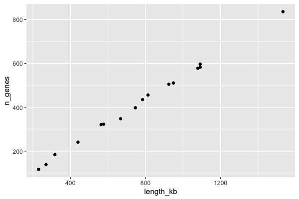

Read the code as: "take the `chroms` data, put `length_kb` on x and `n_genes` on y, and draw points". Longer chromosomes have more genes, almost in a straight line.

## A line plot, with labels

A yeast growth curve (the `growth` data frame from the primer; these example numbers are the same as in the Python lecture). A line plot connects points in x order; here we add *two* geoms, a line and points, to the same plot. `labs()` sets the axis labels and title - always label your axes with units.

```r
ggplot(growth, aes(x = hours, y = od600)) +
  geom_line() +
  geom_point() +
  labs(x = "Time (hours)", y = "OD600",
       title = "Yeast growth in YPD at 30 C")
```

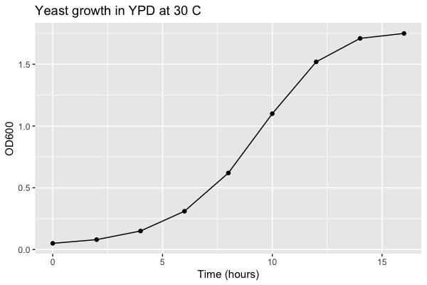

## Saving a plot to a file

In RStudio the plot appears in the Plots pane, and you can use **Export** to save it. In a script (e.g. running with `Rscript` in a Slurm job on the cluster) there is no screen, so save to a file with `ggsave()`. Store the plot in a variable first:

```r
p <- ggplot(growth, aes(x = hours, y = od600)) +
  geom_line() +
  geom_point() +
  labs(x = "Time (hours)", y = "OD600")

ggsave("growth_curve.png", p, width = 6, height = 4, dpi = 300)
ggsave("growth_curve.pdf", p, width = 6, height = 4)
```

The file type comes from the extension. `width` and `height` are in inches by default (add `units = "cm"` if you prefer). If you leave out `p`, ggsave saves the last plot you displayed. Then look at the file with the RStudio Files pane, or copy it to your computer (`scp`, or the file browser in OnDemand).

# Level 2: Distributions and categories

## Histograms - and why the bin width matters

A histogram shows the **distribution** of one numeric variable: it cuts the x-axis into bins and counts how many values fall in each. Only `x` is needed in `aes()`; ggplot counts for you.

```r
ggplot(exons, aes(x = length)) +
  geom_histogram(binwidth = 25) +
  labs(x = "Exon length (bp)", y = "Number of exons",
       title = "1,000 random rice exons")
```

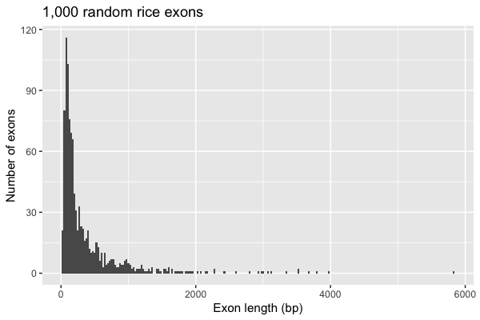

If you do not give a `binwidth` (or `bins`), ggplot uses 30 bins and prints a message telling you to pick a better value. **Always choose the bin width yourself** and try a few: too wide hides the shape, too narrow makes noise. Here most exons are short (under 300 bp) with a long tail of a few very long exons - a *right-skewed* distribution that we will deal with using a log scale in Level 3.

## Bar charts: geom_bar vs geom_col

There are two bar geoms and the difference confuses everyone at first:

* `geom_bar()` **counts rows for you**: give it only `x` (a category column) and it draws one bar per category, with height = number of rows.
* `geom_col()` **uses a y value you already have**: give it `x` and `y`, e.g. after you have run `count()` yourself.

```r
ggplot(species, aes(x = category)) +
  geom_bar() +
  labs(x = "IUCN Red List category", y = "Number of species")
```

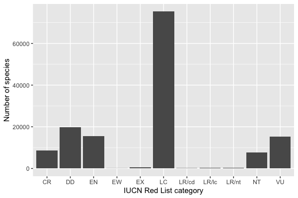

The same numbers with `count()` + `geom_col()`, this time per kingdom:

```r
kingdom_counts <- species |> count(kingdom_name)
kingdom_counts

ggplot(kingdom_counts, aes(x = kingdom_name, y = n)) +
  geom_col() +
  labs(x = NULL, y = "Number of species")
```

```text
# A tibble: 4 x 2
  kingdom_name     n
  <chr>        <int>
1 ANIMALIA     79666
2 CHROMISTA       15
3 FUNGI          627
4 PLANTAE      63424
```

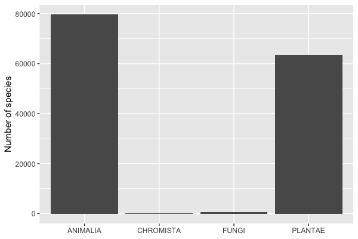

Notice two problems with the category chart: the categories are in alphabetical order, which is meaningless (the Red List has a natural order from Extinct to Least Concern), and there are a few old categories (`LR/cd`, `LR/lc`, `LR/nt`, "Lower Risk" from the pre-2001 system). We fix both in Level 3. The kingdom chart shows another common problem - one bar (Chromista, 15 species) is invisible next to 80,000 animals. A log scale helps there.

## Boxplots

A boxplot summarizes a distribution per group: the box spans the 25th to 75th percentile (the middle half of the data), the line is the median, the whiskers reach to the most extreme values within 1.5 times the box height, and points beyond that are drawn individually as possible outliers.

```r
ggplot(exons, aes(x = chrom, y = length)) +
  geom_boxplot() +
  labs(x = "Chromosome", y = "Exon length (bp)")
```

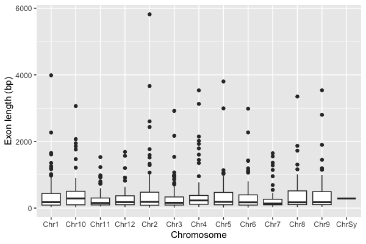

The chromosomes are sorted as text, so `Chr10` comes before `Chr2`, and there is an odd `ChrSy` with a single exon. We fix that in the next level too.

# Level 3: Groups, facets, scales and order

## Categories are factors

For plotting, a text column is turned into a **factor**: a categorical variable with a fixed set of **levels** in a fixed order. ggplot draws categories in level order, and the default order is alphabetical. To control the order, set the levels yourself with `factor(..., levels = ...)`, or use the [forcats](https://forcats.tidyverse.org/) package.

Let's clean up the Red List data: drop the old "LR" categories, and put the rest in their real order from most to least threatened. We also make a `threatened` column: the IUCN counts CR, EN and VU as "threatened".

```r
library(forcats)

iucn_order <- c("EX", "EW", "CR", "EN", "VU", "NT", "LC", "DD")

redlist <- species |>
  filter(category %in% iucn_order) |>
  mutate(category = factor(category, levels = iucn_order),
         threatened = category %in% c("CR", "EN", "VU"))

redlist |> count(category)
```

```text
# A tibble: 8 x 2
  category     n
  <fct>    <int>
1 EX         455
2 EW          53
3 CR        8576
4 EN       15506
5 VU       15267
6 NT        7781
7 LC       75247
8 DD       19897
```

`%in%` tests whether each value is in a set of values (like Python's `in`).

For the chromosomes, `fct_relevel()` could list them by hand, but it is easier to sort by the chromosome number. `readr::parse_number()` pulls the number out of `"Chr10"`, and `fct_reorder()` orders one column's levels by the values in another. The boxplot also showed one exon on `ChrSy`, which has no number (it is not one of the 12 nuclear chromosomes), so we drop it first:

```r
exons <- exons |>
  filter(chrom != "ChrSy") |>
  mutate(chrom = fct_reorder(chrom, parse_number(chrom)))
levels(exons$chrom)
```

```text
 [1] "Chr1"  "Chr2"  "Chr3"  "Chr4"  "Chr5"  "Chr6"  "Chr7"  "Chr8"  "Chr9" 
[10] "Chr10" "Chr11" "Chr12"
```

## Color and fill by group

Map a column to `color` (points, lines) or `fill` (bars, boxes, violins) inside `aes()` and ggplot picks colors and draws a legend. Here each bar is split by kingdom (we keep only plants and animals, the two big groups):

```r
redlist |>
  filter(kingdom_name %in% c("ANIMALIA", "PLANTAE")) |>
  ggplot(aes(x = category, fill = kingdom_name)) +
  geom_bar(position = "dodge") +
  labs(x = "IUCN Red List category", y = "Number of species", fill = "Kingdom")
```

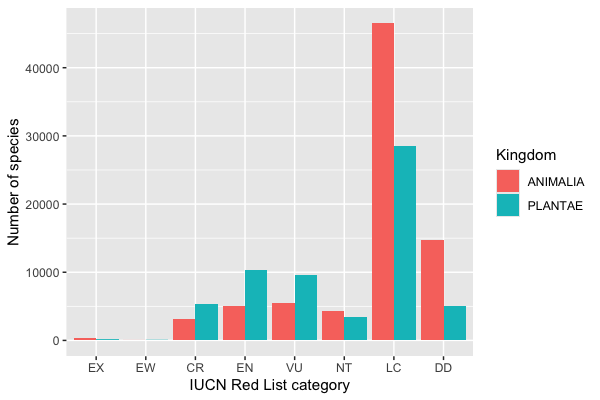

Notice you can pipe a data frame straight into `ggplot()`. `position = "dodge"` puts the bars side by side; the default (`"stack"`) stacks them, and `"fill"` stacks them scaled to 1 to show proportions.

**Inside vs outside `aes()`**: `aes(color = kingdom_name)` means "color depends on this column". To make everything one fixed color, put it *outside* `aes()`: `geom_point(color = "blue")`.

## Violin plots with the points on top

A violin plot is a smoothed histogram mirrored on each side - it shows the *shape* of each group's distribution, which a boxplot hides. With few enough points it is good practice to also show the raw data. `geom_jitter()` draws points with a little random horizontal spread so they do not sit on top of each other.

```r
ggplot(exons, aes(x = chrom, y = length, fill = chrom)) +
  geom_violin() +
  geom_jitter(width = 0.15, size = 0.5, alpha = 0.4) +
  labs(x = "Chromosome", y = "Exon length (bp)") +
  theme(legend.position = "none")
```

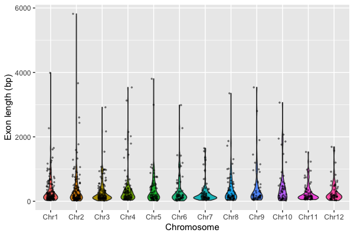

`alpha` sets transparency (0 = invisible, 1 = solid). The legend is redundant here (the x-axis already says which chromosome), so we remove it with `theme(legend.position = "none")`. The long tail squashes the interesting part of the distribution near the bottom - time for a log scale.

## Log scales

When values span several orders of magnitude (gene lengths, read counts, p-values, species counts), a log scale shows them all. `scale_y_log10()` (or `scale_x_log10()`) transforms the axis but keeps the labels in the original units, which is easier to read than taking `log10()` of the data yourself.

```r
ggplot(exons, aes(x = chrom, y = length, fill = chrom)) +
  geom_violin() +
  geom_jitter(width = 0.15, size = 0.5, alpha = 0.4) +
  scale_y_log10() +
  labs(x = "Chromosome", y = "Exon length (bp, log scale)") +
  theme(legend.position = "none")
```

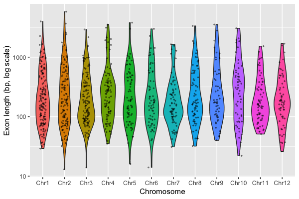

Now you can see that on the log scale exon lengths are roughly symmetric, centered around 100-200 bp, and the chromosomes look alike.

## Reordering bars by value

For bar charts of categories that have no natural order, sorting the bars by their value makes the chart much easier to read. `fct_reorder(class, n)` orders the classes by `n` (base R has `reorder()`, which does the same). Putting the long class names on the y-axis (map the category to `y` instead of `x`) avoids overlapping labels.

```r
class_counts <- redlist |>
  count(class_name) |>
  slice_max(n, n = 15)          # the 15 largest classes

ggplot(class_counts, aes(x = n, y = fct_reorder(class_name, n))) +
  geom_col() +
  labs(x = "Number of assessed species", y = NULL)
```

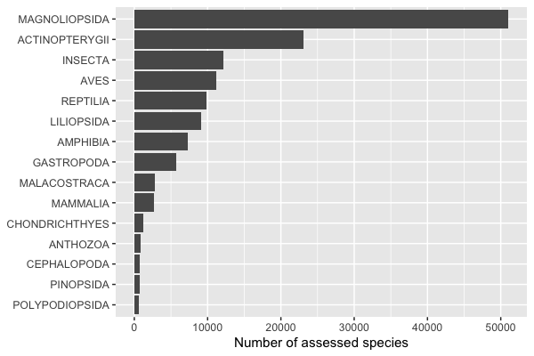

## Facets: small multiples

Instead of cramming groups into one panel with colors, **facets** make one small panel per group with the same axes, so they are easy to compare. `facet_wrap(~ column)` wraps panels into a grid; `facet_grid(rows ~ cols)` makes a grid from two columns.

Here: the fraction of species in each Red List category, one panel for each of six well-known vertebrate and plant classes. We compute proportions with `group_by()` + `mutate()`.

```r
six <- c("MAMMALIA", "AVES", "REPTILIA", "AMPHIBIA", "ACTINOPTERYGII", "MAGNOLIOPSIDA")

class_props <- redlist |>
  filter(class_name %in% six) |>
  count(class_name, category) |>
  group_by(class_name) |>
  mutate(fraction = n / sum(n))

ggplot(class_props, aes(x = category, y = fraction, fill = category %in% c("CR", "EN", "VU"))) +
  geom_col() +
  facet_wrap(~ class_name, ncol = 3) +
  labs(x = "IUCN Red List category", y = "Fraction of assessed species",
       fill = "Threatened")
```

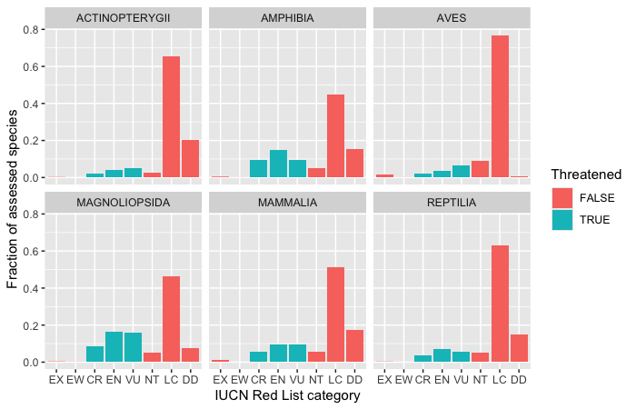

Among these assessed species, flowering plants (MAGNOLIOPSIDA, about 41% threatened) and amphibians (34%) have the largest threatened share, while birds are almost never Data Deficient (DD) - they are the best-studied group. (Keep in mind these are fractions of *assessed* species, and which species get assessed is not random.) `facet_wrap()` gives every panel the same y-axis by default, which is usually what you want for comparisons; add `scales = "free_y"` if the groups are on very different scales.

`facet_grid()` crosses two variables: rows for one and columns for another. Here the rows are kingdoms (plants and animals) and the columns are threatened or not:

```r
redlist |>
  filter(kingdom_name %in% c("ANIMALIA", "PLANTAE")) |>
  ggplot(aes(x = category)) +
  geom_bar() +
  facet_grid(kingdom_name ~ threatened, scales = "free_x", labeller = label_both) +
  labs(x = "IUCN Red List category", y = "Number of species")
```

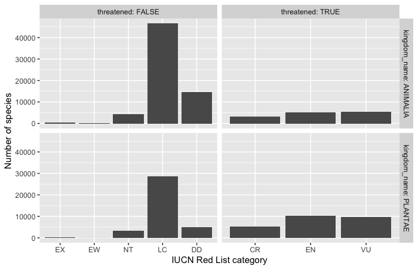

`labeller = label_both` puts the column name in the panel label ("threatened: TRUE") so the reader knows what TRUE means.

# Level 4: Themes and publication choices

## Themes and font size

The default gray background is fine on screen but most journals prefer a white background. Complete themes change the whole look at once: `theme_bw()`, `theme_classic()` (axis lines, no grid - common in biology papers), `theme_minimal()`. Each takes a `base_size` argument to scale all the text; the default (11 pt) is often too small once a figure is shrunk to fit a journal column or shown on a slide. Individual pieces can be changed with `theme()`.

```r
ggplot(chroms, aes(x = length_kb, y = n_genes)) +
  geom_point(size = 2) +
  labs(x = "Chromosome length (kb)", y = "Number of genes") +
  theme_classic(base_size = 14)
```

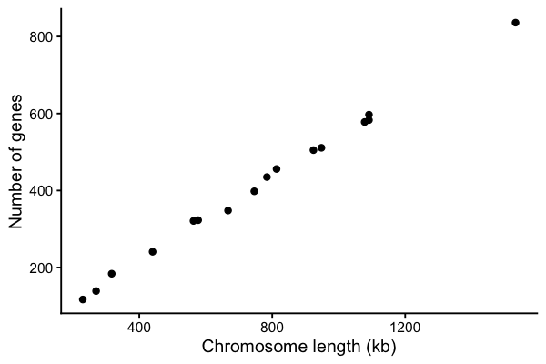

To use one theme for every plot in a script, set it once at the top: `theme_set(theme_bw(base_size = 14))`.

## Colors that everyone can read

About 1 in 12 men and 1 in 200 women have some form of color vision deficiency, most often red-green. The default ggplot colors and the classic red/green heatmap are hard for them to tell apart. Good choices:

* **viridis** palettes for continuous values or ordered categories - they are perceptually even, colorblind safe and still readable in grayscale. Built in: `scale_color_viridis_c()` / `scale_fill_viridis_c()` for continuous, `_d()` for discrete.
* The **Okabe-Ito** palette (8 colors designed to be distinguishable by everyone) for unordered categories: `scale_fill_manual(values = palette.colors(palette = "Okabe-Ito"))` (`palette.colors()` is built into base R, no extra package needed).
* [ColorBrewer](https://colorbrewer2.org) palettes: `scale_fill_brewer(palette = "Dark2")`, with a "colorblind safe" filter on the website.

Test your figure with a simulator such as [Coblis](https://www.color-blindness.com/coblis-color-blindness-simulator/).

```r
okabe_ito <- unname(palette.colors(palette = "Okabe-Ito"))
okabe_ito

redlist |>
  filter(kingdom_name %in% c("ANIMALIA", "PLANTAE")) |>
  ggplot(aes(x = category, fill = kingdom_name)) +
  geom_bar(position = "dodge") +
  scale_fill_manual(values = okabe_ito[2:3],
                    labels = c(ANIMALIA = "Animals", PLANTAE = "Plants")) +
  labs(x = "IUCN Red List category", y = "Number of species", fill = NULL) +
  theme_bw(base_size = 13) +
  theme(legend.position = "top")
```

```text
[1] "#000000" "#E69F00" "#56B4E9" "#009E73" "#F0E442" "#0072B2" "#D55E00"
[8] "#CC79A7" "#999999"
```

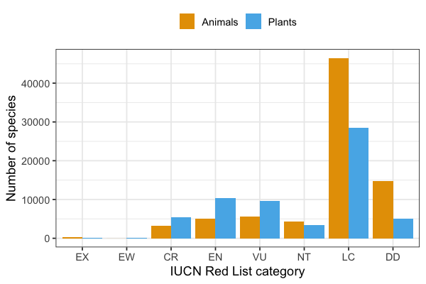

A continuous color scale with viridis - each exon colored by its length (log scale), plotted by its start position along the chromosomes:

```r
ggplot(exons, aes(x = start / 1e6, y = chrom, color = length)) +
  geom_point(size = 1.5) +
  scale_color_viridis_c(trans = "log10") +
  labs(x = "Position (Mb)", y = NULL, color = "Exon\nlength (bp)") +
  theme_bw()
```

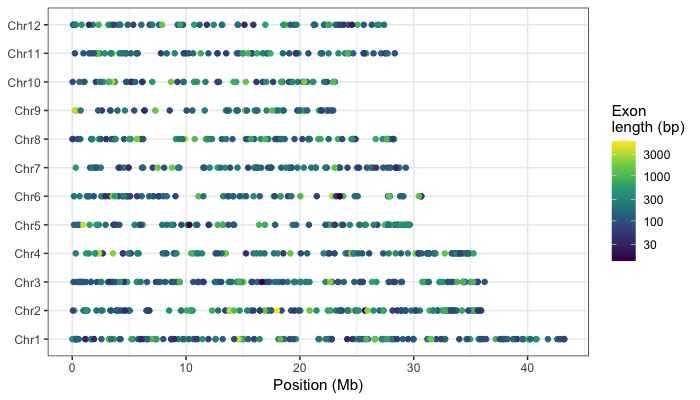

## Things to avoid, and things to include

* **No pie charts** - people compare lengths well and angles badly. Use a bar chart. (Claus Wilke's book has a good chapter, "Visualizing proportions".)
* **No 3D effects** on bar charts or pies - they distort the values and add nothing.
* **Bars start at zero.** A bar's length encodes the value, so a truncated axis exaggerates differences. If you need a non-zero or log axis, use points instead of bars.
* **Show the data** when you can (jitter points on a boxplot or violin) rather than only a bar of means with error bars.
* **Label axes with units** ("Exon length (bp)", "Time (hours)"), and say when an axis is on a log scale.
* **Don't rely on color alone** - use direct labels, shapes or facets as well, and use colorblind-safe palettes.
* Make the text big enough to read at the final size.

## Combining panels with patchwork

Papers usually need multi-panel figures (A, B, C...). The [patchwork](https://patchwork.data-imaging.org/) package combines saved ggplot objects with arithmetic: `|` puts plots side by side, `/` stacks them. `plot_annotation(tag_levels = "A")` adds the panel letters.

```r
library(patchwork)

p_hist <- ggplot(exons, aes(x = length)) +
  geom_histogram(binwidth = 25) +
  labs(x = "Exon length (bp)", y = "Count")

p_log <- ggplot(exons, aes(x = length)) +
  geom_histogram(bins = 30) +
  scale_x_log10() +
  labs(x = "Exon length (bp, log scale)", y = "Count")

p_box <- ggplot(exons, aes(x = chrom, y = length)) +
  geom_boxplot() +
  scale_y_log10() +
  labs(x = NULL, y = "Exon length (bp)") +
  theme(axis.text.x = element_text(angle = 45, hjust = 1))

figure <- (p_hist | p_log) / p_box +
  plot_annotation(tag_levels = "A") &
  theme_bw(base_size = 11)
figure

ggsave("exon_figure.pdf", figure, width = 8, height = 6)
```

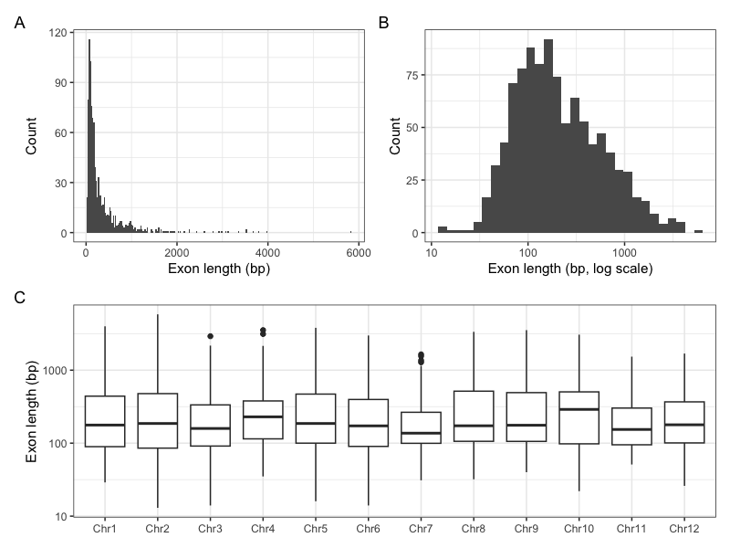

The `&` applies a theme to *every* panel (with `+` it would only change the last one).

## Vector vs raster output

* **Vector** formats (**PDF**, **SVG**, EPS) store lines, points and text as shapes. They are sharp at any zoom, text stays editable in Illustrator or Inkscape, and they are what most journals want for plots. Save final figures as PDF.
* **Raster** formats (**PNG**, TIFF, JPEG) store a grid of pixels. Use PNG for web pages, slides and quick looks, with `dpi = 300` or more for print. Never use JPEG for plots - its compression blurs lines and text.
* A plot with a huge number of points (e.g. a million SNPs) makes a very slow, very large PDF; save that one as a high-resolution PNG.

# Level 5: Genomics and statistics plots

## Feature length distributions on a log scale

Genome annotations are stored in GFF3 files: tab-separated with 9 columns (seqid, source, type, start, end, score, strand, phase, attributes), with `#` comment lines. We read the yeast genome annotation from SGD (the same file used in the Python lecture). Unlike BED, GFF coordinates are 1-based and inclusive, so length = end - start + 1.

```r
gff_cols <- c("seqid", "source", "type", "start", "end",
              "score", "strand", "phase", "attributes")

yeast_gff <- read_tsv("https://github.com/biodataprog/GEN220_data/raw/main/genome/S_cerevisiae.gff3.gz",
                      comment = "#", col_names = gff_cols,
                      col_types = "cccii-c-c") |>
  mutate(length = end - start + 1)

yeast_gff |> count(type, sort = TRUE) |> head(10)
```

```text
# A tibble: 10 x 2
   type                          n
   <chr>                     <int>
 1 CDS                        7058
 2 gene                       6600
 3 mRNA                       6600
 4 noncoding_exon              484
 5 long_terminal_repeat        383
 6 intron                      377
 7 ARS                         352
 8 tRNA_gene                   299
 9 ARS_consensus_sequence      196
10 transposable_element_gene    91
```

In `col_types`, each letter is one column: `c` character, `i` integer, `-` skip. Let's compare lengths of several kinds of features. Their sizes range from tens of bases (short introns) to many kilobases (genes), so a log scale is essential.

```r
feature_types <- c("gene", "tRNA_gene", "snoRNA_gene", "intron",
                   "long_terminal_repeat", "ARS")

features <- yeast_gff |>
  filter(type %in% feature_types) |>
  mutate(type = fct_reorder(type, length, .fun = median))

features |>
  group_by(type) |>
  summarize(n = n(), median_length = median(length))

ggplot(features, aes(x = length, y = type, fill = type)) +
  geom_violin(scale = "width") +
  geom_boxplot(width = 0.15, fill = "white", outlier.shape = NA) +
  scale_x_log10(labels = scales::label_comma()) +
  scale_fill_viridis_d(guide = "none") +
  labs(x = "Feature length (bp, log scale)", y = NULL,
       title = "Feature lengths in the S. cerevisiae genome") +
  theme_bw(base_size = 12)
```

```text
# A tibble: 6 x 3
  type                     n median_length
  <fct>                <int>         <dbl>
1 tRNA_gene              299            73
2 intron                 377           116
3 snoRNA_gene             77           126
4 ARS                    352           241
5 long_terminal_repeat   383           331
6 gene                  6600          1071
```

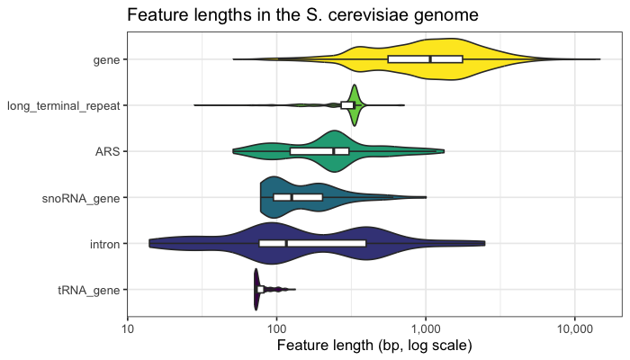

`fct_reorder(type, length, .fun = median)` sorts the feature types by their median length. `scales::label_comma()` prints 10,000 instead of 1e+04 (the `scales::` prefix uses one function from the scales package without loading it all).

Gene length split by how well the gene is supported. SGD records an `orf_classification` in the attributes column (`Verified`, `Uncharacterized`, `Dubious`); we pull it out with a regular expression (see the regular expression lecture) and compare the distributions with overlaid densities. A **density plot** is a smoothed histogram scaled so each group has area 1, which makes groups of different sizes comparable.

```r
genes <- yeast_gff |>
  filter(type == "gene") |>
  mutate(orf_class = sub(".*orf_classification=([A-Za-z]+).*", "\\1", attributes))

genes |> count(orf_class)

ggplot(genes, aes(x = length, fill = orf_class)) +
  geom_density(alpha = 0.5) +
  scale_x_log10(labels = scales::label_comma()) +
  scale_fill_manual(values = okabe_ito[c(2, 4, 6)]) +
  labs(x = "Gene length (bp, log scale)", y = "Density", fill = "ORF class") +
  theme_bw(base_size = 12)
```

```text
# A tibble: 3 x 2
  orf_class           n
  <chr>           <int>
1 Dubious           784
2 Uncharacterized   709
3 Verified         5107
```

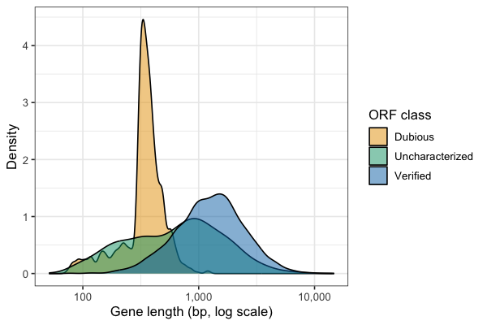

Dubious ORFs are mostly short - exactly what you would expect if many are chance open reading frames rather than real genes. The sharp peak just above 300 bp reflects the 100-codon minimum ORF length used when the yeast genome was first annotated: random ORFs just over the cutoff are common, longer ones are rare.

## Scatter plot with a regression line and correlation

Now we compute the chromosome table from Level 1 ourselves: chromosome lengths come from the `chromosome` rows of the GFF and gene counts from counting `gene` rows per chromosome. We leave out the mitochondrial genome (`chrmt`). `left_join()` combines two tables that share a column, like a database join.

```r
chrom_len <- yeast_gff |>
  filter(type == "chromosome", seqid != "chrmt") |>
  select(seqid, length)

gene_counts <- genes |> count(seqid, name = "n_genes")

yeast_chroms <- chrom_len |>
  left_join(gene_counts, by = "seqid") |>
  mutate(length_kb = length / 1000)
yeast_chroms
```

```text
# A tibble: 16 x 4
   seqid    length n_genes length_kb
   <chr>     <dbl>   <int>     <dbl>
 1 chrI     230218     117      230.
 2 chrII    813184     456      813.
 3 chrIII   316620     184      317.
 4 chrIV   1531933     836     1532.
 5 chrV     576874     323      577.
 6 chrVI    270161     139      270.
 7 chrVII  1090940     583     1091.
 8 chrVIII  562643     321      563.
 9 chrIX    439888     241      440.
10 chrX     745751     398      746.
11 chrXI    666816     348      667.
12 chrXII  1078177     578     1078.
13 chrXIII  924431     505      924.
14 chrXIV   784333     435      784.
15 chrXV   1091291     597     1091.
16 chrXVI   948066     511      948.
```

`geom_smooth(method = "lm")` fits a straight line (a linear model) and draws it with a gray 95% confidence band. Use `lm()` to get the slope and `cor.test()` for the correlation and its p-value - the plot and the numbers should go together.

```r
fit <- lm(n_genes ~ length_kb, data = yeast_chroms)
coef(fit)

ct <- cor.test(yeast_chroms$length_kb, yeast_chroms$n_genes)   # Pearson by default
ct$estimate
ct$p.value
cor(yeast_chroms$length_kb, yeast_chroms$n_genes, method = "spearman")

ggplot(yeast_chroms, aes(x = length_kb, y = n_genes)) +
  geom_smooth(method = "lm", formula = y ~ x, color = "red") +
  geom_point(size = 2) +
  annotate("text", x = 250, y = 750, hjust = 0,
           label = sprintf("r = %.3f\n%.2f genes per kb", ct$estimate, coef(fit)[2])) +
  labs(x = "Chromosome length (kb)", y = "Number of genes") +
  theme_classic(base_size = 13)
```

```text
(Intercept)   length_kb 
  1.6340777   0.5422648 
   cor 
0.9988 
[1] 9.578861e-20
[1] 1
```

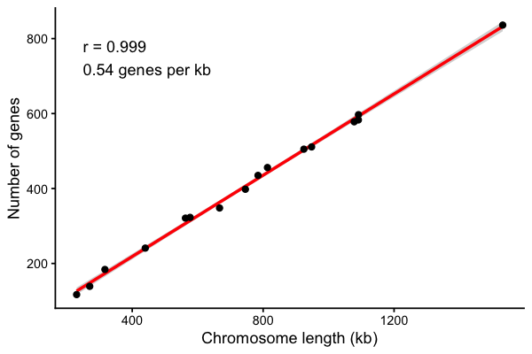

`n_genes ~ length_kb` is an R **formula**: "model n_genes as a function of length_kb". Yeast has about one gene every 2 kb, remarkably evenly across chromosomes. `annotate()` adds a single text label at a fixed position (as opposed to `geom_text()`, which adds one label per row of data). Correlation is not causation, and a correlation coefficient says nothing about the slope - always look at the plot as well as r.

## Simulated expression data

For heatmaps and volcano plots we need a gene expression table like the one you get from an RNA-Seq experiment (see the [RNASeq lecture](../Bioinformatics/RNASeq)). To keep this lecture self-contained **the data below are simulated**, not real: 2,000 genes measured in 4 control and 4 treated samples, as log2 expression values. The first 100 genes are made truly differentially expressed (half up, half down). `set.seed()` makes the random numbers the same every time so everyone gets the same answer.

```r
library(tidyr)
set.seed(220)

n_genes <- 2000
samples <- c("ctrl_1", "ctrl_2", "ctrl_3", "ctrl_4", "trt_1", "trt_2", "trt_3", "trt_4")
group <- rep(c("control", "treated"), each = 4)

# baseline expression for each gene, plus noise for each sample
baseline <- rnorm(n_genes, mean = 8, sd = 2)
expr <- matrix(rnorm(n_genes * 8, mean = baseline, sd = 0.4),
               nrow = n_genes, dimnames = list(sprintf("gene%04d", 1:n_genes), samples))

# the true effect: genes 1-50 go up, 51-100 go down in the treated samples
true_lfc <- c(rnorm(50, 2, 0.7), rnorm(50, -2, 0.7), rep(0, n_genes - 100))
expr[, group == "treated"] <- expr[, group == "treated"] + true_lfc

round(expr[1:4, ], 2)
```

```text
         ctrl_1 ctrl_2 ctrl_3 ctrl_4 trt_1 trt_2 trt_3 trt_4
gene0001   5.65   5.63   5.30   5.79  8.59  8.49  7.11  7.90
gene0002   9.50  10.24   9.53   9.99 12.40 13.25 11.93 12.36
gene0003   4.37   3.36   5.25   4.23  5.80  5.53  5.47  5.62
gene0004  10.39  10.40  10.77  10.26 11.90 11.47 11.79 11.15
```

For each gene, a t-test (`var.equal = TRUE` is the classic Student's t-test, which pools the variance of the two groups) compares treated to control. With thousands of tests we must correct for multiple testing (see the [Sequence evolution lecture](../Bioinformatics/Sequence_evolution)); `p.adjust(..., method = "BH")` gives Benjamini-Hochberg adjusted p-values (FDR). In a real RNA-Seq analysis you would use a count-based method such as [DESeq2](https://bioconductor.org/packages/release/bioc/html/DESeq2.html) or edgeR instead of a t-test, but the output table and the plots are the same.

```r
de <- data.frame(
  gene = rownames(expr),
  log2FC = rowMeans(expr[, group == "treated"]) - rowMeans(expr[, group == "control"]),
  pvalue = apply(expr, 1, function(x) t.test(x[group == "treated"], x[group == "control"], var.equal = TRUE)$p.value)
)
de <- de |>
  mutate(padj = p.adjust(pvalue, method = "BH"),
         status = case_when(padj < 0.05 & log2FC > 1  ~ "up",
                            padj < 0.05 & log2FC < -1 ~ "down",
                            TRUE ~ "not significant"))
de |> count(status)
```

```text
           status    n
1            down   36
2 not significant 1926
3              up   38
```

`case_when()` is dplyr's multi-way if/else: the first condition that is TRUE wins.

## Volcano plot

A volcano plot shows every gene's **effect size** (log2 fold change, x) against its **significance** (-log10 p-value, y). Taking -log10 turns small p-values into big numbers: p = 0.01 is 2, p = 0.0001 is 4. Interesting genes are in the upper left and upper right. Dashed lines mark the cutoffs.

```r
ggplot(de, aes(x = log2FC, y = -log10(pvalue), color = status)) +
  geom_point(size = 1, alpha = 0.6) +
  geom_vline(xintercept = c(-1, 1), linetype = "dashed", color = "gray40") +
  geom_hline(yintercept = -log10(0.05), linetype = "dashed", color = "gray40") +
  scale_color_manual(values = c(down = "#0072B2", up = "#D55E00",
                                "not significant" = "gray70")) +
  labs(x = "log2 fold change (treated / control)", y = "-log10 p-value",
       color = NULL, title = "Simulated differential expression") +
  theme_bw(base_size = 12)
```

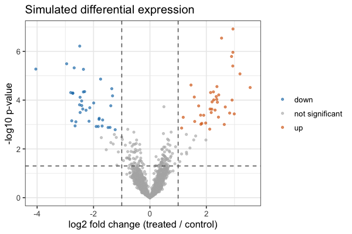

The colors (blue and orange) come from the Okabe-Ito palette so up and down are distinguishable for everyone. The horizontal line marks the raw p = 0.05; genes are colored by the *adjusted* p-value, which is why some points above the line stay gray.

## Heatmap

A heatmap shows a matrix of values as colored tiles - here the expression of the 30 most significant genes in each sample. Two steps are standard: **scale each gene** (subtract its mean and divide by its standard deviation - a *z-score*) so that genes with high and low overall expression can share one color scale, and use a **diverging** palette centered on zero.

ggplot2 wants data in "long" format - one row per gene per sample - so we reshape the matrix with `pivot_longer()` from tidyr, then draw tiles with `geom_tile()`.

```r
top_genes <- de |> slice_min(padj, n = 30) |> pull(gene)

z <- t(scale(t(expr[top_genes, ])))       # z-score each row (gene)

z_long <- as.data.frame(z) |>
  mutate(gene = rownames(z)) |>
  pivot_longer(-gene, names_to = "sample", values_to = "zscore")
head(z_long)

ggplot(z_long, aes(x = sample, y = gene, fill = zscore)) +
  geom_tile() +
  scale_fill_distiller(palette = "RdBu", limits = c(-2, 2), oob = scales::squish) +
  labs(x = NULL, y = NULL, fill = "z-score") +
  theme_minimal(base_size = 9)
```

```text
# A tibble: 6 x 3
  gene     sample zscore
  <chr>    <chr>   <dbl>
1 gene0007 ctrl_1 -0.938
2 gene0007 ctrl_2 -0.806
3 gene0007 ctrl_3 -0.894
4 gene0007 ctrl_4 -1.09 
5 gene0007 trt_1   0.897
6 gene0007 trt_2   0.925
```

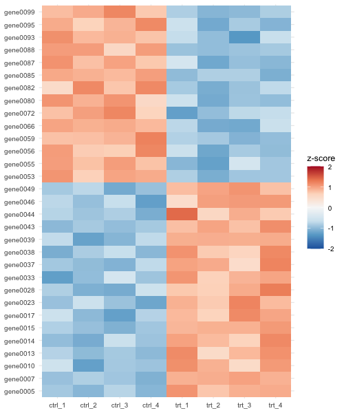

`scale()` works on columns, so we transpose (`t()`) the matrix, scale, and transpose back. `oob = scales::squish` colors values beyond +/-2 with the end colors instead of leaving them blank. RdBu (red-blue) is a diverging ColorBrewer palette that is colorblind safe, unlike red-green.

Here the genes happen to fall into two blocks only because the simulation numbered the up genes 1-50 and the down genes 51-100; with real gene names the alphabetical order is arbitrary and hides any pattern. Heatmaps usually **cluster** rows and columns so that similar genes and samples sit together, with a dendrogram (tree) on the side. Doing this in ggplot2 takes extra work; the [pheatmap](https://cran.r-project.org/package=pheatmap) package does it in one call, and can write straight to a file:

```r
library(pheatmap)

annotation <- data.frame(group = group, row.names = samples)

pheatmap(expr[top_genes, ],
         scale = "row",                    # z-score each gene
         annotation_col = annotation,      # color bar for the sample groups
         color = colorRampPalette(rev(RColorBrewer::brewer.pal(9, "RdBu")))(50),
         fontsize_row = 7,
         filename = "heatmap_pheatmap.png", width = 6, height = 6)
```

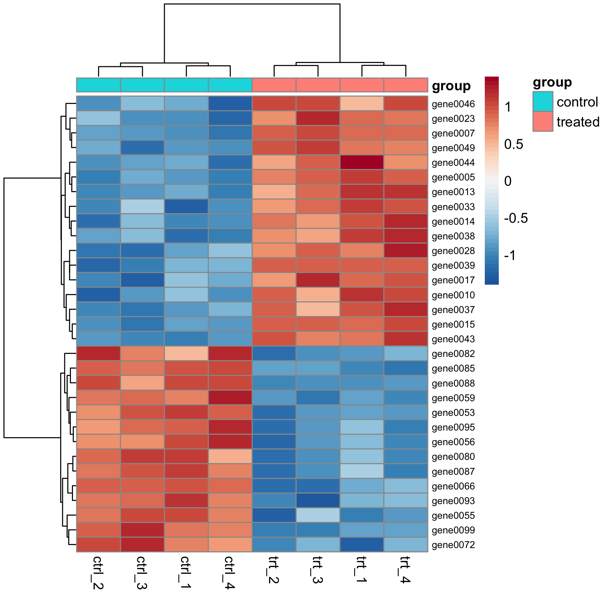

The clustering separates the control and treated samples, and the up- and down-regulated genes into two blocks. (Leave out `filename` to draw it in RStudio's Plots pane.) Bioconductor's [ComplexHeatmap](https://bioconductor.org/packages/release/bioc/html/ComplexHeatmap.html) is a more powerful option for big annotated heatmaps.

## Where this connects to the rest of the course

* **RNA-Seq** ([lecture](../Bioinformatics/RNASeq)): after counting reads per gene (e.g. with Salmon or featureCounts) and running DESeq2, the results table has `log2FoldChange`, `pvalue` and `padj` columns - put them straight into the volcano plot code above. Plot normalized, log-transformed counts of the top genes as a heatmap, and samples on a PCA plot (a scatter plot) to check that replicates group together.
* **Variants** ([lecture](../Bioinformatics/Variants)): `bcftools query` turns a VCF into a table you can read with `read_tsv()`. Plot histograms of variant quality (`QUAL`) and read depth (`DP`) to choose filtering cutoffs (log scale!), count variants per chromosome or per snpEff impact class with `geom_bar()`, or plot variant density along a chromosome with `geom_histogram(aes(x = POS), binwidth = 10000)` faceted by chromosome.
* **Genome features** (the ranges and features lecture): feature lengths, distances between genes, and GC content per window are all distributions - histograms and violins on a log scale.

# Exercises

These step up in difficulty. Write each one in an R script and save each plot with `ggsave()`.

1. **(warm up)** Make a histogram of rice exon lengths with `binwidth = 5`, `binwidth = 100` and `binwidth = 500`. Which one would you put in a paper, and why? Combine the three with patchwork.
2. **(bar charts)** Using the Red List data, make a bar chart of the number of species in each *kingdom* that are threatened (CR, EN or VU). Use a log scale. Why is `geom_bar()` with a log y-axis a questionable choice, and what could you use instead? (Hint: `geom_point()`.)
3. **(filter + color)** For the order `CARNIVORA` (class MAMMALIA), make a horizontal bar chart of species per family, bars sorted by count and filled by whether any species in the family is Critically Endangered.
4. **(facets)** Make a faceted plot with one panel per yeast chromosome (`facet_wrap(~ seqid)`) of gene positions along the chromosome, using `geom_histogram(aes(x = start), binwidth = 20000)`. Use `scales = "free_x"`. Are genes evenly spread along chromosomes?
5. **(themes)** Remake the violin plot of rice exon lengths per chromosome as a "publication" figure: log scale, jittered points, `theme_classic(base_size = 14)`, a viridis fill, no legend and properly labelled axes. Save it as both PDF and PNG (dpi 300) and compare the file sizes.
6. **(statistics)** Is there a relationship between the length of a yeast gene and its GC content? Use the `S_cerevisiae.ORFs.fasta.gz` file from [GEN220_data](https://github.com/biodataprog/GEN220_data/tree/main/genome) (you can compute length and GC for each ORF in Python and write a CSV, then read it in R). Plot with `geom_point(alpha = 0.3)`, a log x-axis and `geom_smooth(method = "lm")`, and report the Spearman correlation.
7. **(challenge)** Change the simulation to 3 replicates per group instead of 4, and then the noise `sd` to 0.8 instead of 0.4. How many of the 100 true differentially expressed genes pass padj < 0.05 now? What does this tell you about planning the number of replicates for an RNA-Seq experiment? Remake the volcano plot and label the 10 most significant genes with `geom_text(data = ..., aes(label = gene))` (or install the `ggrepel` package and use `geom_text_repel()`). Then make a patchwork figure with the volcano plot (A) and the clustered heatmap drawn with ggplot2 (B) - order the genes in the heatmap by `hclust(dist(z))$order`.

# Common mistakes

* **`+` at the start of a line instead of the end.** ggplot layers are joined with `+`, and it must be at the *end* of the line; otherwise R thinks the command is finished and the next line is an error ("Cannot use `+` with a single argument"). And it is `+` for ggplot layers, but `|>` for dplyr steps.
* **Fixed values inside `aes()`.** `aes(color = "blue")` makes a legend entry called "blue" and a red-ish color. Put constants outside: `geom_point(color = "blue")`.
* **Forgetting to load a package** - `could not find function "ggplot"` means you need `library(ggplot2)` (and install it once if needed).
* **`geom_bar()` with a y value.** If you already have counts, use `geom_col()` (or `geom_bar(stat = "identity")`).
* **Categories in alphabetical order** (Chr1, Chr10, Chr11, Chr2...). Set factor levels or use `fct_reorder()`.
* **Accepting the default binwidth.** Always try a few.
* **Taking the log of zero.** `log10(0)` is `-Inf` and those points disappear with a warning (e.g. genes with zero reads). Add a small pseudocount (`log10(count + 1)`) and say so in the legend.
* **Numbers read as text.** If a column that should be numeric shows up as `chr`, a value like "NA", "-" or "1,000" is in it; check with `problems()` after `read_csv()`, or set `na = c("", "NA", "-")`.
* **Case and spelling.** R is case sensitive: `Species` is not `species`, and a column name typo gives "object not found".
* **Plots that never appear from a script.** In `Rscript` there is no screen; use `ggsave()` (inside a loop or function you must also `print()` a plot for it to be drawn).
* **1-based vs 0-based coordinates.** BED starts are 0-based (length = end - start) while GFF and VCF are 1-based (length = end - start + 1).
