# Plotting data with Python

A table of 6,000 gene lengths or 140,000 species is impossible to understand by reading it. A good plot lets you *see* the shape of the data - is it skewed, are there outliers, do two groups differ, do two measurements move together? Plotting is also the fastest way to catch mistakes (a column read as text, a unit off by 1000, a sample swapped).

This lecture builds up in levels:

1. **Level 1** - the anatomy of a figure; line and scatter plots from Python lists; saving files on the cluster
2. **Level 2** - distributions and categories: histograms, bar charts, box plots; reading data from files
3. **Level 3** - pandas + seaborn: tidy data, color by group, violin/strip plots, small multiples, log scales
4. **Level 4** - multi-panel and publication-quality figures
5. **Level 5** - genomics and statistics: length distributions, regression and correlation, volcano plots, clustered heatmaps

The same kinds of plots are made in R with ggplot2 in the [R plotting lecture](../Misc/Rplotting), using some of the same data, so you can compare the two approaches.

## Installing the packages

We use four packages: **matplotlib** (the basic plotting library everything else is built on), **pandas** (tables), **seaborn** (statistical plots on top of matplotlib, works directly with pandas tables) and **scipy** (statistics). **numpy** comes along with them.

On your laptop or in a Python virtual environment:

```bash
pip install matplotlib seaborn pandas scipy
```

Or with conda (e.g. in the course environment used in the [Packages lecture](06_Packages)):

```bash
conda install matplotlib seaborn pandas scipy
```

On the HPCC cluster, see which Python / conda modules are available and load one (the [Packages lecture](06_Packages) uses `miniconda3`):

```bash
module avail python
module avail miniconda
module load miniconda3
conda activate GEN220      # or whatever you named your environment
python -c "import matplotlib, seaborn, pandas; print('ok')"
```

The examples in this lecture were run with matplotlib 3.11.2, seaborn 0.13.2, pandas 3.0.6, numpy 2.5.3 and scipy 1.18.1. Older versions will work for almost everything; a few newer options are noted where they appear.

## Data used in this lecture

All real data except the RNA-seq style example in Level 5, which is **simulated** (explained there).

```bash
mkdir -p plotting && cd plotting
# 1000 randomly chosen rice exons (BED format: chrom, start, end)
curl -O \
  https://raw.githubusercontent.com/biodataprog/GEN220/master/data/rice_random_exons.bed
# yeast (S. cerevisiae) genome annotation
curl -L -O \
  https://github.com/biodataprog/GEN220_data/raw/main/genome/S_cerevisiae.gff3.gz
# the IUCN Red List table is read directly from its URL by pandas below
```

The IUCN Red List table (`threatened-species.csv.gz`) has one row per species with columns `taxonid, kingdom_name, phylum_name, class_name, order_name, family_name, genus_name, scientific_name, taxonomic_authority, infra_rank, infra_name, population, category, main_common_name`. The `category` column is the Red List status: LC = Least Concern, NT = Near Threatened, VU = Vulnerable, EN = Endangered, CR = Critically Endangered, EW = Extinct in the Wild, EX = Extinct, DD = Data Deficient.

# Level 1: The anatomy of a figure

## Figure, axes, labels

In matplotlib a plot has two main parts:

* the **figure** (`fig`) - the whole image or page, which is what gets saved to a file
* one or more **axes** (`ax`) - a single plotting area with an x axis, a y axis, the data, a title and axis labels. A figure with four panels has four axes.

We create both at once with `fig, ax = plt.subplots()`, then call methods on `ax` to draw and label, and `fig.savefig()` to write the file. You will see older code online that calls `plt.plot()`, `plt.xlabel()` etc. directly; that works for a quick single plot, but the `fig, ax` style is clearer and is the only sane way to make multi-panel figures, so we use it from the start.

Every plot needs:

* **axis labels with units** - "Time (hours)" not "x"
* a title or caption that says what is shown
* sensible limits and tick marks (usually the defaults are fine)

## Plotting on the cluster: no screen

On your laptop `plt.show()` pops up a window. On the HPCC cluster (in a Slurm job or an ssh session) there is **no screen**, and `plt.show()` either does nothing or crashes with an error about the display. Instead we:

1. tell matplotlib to use the `Agg` backend (draws into memory, not a window) - do this *before* importing `pyplot`
2. write the figure to a file with `fig.savefig("name.png")`
3. copy the file to your laptop (`scp`, or open it in the OnDemand file browser) to look at it

Newer versions of matplotlib pick `Agg` automatically when there is no display, but setting it explicitly makes your script safe everywhere.

## A first line plot

A line plot connects points in order - good for something measured over time. Here are the kind of OD600 readings you might record from a yeast culture (example numbers typed in by hand).

```python
#!/usr/bin/env python3
# A first line plot: a yeast growth curve
import matplotlib
matplotlib.use("Agg")          # no screen needed - draw straight to a file
import matplotlib.pyplot as plt

hours = [0, 2, 4, 6, 8, 10, 12, 14, 16]
od600 = [0.05, 0.08, 0.15, 0.31, 0.62, 1.10, 1.52, 1.71, 1.75]

fig, ax = plt.subplots(figsize=(5, 3.5))
ax.plot(hours, od600, marker="o")
ax.set_xlabel("Time (hours)")
ax.set_ylabel("OD600")
ax.set_title("Yeast growth in YPD at 30 C")
fig.tight_layout()
fig.savefig("growth_curve.png", dpi=100)
print("wrote growth_curve.png")
```

```text
wrote growth_curve.png
```

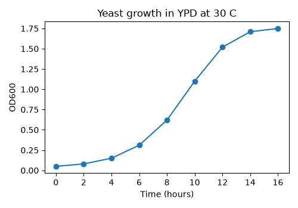

`marker="o"` draws a dot at each measurement. Without it you only get the line, which hides how many points you actually measured.

## A first scatter plot

A scatter plot shows the relationship between two measurements made on the same things. These are the real lengths and gene counts of the 16 nuclear chromosomes of *S. cerevisiae*, computed from the `S_cerevisiae.gff3.gz` annotation.

```python
#!/usr/bin/env python3
# Scatter plot: yeast chromosome size vs number of genes
import matplotlib
matplotlib.use("Agg")
import matplotlib.pyplot as plt

chroms = ["I", "II", "III", "IV", "V", "VI", "VII", "VIII",
          "IX", "X", "XI", "XII", "XIII", "XIV", "XV", "XVI"]
length_kb = [230, 813, 317, 1532, 577, 270, 1091, 563,
             440, 746, 667, 1078, 924, 784, 1091, 948]
n_genes = [117, 456, 184, 836, 323, 139, 583, 321,
           241, 398, 348, 578, 505, 435, 597, 511]

fig, ax = plt.subplots(figsize=(5, 4))
ax.scatter(length_kb, n_genes, color="darkorange", edgecolor="black")
# label each point with its chromosome name
for name, x, y in zip(chroms, length_kb, n_genes):
    ax.annotate(name, (x, y), xytext=(4, 4), textcoords="offset points",
                fontsize=8)
ax.set_xlabel("Chromosome length (kb)")
ax.set_ylabel("Number of genes")
ax.set_title("S. cerevisiae chromosomes")
fig.tight_layout()
fig.savefig("chrom_scatter.png", dpi=100)
fig.savefig("chrom_scatter.pdf")
```

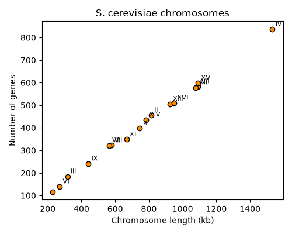

Things to notice:

* `zip()` lets us walk through three lists at once to label each point
* we saved **two** files: `chrom_scatter.png` (a raster image made of pixels) and `chrom_scatter.pdf` (a vector image). More on this choice in Level 4.
* the relationship is almost a perfect line - yeast genes are packed at a nearly constant density. We will measure that in Level 5.

## Customizing: the common options

| what | how |
|------|-----|
| color | `color="red"`, `color="#1f77b4"`, `color="steelblue"` |
| marker / size | `marker="o"`, `marker="s"`, `s=20` (scatter), `markersize=4` (plot) |
| line style | `linestyle="--"`, `linewidth=2` |
| transparency | `alpha=0.5` (0 = invisible, 1 = solid) - useful when points overlap |
| a legend | give each call `label="..."` and then call `ax.legend()` |
| axis range | `ax.set_xlim(0, 100)`, `ax.set_ylim(bottom=0)` |
| figure size | `plt.subplots(figsize=(width, height))` in inches |
| resolution | `fig.savefig("x.png", dpi=300)` |

# Level 2: Distributions and categories

## Histograms: what does the distribution look like?

A **histogram** splits the range of values into bins and counts how many values fall in each bin. It is the first plot to make for any single numeric column. Here we read the rice exon BED file with plain Python (as in the [Loops and IO lecture](02_Loops_IO)) and compute each exon's length as `end - start` (BED coordinates are 0-based, half-open, so no `+1` is needed).

```python
#!/usr/bin/env python3
# Histogram of exon lengths read from a BED file
import matplotlib
matplotlib.use("Agg")
import matplotlib.pyplot as plt

lengths = []
with open("rice_random_exons.bed") as fh:
    for line in fh:
        chrom, start, end = line.split()[0:3]
        lengths.append(int(end) - int(start))

print("exons:", len(lengths))
print("shortest:", min(lengths), "longest:", max(lengths))
print("mean length: %.1f" % (sum(lengths) / len(lengths)))

for nbins in [10, 100]:
    fig, ax = plt.subplots(figsize=(5, 3.5))
    ax.hist(lengths, bins=nbins, color="steelblue", edgecolor="white")
    ax.set_xlabel("Exon length (bp)")
    ax.set_ylabel("Number of exons")
    ax.set_title("Rice exons, bins=%d" % nbins)
    fig.tight_layout()
    fig.savefig("exon_hist_%dbins.png" % nbins, dpi=100)
    plt.close(fig)       # free memory when making many figures in a loop
```

```text
exons: 1000
shortest: 13 longest: 5818
mean length: 369.9
```

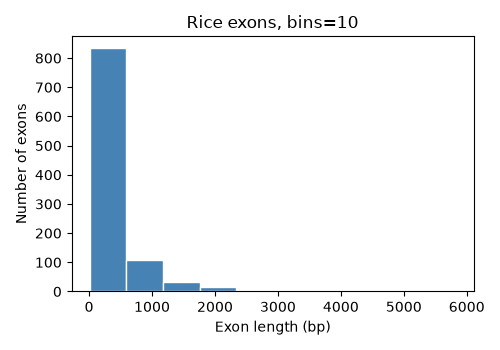

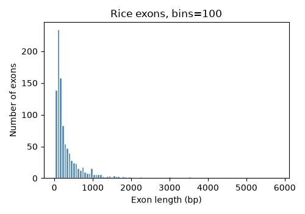

**Bins matter.** With 10 bins almost everything is in the first bar and we learn little. With 100 bins we can see that most exons are 100-300 bp with a long tail of long exons out to almost 6 kb. Always try a few bin numbers - the default (10) is rarely the best. You can also give the bin edges yourself, e.g. `bins=range(0, 3001, 100)` for 100 bp bins. The long tail is a hint that a **log scale** would help - see Level 5.

`plt.close(fig)` releases the memory used by a figure. When a script makes hundreds of figures in a loop, forgetting this will eventually use up all the memory in your job.

## Box plots: comparing groups

A **box plot** summarizes a distribution in five numbers: the box goes from the 25th to the 75th percentile (the middle half of the data), the line in the box is the median, the whiskers extend to the most extreme values within 1.5 times the box height, and points beyond that are drawn individually as possible outliers. Box plots are good for comparing many groups side by side.

Here we use a dictionary of lists to group exon lengths by chromosome.

```python
#!/usr/bin/env python3
# Box plot of exon lengths for each chromosome, grouped with a dictionary
import matplotlib
matplotlib.use("Agg")
import matplotlib.pyplot as plt

by_chrom = {}
with open("rice_random_exons.bed") as fh:
    for line in fh:
        chrom, start, end = line.split()[0:3]
        if chrom not in by_chrom:
            by_chrom[chrom] = []
        by_chrom[chrom].append(int(end) - int(start))

# sort Chr1, Chr2 ... Chr12 numerically, skip tiny groups
names = [c for c in by_chrom if len(by_chrom[c]) >= 10]
names.sort(key=lambda c: int(c.replace("Chr", "")))
data = [by_chrom[c] for c in names]
for c in names:
    print(c, len(by_chrom[c]))

fig, ax = plt.subplots(figsize=(7, 3.5))
ax.boxplot(data)
ax.set_xticks(range(1, len(names) + 1))
ax.set_xticklabels(names)
ax.set_xlabel("Chromosome")
ax.set_ylabel("Exon length (bp)")
fig.tight_layout()
fig.savefig("exon_boxplot.png", dpi=100)
```

```text
Chr1 146
Chr2 123
Chr3 122
Chr4 92
Chr5 77
Chr6 66
Chr7 71
Chr8 70
Chr9 50
Chr10 55
Chr11 67
Chr12 60
```

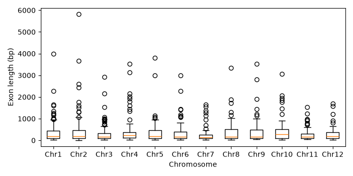

The distributions look similar on every chromosome - that's what we'd expect for randomly chosen exons. (The file also has one exon on `ChrSy`, which we skipped because a box plot of one value is meaningless.)

## Bar charts: counts of categories

A **bar chart** shows one number per category - here, how many species are in each IUCN Red List category. Reading a CSV is exactly what pandas is for (see the [Pandas lecture](07_Pandas)); `value_counts()` counts how many rows have each value.

```python
#!/usr/bin/env python3
# Bar chart of IUCN Red List categories with pandas + matplotlib
import matplotlib
matplotlib.use("Agg")
import matplotlib.pyplot as plt
import pandas as pd

url = ("https://github.com/biodataprog/GEN220_data/raw/main/"
       "tabular/threatened-species.csv.gz")
species = pd.read_csv(url)      # pandas can read .gz files and URLs directly
print(species.shape)

counts = species["category"].value_counts()
print(counts)

# put the categories in a meaningful order (least to most threatened)
order = ["LC", "NT", "VU", "EN", "CR", "EW", "EX", "DD"]
counts = counts.reindex(order)

fig, ax = plt.subplots(figsize=(6, 3.5))
ax.bar(counts.index, counts.values, color="seagreen")
ax.set_xlabel("IUCN Red List category")
ax.set_ylabel("Number of species")
fig.tight_layout()
fig.savefig("iucn_bar.png", dpi=100)
```

```text
(143732, 14)
category
LC       75247
DD       19897
EN       15506
VU       15267
CR        8576
NT        7781
EX         455
LR/nt      443
LR/lc      387
LR/cd      120
EW          53
Name: count, dtype: int64
```

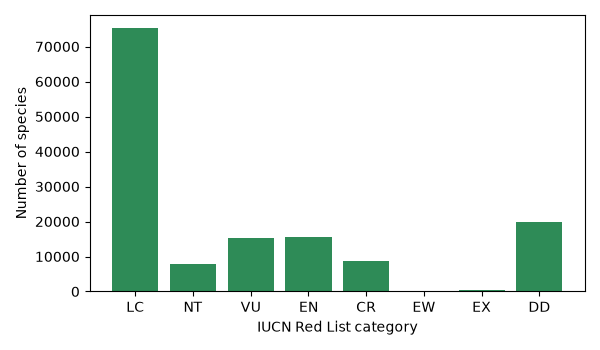

`value_counts()` sorts from most to least common. For categories that have a natural order (like threat level, or developmental stage, or time point) put them in that order instead - here with `reindex()`. Note that `reindex` also *dropped* the old "LR/..." (Lower Risk) categories from an earlier version of the Red List because they were not in our `order` list; always check the counts so you know what you left out.

**Bar charts are for counts or totals, starting at zero.** Don't use a bar to show a mean of measurements - it hides the spread of the data. Use a box plot, violin plot or points instead (Level 3).

# Level 3: pandas + seaborn

## Tidy (long) data

seaborn works best with **tidy** data, also called **long format**: one row per observation, one column per variable. For genes that means one row per gene with columns like `gene`, `chrom`, `length`, `orf_class`. A "wide" table with one column per group (e.g. a `Verified_length` column and a `Dubious_length` column) is harder to plot. Once your data is tidy, you tell seaborn *which column goes where*: `x="orf_class", y="length", hue="chrom"`. The R ggplot2 lecture uses exactly the same idea.

(If you have a wide table, `pd.melt()` converts it to long format.)

Let's make a tidy table of yeast genes from the GFF3 annotation. The last column of a GFF3 line holds `key=value` pairs separated by `;`, which we turn into a dictionary. The yeast annotation has an `orf_classification` for each gene: **Verified** (evidence it makes a real protein), **Uncharacterized** (probably real, no experimental evidence yet) or **Dubious** (probably not a real gene).

```python
#!/usr/bin/env python3
# Build a tidy table of yeast genes from a GFF3 file
import gzip
# GFF3 encodes special characters, e.g. %7C means "|"
from urllib.parse import unquote
import pandas as pd

rows = []
with gzip.open("S_cerevisiae.gff3.gz", "rt") as fh:
    for line in fh:
        if line.startswith("##FASTA"):   # sequence section at the end
            break
        if line.startswith("#"):
            continue
        cols = line.rstrip("\n").split("\t")
        if len(cols) != 9 or cols[2] != "gene":
            continue
        # turn "ID=YAL069W;Name=YAL069W;..." into a dictionary
        attrs = {}
        for pair in cols[8].split(";"):
            if "=" in pair:
                key, value = pair.split("=", 1)
                attrs[key] = value
        # "Verified%7Csilenced_gene" -> "Verified|silenced_gene" -> "Verified"
        orf_class = unquote(attrs.get("orf_classification", "NA")).split("|")[0]
        rows.append({"gene": attrs["ID"],
                     "chrom": cols[0],
                     "strand": cols[6],
                     "length": int(cols[4]) - int(cols[3]) + 1,
                     "orf_class": orf_class})

genes = pd.DataFrame(rows)
print(genes.head())
print(genes["orf_class"].value_counts())
genes.to_csv("yeast_genes.csv", index=False)
```

```text
        gene chrom strand  length        orf_class
0    YAL069W  chrI      +     315          Dubious
1  YAL068W-A  chrI      +     255          Dubious
2    YAL068C  chrI      -     363         Verified
3  YAL067W-A  chrI      +     228  Uncharacterized
4    YAL067C  chrI      -    1782         Verified
orf_class
Verified           5107
Dubious             784
Uncharacterized     709
Name: count, dtype: int64
```

The `unquote` step was added after the first version of this script printed a strange category `Verified%7Csilenced_gene` - GFF3 files encode characters such as `|` as `%7C`. Counting the values of a column *before* plotting is how you find surprises like this.

## Violin and strip plots: show the data

A **violin plot** is a smoothed histogram turned sideways and mirrored, so you can see the *shape* of each group's distribution (for example two peaks), which a box plot hides. A **strip plot** draws every data point, with a little random sideways "jitter" so they don't all sit on one line. Layering the two shows both the shape and the actual data.

Gene lengths span more than two orders of magnitude, so we put the y axis on a log scale. (`log_scale=True` in seaborn functions is new in seaborn 0.13; with older versions use `ax.set_yscale("log")` after plotting.)

```python
#!/usr/bin/env python3
# Gene length by ORF class: violin + strip plot with seaborn
import matplotlib
matplotlib.use("Agg")
import matplotlib.pyplot as plt
import pandas as pd
import seaborn as sns

genes = pd.read_csv("yeast_genes.csv")
order = ["Verified", "Uncharacterized", "Dubious"]

print(genes.groupby("orf_class")["length"].median())

fig, ax = plt.subplots(figsize=(6, 4))
sns.violinplot(data=genes, x="orf_class", y="length", order=order,
               color="lightgray", inner=None, log_scale=True, ax=ax)
sns.stripplot(data=genes, x="orf_class", y="length", order=order,
              size=1.5, alpha=0.3, jitter=0.25, color="black", ax=ax)
ax.set_xlabel("SGD ORF classification")
ax.set_ylabel("Gene length (bp, log scale)")
fig.tight_layout()
fig.savefig("yeast_violin.png", dpi=100)
```

```text
orf_class
Dubious             348.0
Uncharacterized     699.0
Verified           1287.0
Name: length, dtype: float64
```

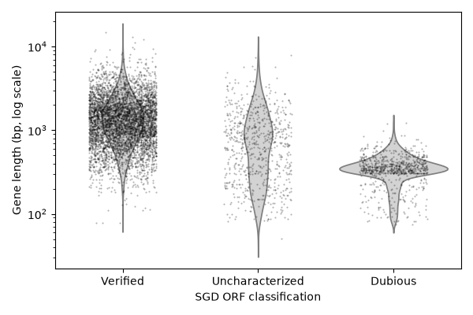

Dubious ORFs are short (median 348 bp) and very uniform in length, Verified genes are longer (median 1287 bp). This makes biological sense: a random stretch of DNA can be read as a short ORF by chance, but a long one without stop codons is unlikely unless it is a real gene. Many "Dubious" ORFs were probably called by a gene finder that used a minimum length of 100 codons (300 bp) - see the sharp edge in the next figure.

## Color by group: hue

The `hue` argument colors the data by another column. Here we split the Red List counts by kingdom. `palette="colorblind"` uses a set of colors that can be told apart by people with the common forms of color blindness.

```python
#!/usr/bin/env python3
# Count plot with hue: Red List category split by kingdom
import matplotlib
matplotlib.use("Agg")
import matplotlib.pyplot as plt
import pandas as pd
import seaborn as sns

url = ("https://github.com/biodataprog/GEN220_data/raw/main/"
       "tabular/threatened-species.csv.gz")
species = pd.read_csv(url)
kingdoms = ["ANIMALIA", "PLANTAE", "FUNGI"]
order = ["LC", "NT", "VU", "EN", "CR", "EW", "EX", "DD"]
keep = species[species["kingdom_name"].isin(kingdoms)]

# a table of counts is often the best first look
print(pd.crosstab(keep["category"], keep["kingdom_name"]).reindex(order))

fig, ax = plt.subplots(figsize=(7, 3.5))
sns.countplot(data=keep, x="category", order=order,
              hue="kingdom_name", hue_order=kingdoms,
              palette="colorblind", ax=ax)
ax.set_xlabel("IUCN Red List category")
ax.set_ylabel("Number of species")
ax.legend(title="Kingdom")
fig.tight_layout()
fig.savefig("iucn_by_kingdom.png", dpi=100)

# the same counts as proportions within each kingdom
prop = (keep.groupby("kingdom_name")["category"]
            .value_counts(normalize=True)
            .rename("proportion")
            .reset_index())
print(prop.head())
fig, ax = plt.subplots(figsize=(7, 3.5))
sns.barplot(data=prop, x="category", y="proportion", order=order,
            hue="kingdom_name", hue_order=kingdoms,
            palette="colorblind", ax=ax)
ax.set_xlabel("IUCN Red List category")
ax.set_ylabel("Proportion of species in kingdom")
ax.legend(title="Kingdom")
fig.tight_layout()
fig.savefig("iucn_by_kingdom_prop.png", dpi=100)
```

```text
kingdom_name  ANIMALIA  FUNGI  PLANTAE
category                              
LC               46491    211    28545
NT                4350     61     3370
VU                5532    154     9580
EN                5090    101    10314
CR                3136     35     5401
EW                  12      0       41
EX                 330      0      125
DD               14711     65     5112
  kingdom_name category  proportion
0     ANIMALIA       LC    0.583574
1     ANIMALIA       DD    0.184658
2     ANIMALIA       VU    0.069440
3     ANIMALIA       EN    0.063892
4     ANIMALIA       NT    0.054603
```

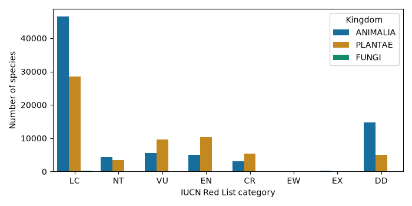

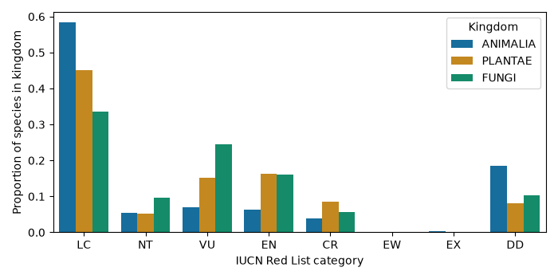

The first plot answers "how many?", the second "what fraction?". Fungi are invisible in the count plot because only 627 fungi have been assessed, but the proportions show a larger share of assessed fungi are Vulnerable or Endangered than animals - partly because fungi tend to be assessed only when someone suspects they are threatened. Choosing counts vs proportions changes the story; decide which question you are asking.

Always set `hue_order` (and `order`): otherwise seaborn uses the order the values first appear in the data, and the same kingdom can get a different color in two figures.

## Small multiples (faceting)

Instead of cramming all groups into one plot, **small multiples** draw the same plot once per group in a row or grid of panels. seaborn's "figure-level" functions `displot` (distributions), `catplot` (categories) and `relplot` (scatter/line) do this with `col=` and `row=`.

```python
#!/usr/bin/env python3
# Small multiples: one histogram panel per ORF class
import matplotlib
matplotlib.use("Agg")
import pandas as pd
import seaborn as sns

genes = pd.read_csv("yeast_genes.csv")
order = ["Verified", "Uncharacterized", "Dubious"]

g = sns.displot(data=genes, x="length", col="orf_class", col_order=order,
                log_scale=True, bins=40, height=3, aspect=1,
                facet_kws={"sharey": False})
g.set_axis_labels("Gene length (bp, log scale)", "Number of genes")
g.set_titles("{col_name}")
g.savefig("yeast_length_facets.png", dpi=100)
```

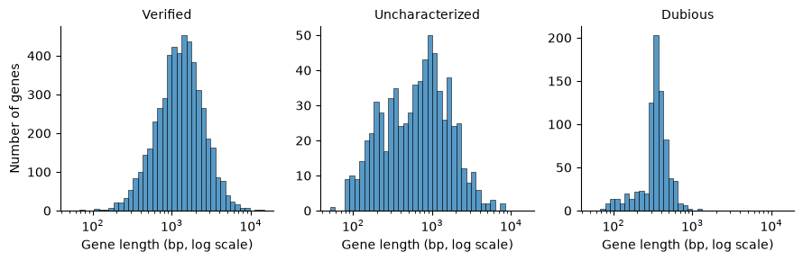

The Dubious panel has a sharp jump near 300 bp - the 100 codon cutoff mentioned above. `sharey=False` gives each panel its own y axis because the groups are very different sizes; the x axes stay shared so the lengths can be compared directly.

Figure-level functions return a `FacetGrid` object (`g` here) instead of an `ax`, so you save it with `g.savefig()`.

## Log scales

Use a log scale when values span several orders of magnitude (gene lengths, read counts, expression, p-values, genome sizes), or when you care about fold changes (2x up and 2x down look the same size on a log axis). Ways to do it:

* matplotlib: `ax.set_xscale("log")` or `ax.set_yscale("log")`
* seaborn 0.13+: `log_scale=True` in most plotting functions
* transform the data yourself, e.g. `np.log10(x)` or `np.log2(x + 1)` (the `+ 1` avoids `log(0)`), and **say so in the axis label**

# Level 4: Multi-panel and publication-quality figures

## Several panels in one figure

`plt.subplots(nrows, ncols)` returns a figure and an **array** of axes; you draw on each one separately. Here we make a three-panel figure summarizing the yeast genome, with panel letters A-C as used in journals.

```python
#!/usr/bin/env python3
# A three-panel figure about the yeast genome, ready for a paper
import matplotlib
matplotlib.use("Agg")
import matplotlib.pyplot as plt
import numpy as np
import pandas as pd
import seaborn as sns

# settings for the whole figure: readable fonts, clean style
plt.rcParams.update({"font.size": 9, "axes.titlesize": 10,
                     "axes.labelsize": 9, "legend.fontsize": 8,
                     "pdf.fonttype": 42})   # keep text editable in Illustrator
sns.set_palette("colorblind")

genes = pd.read_csv("yeast_genes.csv")
order = ["Verified", "Uncharacterized", "Dubious"]
nuclear = genes[genes["chrom"] != "chrmt"]
per_chrom = nuclear.groupby("chrom").size()   # genes per chromosome
chrom_len_kb = {"chrI": 230, "chrII": 813, "chrIII": 317, "chrIV": 1532,
                "chrV": 577, "chrVI": 270, "chrVII": 1091, "chrVIII": 563,
                "chrIX": 440, "chrX": 746, "chrXI": 667, "chrXII": 1078,
                "chrXIII": 924, "chrXIV": 784, "chrXV": 1091, "chrXVI": 948}
lens = [chrom_len_kb[c] for c in per_chrom.index]

# 7 x 2.8 inches is roughly the width of a two-column journal page
fig, axes = plt.subplots(1, 3, figsize=(7, 2.8), layout="constrained")

# A: distribution of gene lengths
bins = np.logspace(np.log10(50), np.log10(20000), 40)
axes[0].hist(genes["length"], bins=bins, color="gray", edgecolor="white")
axes[0].set_xscale("log")
axes[0].set_xlabel("Gene length (bp)")
axes[0].set_ylabel("Number of genes")

# B: length by ORF class
sns.boxplot(data=genes, x="orf_class", y="length", order=order,
            hue="orf_class", hue_order=order, legend=False,
            log_scale=True, fliersize=1, ax=axes[1])
axes[1].set_xlabel("")
axes[1].set_ylabel("Gene length (bp)")
plt.setp(axes[1].get_xticklabels(), rotation=30, ha="right")

# C: genes vs chromosome size
axes[2].scatter(lens, per_chrom.values, s=15, color="black")
axes[2].set_xlabel("Chromosome length (kb)")
axes[2].set_ylabel("Number of genes")

# panel letters in the top-left corner, outside the plotting area
for ax, letter in zip(axes, ["A", "B", "C"]):
    ax.text(-0.25, 1.05, letter, transform=ax.transAxes,
            fontsize=12, fontweight="bold")

fig.savefig("yeast_figure.png", dpi=100)
fig.savefig("yeast_figure.pdf")     # vector version for the journal
```

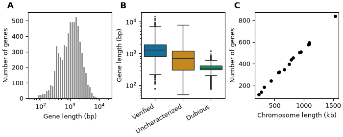

Notes:

* `layout="constrained"` (matplotlib 3.6+; use `fig.tight_layout()` on older versions) adjusts spacing so labels don't overlap
* panel letters use `transform=ax.transAxes`, which means the coordinates are fractions of the panel (0,0 = bottom-left, 1,1 = top-right) instead of data values, so the letters land in the same place on every panel
* `plt.rcParams.update()` sets defaults for the whole script, so all panels match
* histogram bins on a log axis are made with `np.logspace()` so that every bin has the same width *on the log axis*

## Shared axes

When panels show the same measurement, use the **same axis ranges** so readers can compare them by eye. `sharex=True, sharey=True` does this and removes the repeated tick labels.

```python
#!/usr/bin/env python3
# Shared axes make panels directly comparable
import matplotlib
matplotlib.use("Agg")
import matplotlib.pyplot as plt
import pandas as pd

bed = pd.read_csv("rice_random_exons.bed", sep="\t", header=None,
                  names=["chrom", "start", "end"])
bed["length"] = bed["end"] - bed["start"]

chroms = ["Chr1", "Chr2", "Chr3", "Chr4"]
fig, axes = plt.subplots(2, 2, figsize=(6, 4.5), sharex=True, sharey=True)
# axes is a 2 x 2 array; .flat walks through it as one list
for ax, chrom in zip(axes.flat, chroms):
    subset = bed[bed["chrom"] == chrom]
    ax.hist(subset["length"], bins=range(0, 3001, 100), color="steelblue")
    ax.set_title("%s (n=%d)" % (chrom, len(subset)))
for ax in axes[1, :]:
    ax.set_xlabel("Exon length (bp)")
for ax in axes[:, 0]:
    ax.set_ylabel("Exons")
fig.tight_layout()
fig.savefig("exon_shared_axes.png", dpi=100)
```

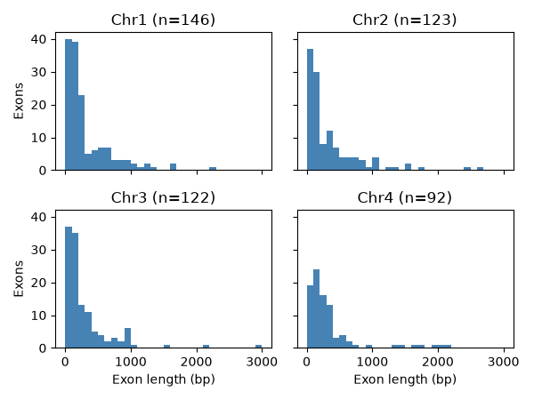

Here the BED file is read with `pd.read_csv(..., sep="\t", header=None)` - pandas can read any tab-delimited file, not only CSV.

## Publication-quality choices

* **Font size**: text in the final printed figure should be about 6-10 pt. Make the figure at its *real printed size* (a journal column is about 3.5 inches wide, a full page about 7 inches) instead of making it huge and shrinking it, which makes the text tiny.
* **Label axes with units**: "Gene length (bp)", "Expression (log2 CPM)", "Temperature (C)".
* **Colorblind-friendly colors**: about 1 in 12 men has red-green color blindness. Use `sns.color_palette("colorblind")`, or the `viridis` / `cividis` colormaps for continuous values. Avoid red vs green as the only difference between groups. Use a **diverging** colormap (e.g. `vlag`, `RdBu_r`) centered at 0 for values that go up and down (fold changes, z-scores), and a **sequential** one (`viridis`) for values that only go up (counts).
* **Avoid 3D bar charts and pie charts**: 3D distorts sizes, and people are bad at comparing angles and areas. A bar chart or a dot plot shows the same numbers more accurately.
* **Show the data**: with fewer than ~20 points per group, plot the points themselves (strip plot) rather than only a summary bar.
* **Don't truncate bar axes**: bar lengths must start at zero. (Points and lines don't need to.)
* **Consistent colors**: the same group should have the same color in every figure of a paper.

## Vector vs raster output

| | Raster (PNG, JPG, TIFF) | Vector (PDF, SVG, EPS) |
|---|---|---|
| stored as | a grid of pixels | shapes, lines and text |
| zooming | gets blurry / blocky | stays sharp at any size |
| editing text later | no | yes, e.g. in Illustrator or Inkscape |
| good for | web pages, slides, figures with huge numbers of points | papers, posters, line art |

For papers, save a PDF (or SVG) and let the journal convert it, or a PNG/TIFF at 300-600 `dpi` if they require a raster. A scatter plot with a million points makes a huge, slow PDF - for that case use PNG, or `ax.scatter(..., rasterized=True)` to rasterize only the points while keeping the text as vectors. The figures on this web page are PNGs at `dpi=100` to keep them small. Never save plots as JPG: its compression makes blurry smudges around lines and text.

# Level 5: Genomics and statistics

## Feature length distributions on a log scale

Lengths of genes, exons, introns, contigs, and reads are almost always **right-skewed**: many short ones and a long tail of very long ones. On a linear axis the short ones are crushed into one or two bars. A log axis spreads them out.

```python
#!/usr/bin/env python3
# Feature lengths are skewed: compare linear and log axes
import matplotlib
matplotlib.use("Agg")
import matplotlib.pyplot as plt
import numpy as np
import pandas as pd

bed = pd.read_csv("rice_random_exons.bed", sep="\t", header=None,
                  names=["chrom", "start", "end"])
bed["length"] = bed["end"] - bed["start"]
print(bed["length"].describe())

fig, (ax1, ax2) = plt.subplots(1, 2, figsize=(8, 3.2))
ax1.hist(bed["length"], bins=50, color="gray")
ax1.set_xlabel("Exon length (bp)")
ax1.set_ylabel("Number of exons")
ax1.set_title("Linear x axis")

# on a log axis the bins must be evenly spaced in log space too
bins = np.logspace(np.log10(10), np.log10(10000), 50)
ax2.hist(bed["length"], bins=bins, color="gray")
ax2.set_xscale("log")
ax2.axvline(bed["length"].median(), color="red", linestyle="--",
            label="median = %d bp" % bed["length"].median())
ax2.set_xlabel("Exon length (bp, log scale)")
ax2.set_title("Log x axis")
ax2.legend()
fig.tight_layout()
fig.savefig("exon_log_hist.png", dpi=100)
```

```text
count    1000.000000
mean      369.855000
std       534.342077
min        13.000000
25%        95.750000
50%       175.500000
75%       410.000000
max      5818.000000
Name: length, dtype: float64
```

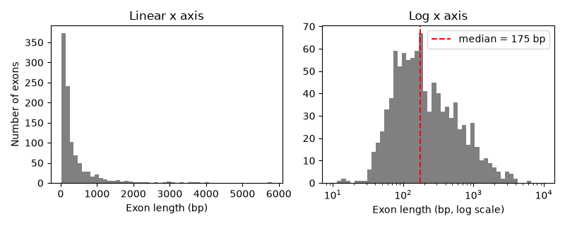

Notice the mean (370 bp) is twice the median (175 bp) - a sign of a skewed distribution. For skewed data report the median, and use statistical tests that don't assume a normal distribution (or test the log-transformed values).

## Scatter plot with a regression line and correlation

Back to the yeast chromosomes from Level 1. `scipy.stats.linregress` fits a straight line (least squares) and reports the slope, intercept and the **Pearson correlation** `r`. **Spearman's rho** uses ranks instead of values, so it measures any consistently increasing (or decreasing) relationship and is not pulled around by outliers. `sns.regplot` draws the points, the fitted line and a 95% confidence band.

```python
#!/usr/bin/env python3
# Scatter with a regression line and correlation
import matplotlib
matplotlib.use("Agg")
import matplotlib.pyplot as plt
import seaborn as sns
from scipy import stats

length_kb = [230, 813, 317, 1532, 577, 270, 1091, 563,
             440, 746, 667, 1078, 924, 784, 1091, 948]
n_genes = [117, 456, 184, 836, 323, 139, 583, 321,
           241, 398, 348, 578, 505, 435, 597, 511]

fit = stats.linregress(length_kb, n_genes)
rho, rho_p = stats.spearmanr(length_kb, n_genes)
print("slope = %.3f genes per kb" % fit.slope)
print("intercept = %.1f" % fit.intercept)
print("Pearson r = %.4f, R^2 = %.4f, p = %.2g"
      % (fit.rvalue, fit.rvalue**2, fit.pvalue))
print("Spearman rho = %.4f" % rho)

fig, ax = plt.subplots(figsize=(5, 4))
# regplot draws the points, the least-squares line and a 95% confidence band
sns.regplot(x=length_kb, y=n_genes, ax=ax,
            scatter_kws={"color": "black", "s": 20},
            line_kws={"color": "red"})
ax.text(0.05, 0.92, "r = %.3f\n%.2f genes/kb" % (fit.rvalue, fit.slope),
        transform=ax.transAxes, va="top")
ax.set_xlabel("Chromosome length (kb)")
ax.set_ylabel("Number of genes")
fig.tight_layout()
fig.savefig("chrom_regression.png", dpi=100)
```

```text
slope = 0.542 genes per kb
intercept = 1.6
Pearson r = 0.9988, R^2 = 0.9976, p = 9.4e-20
Spearman rho = 0.9993
```

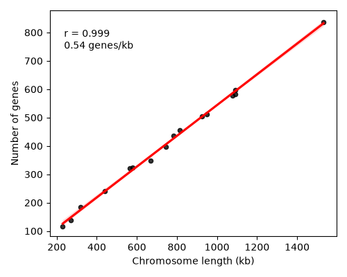

About 0.54 genes per kb, or one gene every ~1.8 kb - yeast has a very compact genome. Correlation is not causation, and a high `r` does not prove the relationship is a straight line: always look at the plot, not only the number.

## An RNA-seq example: simulated data

In the [RNASeq lecture](../Bioinformatics/RNASeq) we mapped reads and counted reads per gene with `featureCounts`, which gives a table of genes by samples. Tools such as DESeq2 or edgeR then test each gene for a difference between conditions and report a **log2 fold change** and a **p-value** (and an adjusted p-value) per gene. The two most common plots of those results are the volcano plot and the clustered heatmap.

To keep this example self-contained **we simulate the count table** with numpy, using a fixed random seed so you get exactly the same numbers. These are *not* real measurements: we made 2000 fake genes, gave 200 of them a true fold change between control and treated, and added realistic-looking noise. The advantage of simulated data is that we know the right answer, so we can check how well the analysis finds it (see the exercises). You can run the same plotting code on a real `featureCounts` or DESeq2 table.

```python
#!/usr/bin/env python3
# SIMULATED RNA-seq style counts: 2000 genes, 3 control + 3 treated samples
import numpy as np
import pandas as pd

rng = np.random.default_rng(220)        # fixed seed = same numbers every run
n_genes = 2000
samples = ["ctrl_1", "ctrl_2", "ctrl_3", "treat_1", "treat_2", "treat_3"]

# baseline expression level for each gene (a few high, many low)
base = rng.lognormal(mean=5, sigma=1.5, size=n_genes)
# true log2 fold change: 0 for most genes, up or down for 10% of them
true_lfc = np.zeros(n_genes)
de = rng.choice(n_genes, size=200, replace=False)
true_lfc[de] = rng.normal(0, 2, size=200)

counts = {}
for s in samples:
    mean = base * (2 ** true_lfc if s.startswith("treat") else 1)
    # negative binomial noise, like real read counts
    p = 50 / (50 + mean)
    counts[s] = rng.negative_binomial(50, p)

table = pd.DataFrame(counts)
table.index = ["gene%04d" % i for i in range(n_genes)]
table.index.name = "gene"
table.to_csv("simulated_counts.csv")
print(table.head())
print(table.shape)
```

```text
          ctrl_1  ctrl_2  ctrl_3  treat_1  treat_2  treat_3
gene                                                       
gene0000      92      82      56      115      104      119
gene0001      70      77      65       62       60       79
gene0002     270     243     256      225      253      228
gene0003     118     119      96       12       18       15
gene0004    2366    2346    2353     2538     2315     2172
(2000, 6)
```

## Volcano plot

A **volcano plot** puts the size of the change (log2 fold change) on the x axis and the strength of the evidence (-log10 p-value) on the y axis. Each point is a gene. Genes that change a lot *and* are highly significant land in the upper corners. log2 is used for fold change so that 2x up (+1) and 2x down (-1) are symmetric; -log10 turns tiny p-values into big numbers (p = 0.001 becomes 3).

For a simple demonstration we use a t-test on log2 CPM values and the Benjamini-Hochberg correction for testing 2000 genes at once (the multiple testing idea from the [Sequence evolution lecture](../Bioinformatics/Sequence_evolution)). For real RNA-seq use DESeq2 or edgeR, which model count data properly and work better with only 3 replicates. (`stats.false_discovery_control` needs scipy 1.11 or newer.)

```python
#!/usr/bin/env python3
# Volcano plot from the SIMULATED count table
import matplotlib
matplotlib.use("Agg")
import matplotlib.pyplot as plt
import numpy as np
import pandas as pd
from scipy import stats

counts = pd.read_csv("simulated_counts.csv", index_col="gene")
counts = counts[counts.sum(axis=1) >= 10]          # drop nearly silent genes

# normalize for library size (counts per million) and log transform
cpm = counts / counts.sum() * 1e6
logexp = np.log2(cpm + 1)
ctrl = logexp[["ctrl_1", "ctrl_2", "ctrl_3"]]
treat = logexp[["treat_1", "treat_2", "treat_3"]]

res = pd.DataFrame(index=logexp.index)
res["log2FC"] = treat.mean(axis=1) - ctrl.mean(axis=1)
res["pvalue"] = stats.ttest_ind(treat, ctrl, axis=1).pvalue
# Benjamini-Hochberg adjusted p-values
res["padj"] = stats.false_discovery_control(res["pvalue"])
res["sig"] = (res["padj"] < 0.05) & (res["log2FC"].abs() >= 1)
res.to_csv("simulated_de_results.csv")
print(res.sort_values("padj").head())
print("significant genes:", res["sig"].sum(), "of", len(res))

fig, ax = plt.subplots(figsize=(5, 4.5))
colors = np.where(res["sig"], "firebrick", "lightgray")
ax.scatter(res["log2FC"], -np.log10(res["pvalue"]), c=colors, s=6)
ax.axvline(-1, color="black", linestyle=":", linewidth=0.8)
ax.axvline(1, color="black", linestyle=":", linewidth=0.8)
ax.set_xlabel("log2 fold change (treated / control)")
ax.set_ylabel("-log10 p-value")
ax.set_title("Volcano plot (simulated data)")

# label the 5 most significant genes
for gene in res.sort_values("pvalue").index[:5]:
    x = res.loc[gene, "log2FC"]
    y = -np.log10(res.loc[gene, "pvalue"])
    ax.annotate(gene, (x, y), fontsize=7,
                xytext=(3, 3), textcoords="offset points")
fig.tight_layout()
fig.savefig("volcano.png", dpi=100)
```

```text
            log2FC        pvalue      padj   sig
gene                                            
gene0684  3.991010  2.648018e-07  0.000188  True
gene1362 -5.151614  2.024345e-07  0.000188  True
gene1879 -4.831011  2.819924e-07  0.000188  True
gene1705  4.989061  9.129712e-07  0.000399  True
gene1396  2.698295  9.990602e-07  0.000399  True
significant genes: 79 of 1995
```

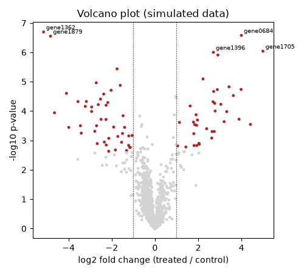

79 genes were called significant, although we simulated 200 changed genes. Many of the 200 were given only a small fold change, and with 3 replicates a small change can't be told apart from noise. This is a very common situation in real experiments: "not significant" does not mean "not changed".

## Clustered heatmap

A **heatmap** shows a matrix of numbers as colors: here genes are rows, samples are columns. `sns.clustermap` also **clusters** the rows and columns (hierarchical clustering), reorders them so similar ones are next to each other, and draws the tree (dendrogram). If the experiment worked, the samples should split into control vs treated, and the genes into "up" and "down" groups.

```python
#!/usr/bin/env python3
# Clustered heatmap of the top DE genes (SIMULATED data)
import matplotlib
matplotlib.use("Agg")
import numpy as np
import pandas as pd
import seaborn as sns

counts = pd.read_csv("simulated_counts.csv", index_col="gene")
res = pd.read_csv("simulated_de_results.csv", index_col="gene")
logexp = np.log2(counts / counts.sum() * 1e6 + 1)

top = res.sort_values("padj").index[:30]      # 30 most significant genes
mat = logexp.loc[top]

# z_score=0 scales each ROW (gene) to mean 0, sd 1 so we see the pattern,
# not just which genes are highly expressed overall
g = sns.clustermap(mat, z_score=0, cmap="vlag", center=0,
                   figsize=(5, 7), yticklabels=True,
                   cbar_kws={"label": "z-score"})
g.ax_heatmap.set_ylabel("")
g.ax_heatmap.tick_params(axis="y", labelsize=6)
g.savefig("heatmap_clustered.png", dpi=100)
```

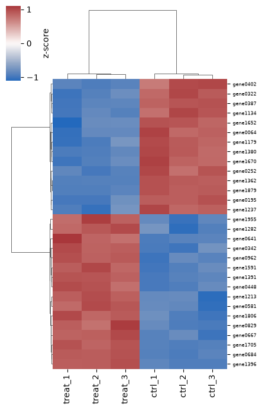

The columns separate into the three treated and three control samples, and the genes into two blocks, up and down. Choices that matter:

* **scaling**: without `z_score=0`, the colors mostly show which genes are highly expressed overall. Scaling each gene shows the *pattern* across samples.
* **diverging colormap centered at 0** (`cmap="vlag", center=0`) for z-scores or fold changes
* **which genes**: choosing the genes by significance (as here) guarantees the samples will cluster by condition, so this plot is an illustration, not evidence. To check sample quality without that bias, cluster on the most *variable* genes instead (exercise 7). A PCA plot of samples is another common check.

## Connection to variant data

The same tools apply to the [Variants lecture](../Bioinformatics/Variants). `bcftools query` turns a VCF into a plain table that pandas can read, for example:

```bash
bcftools query -f '%CHROM\t%POS\t%QUAL\t%INFO/DP\n' calls.vcf.gz > calls.tsv
```

Then a histogram of `QUAL` (log scale) helps choose a quality filter, a histogram of depth (`DP`) shows coverage and possible duplicated regions, and a scatter of `POS` vs a value (one panel per chromosome, with `col="chrom"`) shows where variants cluster along the genome - the idea behind a Manhattan plot.

# Common mistakes

* Calling `plt.show()` on the cluster and getting no file. Use `fig.savefig()` (and the `Agg` backend).
* Calling `savefig` *after* `plt.show()` - on a laptop, `show()` may clear the figure, so you save a blank image. Save first.
* No axis labels or no units.
* Using the default 10 bins for a histogram, or a linear axis for data spanning 1 to 100,000.
* Numbers read as text: if the axis shows every value as a separate tick in random order, the column is strings. Check `df.dtypes` and convert with `int()`/`float()` or `pd.to_numeric()`.
* Categories in alphabetical (or random) order instead of their natural order; forgetting `order=` / `hue_order=`.
* Different colors for the same group in different figures.
* Bar charts of means that hide the data; bar axes that don't start at zero.
* Red/green only color schemes; rainbow (`jet`) colormaps that create false boundaries.
* Overplotting: 100,000 points drawn on top of each other look like a solid blob. Use `alpha=0.1`, smaller points, or a 2D histogram (`ax.hexbin`, `sns.histplot(x=..., y=...)`).
* Making many figures in a loop without `plt.close(fig)` and running out of memory.
* Saving at a huge size and shrinking it in the paper, leaving unreadable text.

# Exercises

The exercises step up in difficulty. Save every figure with `fig.savefig()` and run at least one of them as a Slurm job on the cluster.

1. **(Level 1)** Add a second growth curve to the line plot (make up values for a slower growing mutant) using a second `ax.plot()` call, give both lines a `label=`, and add a legend. Save as both PNG and PDF.
2. **(Level 1-2)** Plot the rice exon lengths as a histogram with 20, 50 and 200 bins. Which do you prefer and why? Add a vertical line at the median with `ax.axvline()`.
3. **(Level 2)** From the Red List table, make a horizontal bar chart (`ax.barh`) of the 15 classes (`class_name`) with the most species, sorted largest at the top.
4. **(Level 3)** For the yeast genes, compute the number of genes on each chromosome for each ORF class with `groupby(["chrom", "orf_class"]).size().reset_index(name="n")`, and plot it with `sns.barplot(..., hue="orf_class")`. Put the chromosomes in order I, II, III ... XVI (not alphabetical!).
5. **(Level 3)** Keep only the Red List species with category CR, EN or VU (threatened) in kingdom ANIMALIA. Use `sns.catplot(kind="count", ...)` with `col="class_name"` and `col_wrap=3` for the six classes with the most species. Which class has the largest share of Critically Endangered species?
6. **(Level 4)** Make a two-panel figure (panels labeled A and B): A, the violin/strip plot of yeast gene length by ORF class; B, the log-scale histogram of rice exon lengths. Set the figure to 7 inches wide, font size 8, and save a PDF. Open the PDF and zoom in on the text.
7. **(Level 5)** Using the simulated data: (a) make the heatmap again but with the 50 genes with the highest *variance* across all six samples (`logexp.var(axis=1)`) instead of the most significant ones. Do the samples still cluster by condition? (b) Because the data are simulated we know the truth: modify the simulation script to also save `true_lfc` as a column, and make a scatter plot of true vs estimated log2 fold change. How close are they for highly vs lowly expressed genes?
8. **(Level 5, challenge)** Add a `start` column to the yeast gene table (in the GFF3 parsing script), then plot the position of every gene along each chromosome (x = gene start, one row or facet per chromosome), colored by ORF class. Alternatively, if you have a VCF from the Variants lecture, use `bcftools query` and plot a QUAL histogram and variant density along each chromosome.

# More resources

* matplotlib gallery - find a plot that looks like what you want and copy its code: [https://matplotlib.org/stable/gallery/](https://matplotlib.org/stable/gallery/)
* seaborn tutorial and gallery: [https://seaborn.pydata.org/tutorial.html](https://seaborn.pydata.org/tutorial.html)
* Claus Wilke, *Fundamentals of Data Visualization* (free online; examples are in R but the advice applies to any language): [https://clauswilke.com/dataviz/](https://clauswilke.com/dataviz/)
* Ten Simple Rules for Better Figures (Rougier et al. 2014, PLoS Comput Biol): [https://doi.org/10.1371/journal.pcbi.1003833](https://doi.org/10.1371/journal.pcbi.1003833)
* The same plots in R with ggplot2: [R plotting lecture](../Misc/Rplotting)
