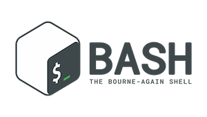

# UNIX

These lectures teach the UNIX command line, shell scripting, and running analyses on the UCR HPCC cluster. They build on each other, so work through them in order.

| | Lecture | Class | Topics |
| :- | :------ | :---- | :----- |
| I | [Logging In and Command Line Basics](00_Login_Notebook) ([PDF](00_Login_Notebook.pdf)) | Sep 24 | the cluster, logging in, OnDemand, paths and navigation, viewing files, getting help, shortcuts, nano, your first shell script |
| II | [Files, Data and Running Programs](01_Tools) ([PDF](01_Tools.pdf)) | Sep 29 | copying and moving, wildcards, symbolic links, permissions, quotas, redirection and pipes, grep, compression, downloading and transferring data, modules, interactive jobs, Git for homework |
| III | [Shell Programming](02_Analysis_summary) ([PDF](02_Analysis_summary.pdf)) | Oct 1 | variables and quoting, conditionals, loops, functions, robust scripts, looping over samples |
| III lab | [Data Processing with Pipes](02b_Data_processing_lab) ([PDF](02b_Data_processing_lab.pdf)) | lab / reading | grep, cut, sort/uniq, tr, paste, join, sed, awk; answering questions about GFF and BLAST tables |
| IV | [Running Analyses on the Cluster](03_Advanced_UNIX_DataProcessing) ([PDF](03_Advanced_UNIX_DataProcessing.pdf)) | Oct 29 | SLURM batch jobs, choosing resources, job arrays, storage, tmux, conda and containers, find/xargs/parallel |

See also the [SSH keys guide](../Resources/SSH_keys) and the [Git and GitHub guide](../Resources/Git_tutorial).

